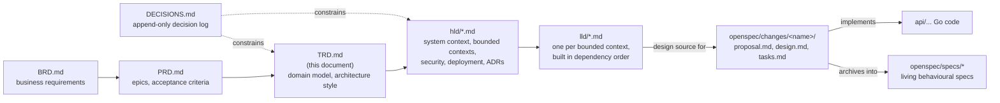
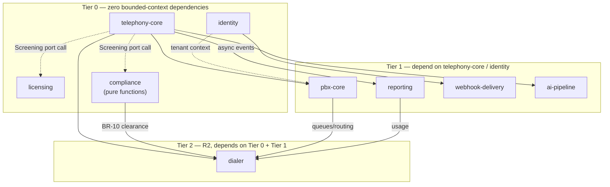

# Technical Requirements Document (TRD)

Cross-cutting technical decisions that apply to every OpenSpec domain change:
domain model, high-level design, data model, API contract and test strategy.
Per [[DECISIONS.md]] D-29, these stay here in `docs/` rather than as OpenSpec
specs — BRD/PRD/decisions are a different audience and lifecycle from the
per-change proposal/design/tasks that live under `openspec/changes/`.

Read [[DECISIONS.md]] first — most of what's below is just this document
applying those decisions concretely; don't re-litigate a decision that's
already there.

## Terminology note — Leg superseded by Participant

`docs/DECISIONS.md` D-17 and D-18 originally introduced this domain concept
as **Leg** ("a Leg is one participant's participation in a Call; a Leg is
not a Channel"). **D-32** renamed it to **Participant** (entity name
`CallParticipant` where precision matters, e.g. the Call aggregate's child
collection) — same concept, terminology only, no behavioural change. D-17
and D-18 keep their original numbers and are annotated as historically
named "Leg"; D-32 is the authoritative record of the rename. `docs/BRD.md`
and `docs/PRD.md` have been updated to say "participant" wherever they
previously said "leg" in this sense.

## Architecture style (D-15, D-16, D-20)

- Modular monolith: bounded contexts as Go packages/modules, not
  microservices. Extract a module to its own service later only if justified
  by actual load — not speculatively (D-20).
- Ports & adapters (hexagonal): domain/application layers define ports
  (interfaces). Infrastructure — Asterisk ARI/AMI, Postgres, SIP, carriers —
  implements them as adapters. Domain code never imports an adapter package.
- One anti-corruption layer for the media engine (Asterisk). All ARI/AMI
  channel-juggling (D-17: a transfer replaces channels mid-participation) is
  absorbed here — the domain never sees a raw Asterisk channel, only a
  Participant.
- All call logic lives in application code. Asterisk dialplan/config
  (`core/conf/*`) holds entry points only — it hands control to the Stasis
  app and application code decides everything else (D-16).

```
AtsaPBX Domain
  Call
   └── Participant(s)
              │
              ▼
  Asterisk Anti-Corruption Layer
              │
              ▼
  Asterisk
   ├── Channel(s)
   ├── Bridge(s)
   ├── PJSIP
   ├── RTP / media
   ├── ARI
   └── AMI
```

The anti-corruption layer maps infrastructure events — channel created,
channel answered, channel transferred, channel replaced, channel hung up,
bridge entered, bridge left — into domain behaviour on `Call` and
`Participant`. The domain must never depend on a raw Asterisk channel
identifier or an Asterisk-specific lifecycle concept; it depends only on
`Participant` identity, which the anti-corruption layer keeps stable across
however many channels that participant's involvement touches.

## Domain model (D-17, D-18, D-19, D-21, D-22)

- **Call** is an aggregate of N **Participants** — never modelled as fixed
  "caller"/"agent" parties (D-18). Two participants today; three when a
  supervisor joins or an interpreter is bridged in.
- **Participant ≠ Channel.** A `Participant` (entity: `CallParticipant`
  where the more explicit name earns its keep, e.g. in the aggregate's
  internal collection) is one party's participation in a Call — a business
  concept with its own identity and lifecycle. An Asterisk `Channel` is a
  telephony/infrastructure resource. A single Participant MAY be associated
  with multiple Asterisk Channels over its lifecycle:

  ```
  Call
  ├── Participant A
  │   ├── Asterisk Channel 1
  │   └── Asterisk Channel 2      (e.g. after a transfer)
  │
  ├── Participant B
  │   └── Asterisk Channel 3
  │
  └── Participant C               (e.g. supervisor or interpreter)
      └── Asterisk Channel 4
  ```

  A transfer, attended transfer, channel replacement, or supervisor
  intervention changes which Channel(s) back a Participant; the
  Participant's domain identity and billable duration continue unbroken
  (D-17). Modelling this as "caller and agent" would need a new column for
  every future case (interpreter, supervisor); modelling by Channel would
  incorrectly split one participation into several whenever the underlying
  channel changes. This is exactly why the anti-corruption layer, not the
  domain, absorbs Asterisk's channel-swapping.
- Originate with our own caller-supplied channel identifier, never correlate
  by dialled-number-plus-timestamp — that guess is wrong under concurrency
  (D-19). This identifier is an anti-corruption-layer concern for mapping
  Asterisk channel events back to the right Participant; it is not part of
  the domain's Participant identity.
- **Compliance** (do-not-call, calling hours, abandonment limits) is pure
  functions, not an aggregate: no state, no I/O, inputs in, a verdict out
  (D-21). Exhaustively unit-testable, independently auditable. Unaffected by
  the Participant rename.
- **IVR / call-flow** is data (a node graph) that the domain interprets via a
  pure fold: (current node, event) → (next node, commands) — not dialplan,
  not procedural code (D-22). Unaffected by the Participant rename.

## Extensibility seams — required from the first commit (D-24, D-31)

Scaled-down DDD keeps: ubiquitous language, bounded contexts, aggregates
with invariants, domain events, ports and adapters, one anti-corruption
layer. It drops: event sourcing, CQRS as an architecture, a repository per
entity, value objects for everything, factories, domain services by default
(D-31).

Within that scope, four seams are cheap now and expensive to retrofit, so
they exist even in the MVP even where nothing consumes them yet (D-24):

1. `tenant_id` on every row and every domain object, from commit one.
2. Call as N Participants (never 2 named parties) — see Domain model above.
3. API-first: every capability reachable through the same API our own
   console/CLI would use, from the first commit.
4. Per-participant, per-second usage records emitted even before any
   billing/reporting feature reads them — historical usage you never wrote
   cannot be recreated later.

This list is exactly the answer to "how do we keep the MVP extensible to the
full product": these four, done now, are what make the difference. Nothing
else needs to be over-built ahead of demand (see D-08 on not over-building
for year-three scale prematurely).

## Usage records

Usage is recorded per Participant, per second — not per Asterisk Channel.
Because a Participant may span multiple Channels over its lifecycle (a
transfer, a channel replacement), the technical architecture must key usage
accrual on Participant identity and treat a Channel change within the same
Participant as continuous, unbroken participation. A participant changing
channels must never cause usage to double-count (two channels billed as two
participations) or under-count (a gap during the handover). This directly
implements BRD BR-07 (usage telemetry integrity) and FBR-R1-10/§12.1
(per-participant quality measurement, immutable records) without assuming
one-participant-equals-one-channel.

## Bounded contexts (draft — refine as changes are proposed)

- **telephony-core** — Call/Participant lifecycle, the Asterisk ARI/AMI
  anti-corruption layer (uses the ARI/AMI adapters now under
  `api/internal/telephony/acl`).
- **pbx-core** — extensions, SIP trunks, IVR/call-flow-as-data
  (3CX/VitalPBX-equivalent).
- **dialer** — campaigns, dial lists, pacing. Power dialling before
  predictive (D-27): prove the loop with power dialling first, add the
  predictive pacing algorithm on top of a loop that already works.
- **compliance** — pure-function do-not-call/hours/abandonment checks,
  called by dialer and by manual-dial paths alike (BR-10 applies to both).
- **licensing** — capacity entitlement, hardware fingerprint, offline grace.
- **reporting** — CDR/CEL-based usage and billing export, keyed on
  Participant identity per Usage records above.

## Dependency graph

Two dependency chains matter here, and they are easy to conflate: which
*document* a decision must trace back to, and which *bounded context* a
package is allowed to import. Both exist to do one job — stop scope creep —
so both are made explicit rather than left implicit in prose.

### Document lineage



A change here never skips a link: a new epic with no BRD requirement behind
it, an HLD chapter with no TRD principle behind it, or an OpenSpec change
with no LLD behind it is exactly the creep this chain exists to catch. Per
D-29, BRD/PRD/DECISIONS/TRD/HLD/LLD are read by OpenSpec proposals as
*context*, never rewritten as OpenSpec specs — the rightward arrows above
are "informs" and "traces to," not "is converted into."

### Bounded-context build order (condensed)

Full detail — the allowed-dependency matrix and the LLD build sequence it
implies — lives in
[`hld/04-bounded-contexts.md` §10](hld/04-bounded-contexts.md#10-bounded-context-build--dependency-graph)
and is not duplicated here. This is the quick-reference view:



`telephony-core` is built first (Tier 0, but risk-first per D-26) against
**stub** `LicenseManager`/`ComplianceEngine` adapters — see LLD-01 §5 — so
the dependency arrows above are real from day one even before `licensing`
and `compliance` have real implementations behind them.

## Call and Participant lifecycle (state machines)

Not yet formally specified in this document — `docs/PRD.md` §11.1 defines
the Call lifecycle (Initiated → Screening → Routing → Presenting → Active →
Degraded → Terminating → Terminated) in product-behaviour terms, without a
technology choice, which is correct for a PRD. When this is elaborated here
as a technical state machine, both `Call` and `Participant` are domain
state machines with their own identity and transitions (a Participant can
be added or leave without the Call itself changing state, per PRD §11.1's
note that "participants may join and leave without the call changing
state"). Asterisk Channel state is not a domain state machine — it belongs
entirely to the anti-corruption layer/telephony adapter, which translates
channel-level events into Participant-level and Call-level transitions.

## High-level design, data model, API contract, test strategy

Not yet written — fill in as the first bounded context (`telephony-core`) is
built, once D-25's walking-skeleton spike has proven the real call path.
Add sections here rather than creating separate top-level docs, unless/until
any one section grows large enough to warrant its own file.

One data-model constraint to carry forward once this is written: the
relationship between `Participant` and Asterisk `Channel` records is
one-to-many (a Participant may reference several Channels across its
lifetime), never one-to-one. Any table or API contract that assumes a
single channel identifier per participation will not survive a transfer.

## OpenSpec integration

No OpenSpec domain specs exist yet under `openspec/specs/` (repository is
freshly initialized), so there is no historical OpenSpec artifact to
migrate. Guidance for future proposals: any change touching call
participation MUST use `Participant` (or `CallParticipant`) as the domain
term; `Leg` must not be (re)introduced as a modeling term in new specs.
`openspec/config.yaml`'s `context:` field has been updated to match.

## Tech stack

Go (`api/`), Asterisk built from source (`core/`), Postgres
(`deploy/postgres`), Docker Compose for local/prod (`deploy/`).
