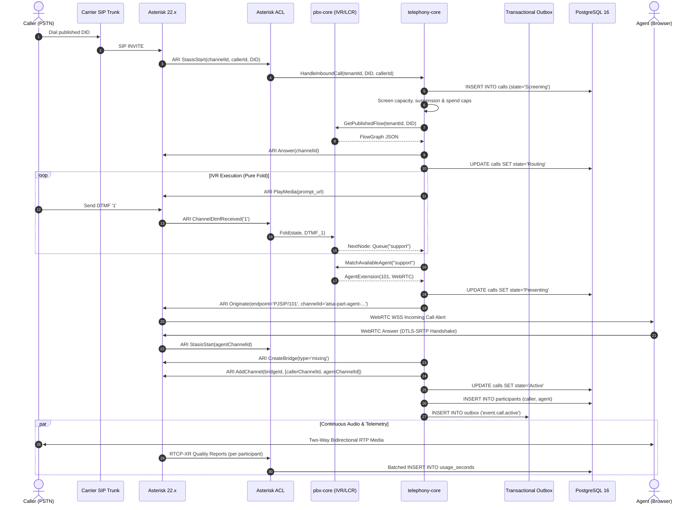
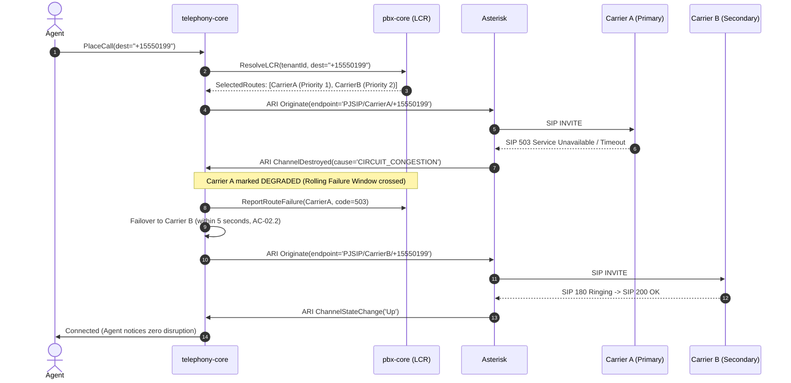
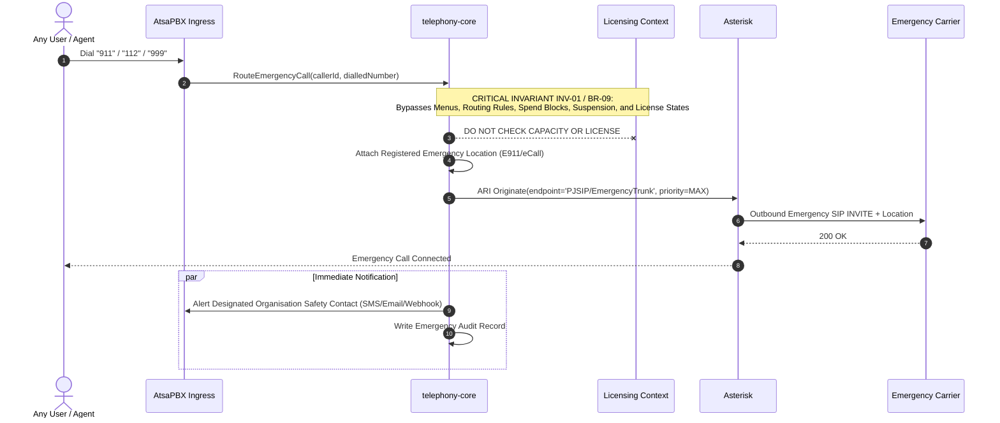

<!-- OpenSpec: TRD-HLD-03 -->
# System Context & Interfaces

## 1. System Context (C4 Level 1 & 2)

AtsaPBX operates as a self-hosted or partner-hosted software solution. It connects human users, physical IP devices, carrier telecommunications networks, external AI engines, and partner back-office platforms.

```text
                                +---------------------------------------------------------+
                                |                      HUMAN ACTORS                       |
                                |  ┌──────────────────────┐    ┌───────────────────────┐  |
                                |  │ Tenant User / Agent  │    │ Partner Admin / Eng   │  |
                                |  │ (WebRTC Browser App) │    │ (Console / CLI)       │  |
                                |  └──────────┬───────────┘    └──────────┬────────────┘  |
                                +-------------┼───────────────────────────┼---------------+
                                              │                           │
                                    WSS / DTLS-SRTP            HTTPS / ConnectRPC
                                              │                           │
                                              ▼                           ▼
+───────────────────────────────────────────────────────────────────────────────────────────────────────────────────+
|                                           AtsaPBX Platform Boundary                                               |
|                                                                                                                   |
|   ┌─────────────────────────────────────────────────┐       ┌─────────────────────────────────────────────────┐   |
|   │               AtsaPBX Edge Gateway              │       │          AtsaPBX Core API Monolith              │   |
|   │  - TLS 1.3 Termination (TCP 443)                │       │  - ConnectRPC Handlers (gRPC & HTTP/JSON)       │   |
|   │  - WSS WebRTC Signalling Gateway                │<─────>│  - Tenant Auth & RBAC Middleware                │   |
|   │  - Desk-phone Provisioning Server (HTTPS)       │       │  - Bounded Context Domains & State Machines     │   |
|   └────────────────────────┬────────────────────────┘       │  - Transactional Outbox Worker                  │   |
|                            │                                └─────────┬─────────────────────────────┬─────────┘   |
|                            │ ARI REST & WS Control                    │ SQL (pgx + RLS)             │             |
|                            ▼                                          ▼                             │             |
|   ┌─────────────────────────────────────────────────┐       ┌──────────────────┐                    │             |
|   │            Asterisk 22.x LTS Media Engine       │       │  PostgreSQL 16   │                    │             |
|   │  - PJSIP SIP/TLS (5061) & UDP RTP (10000-20000) │       │  - Tenancy RLS   │                    │             |
|   │  - WebSockets & DTLS-SRTP Media Termination     │       │  - Flow Graphs   │                    │             |
|   │  - Audio Bridges, Recording & Snoop/AudioFork   │       │  - Outbox Table  │                    │             |
|   └───────────────┬─────────────────┬───────────────┘       └──────────────────┘                    │             |
|                   │                 │ Audio Snoop (Out-of-band)                                     │             |
|                   │ RTP/SRTP        ▼                                                               │             |
|                   │        ┌────────────────────────┐       ┌──────────────────┐                    │             |
|                   │        │ AI Pipeline Adapter    │       │ NATS JetStream   │<───────────────────┘             |
|                   │        │ (Buffer, VAD, Workers) │       │ (Async Events)   │       Durable Pub/Sub    |
|                   │        └────────┬───────────────┘       └────────┬─────────┘                          |
|                   │                 │                                │                                    |
+───────────────────┼─────────────────┼────────────────────────────────┼────────────────────────────────────+
                    │                 │ gRPC Streaming                 │
                    ▼                 ▼                                ▼
       +──────────────────────+  +──────────────────────+  +─────────────────────────+
       |   BYOT SIP Trunks    |  | External AI Engines  |  | Partner Back-Office     |
       |  (Carrier SIP/TLS,   |  | (Self-hosted Whisper/|  | (Billing, CRM, ERP      |
       |   SRTP/RTP G.711/Opus|  |  Ollama, OpenAI,     |  |  Webhooks & ConnectRPC  |
       |   Public Ingress)    |  |  Deepgram)           |  |  Event Subscriptions)   |
       +──────────────────────+  +──────────────────────+  +─────────────────────────+
```

---

## 2. Network Boundaries & Protocols

| Boundary / Interface | Protocol & Transport | Network Zone | Authentication & Security | Invariant / Rule |
|---|---|---|---|---|
| **WebRTC Softphone** | WSS (Signalling), DTLS 1.2 / SRTP (Media) | Public Internet / Corporate LAN | Short-lived tenant-scoped JWT; ephemeral SRTP keys | BR-01, BR-02, FBR-R1-01 |
| **Desk Phone (SIP)** | SIP over TLS (TCP 5061), SRTP (UDP) | Corporate Voice VLAN | Digest auth with unique per-device password; mTLS option | FBR-R1-02, AC-03.5 |
| **Desk Phone (Prov)** | HTTPS (TCP 443 / 8443) | Corporate LAN | HTTP Basic + Client MAC validation; encrypted XML config | FBR-R1-02, AC-03.5 |
| **Carrier SIP Trunks** | SIP over TLS/UDP, SRTP/RTP (UDP) | Public Internet / Direct Interconnect | IP ACL + SIP Digest; TLS cert validation | BR-02, FBR-R1-03 |
| **Public API / Admin** | ConnectRPC (HTTP/2 & HTTP/1.1 JSON) | Public Internet / Partner VPN | Tenant API Keys (SHA-256) or User Bearer JWT | BR-15, BR-16, FBR-R1-11 |
| **Partner Webhooks** | Outbound HTTPS POST | Public Internet | HMAC-SHA256 signature in header, replay nonce | INV-06, AC-05.3 |
| **AI Audio Stream** | gRPC / WebSocket over TLS | Private VPC / Public Egress | Partner-supplied credentials stored in Vault | D-05, D-23, INV-04 |
| **Asterisk Control** | ARI (HTTP REST + WS), AMI (TCP) | Private Container Network | Fixed internal token, localhost / private bridge only | D-15, D-16 |
| **PostgreSQL 16** | PostgreSQL Wire Protocol (TLS) | Private Container Network | Scoped app user, `SET LOCAL app.tenant_id` RLS | BR-01, FBR-R1-04 |
| **NATS JetStream** | NATS Protocol (TCP 4222) | Private Container Network | User/token auth; internal service communication only | D-23 |

---

## 3. Trust Boundaries & Encryption Demarcation (BR-02, D-15)

### 3.1 Media Encryption Demarcation

AtsaPBX terminates media encryption at the Asterisk media engine:
- **Browser-to-Asterisk:** Secured via DTLS-SRTP (WebRTC mandatory).
- **Asterisk-to-Carrier:** Secured via SIP/TLS and SRTP when supported by the partner's carrier.

> [!IMPORTANT]
> **Accepted Architectural Limitation (DECISIONS §Known limitations):**
> AtsaPBX terminates encryption when bridging audio between WebRTC browsers and PSTN trunks. The platform **is not end-to-end encrypted from browser to PSTN phone number** and must never be sold as such. Terminating media inside Asterisk is what makes call mixing, recording governance, RTCP-XR quality analysis, and optional AI audio snooping technically possible.

### 3.2 AI Audio Snoop Demarcation (D-23, INV-04, BR-14)

Audio sent to AI providers uses an Asterisk out-of-band Snoop channel (`ARI /channels/{channelId}/snoop` with `spy=in` or `spy=out` or `spy=both`).
- The snoop channel receives an isolated copy of RTP frames.
- Slow or unresponsive AI consumers cause frame buffers in the Go AI adapter to drop silently (`tail-drop`).
- Under no circumstances does the AI snoop channel backpressure the Asterisk bridge or delay the primary RTP media path.

---

## 4. Multi-Actor Scenario Traces (PRD §12)

### 4.1 Inbound Call via Visual IVR to WebRTC Agent (PRD §12.1)



### 4.2 Carrier Failover during Outbound Dialling (PRD §12.2, EPIC-02)



### 4.3 Emergency Call Bypass (PRD §12.3, INV-01, BR-09)



---

## 5. Verification & Interface Acceptance

1. **Protocol Compliance Test:** Automated SIP test tool (e.g. SIPp) validates that incoming SIP INVITEs receive standard SIP response codes (`100 Trying`, `180 Ringing`, `200 OK`, `503 Service Unavailable`).
2. **Audio Isolation Test:** Verifies that under zero-load and full-load conditions, starting or terminating an AI snoop stream causes less than 1 ms jitter variation on the primary RTP bridge.
3. **Carrier Failover Verification:** Simulates network drop on Carrier A; verifies that new call setup switches to Carrier B in under 5 seconds (AC-02.2) and active calls on Carrier B continue unaffected.


