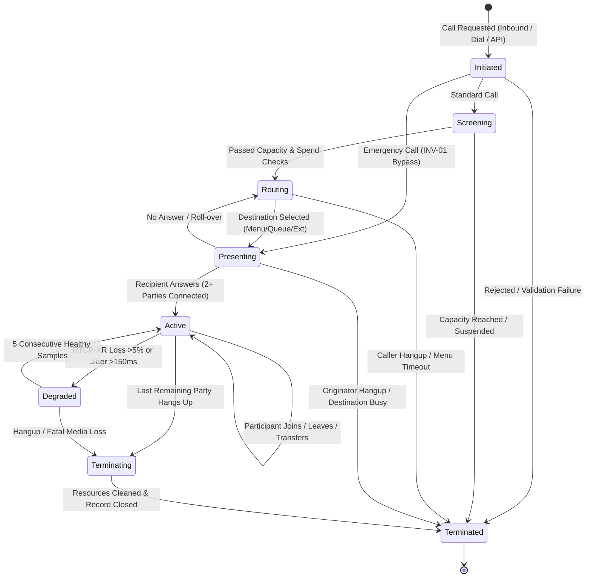

<!-- OpenSpec: TRD-HLD-04 -->
# Domain Model & State Machines

## 1. Primary Aggregate: Participant, Not Channel (D-17, D-18, D-32)

In AtsaPBX, telephony is modeled around persistent business concepts, not transient engine resources.

- **`Call` Aggregate Root:** Represents a logical communication session belonging to a tenant. It contains metadata, overall lifecycle state, and a child collection of N `CallParticipant` entities. A Call is **never modeled as fixed "caller" and "agent" columns** (D-18); this enables conference calls, supervisor monitoring (R2), and multi-party specialist translation (R3) without schema redesign.
- **`CallParticipant` Entity:** Represents one party's participation in a Call (customer, employee, IVR bot, queue waiting slot, supervisor coach, or language specialist). The Participant has a stable identity (`participant_id`) that persists across holds, mutes, transfers, and bridge migrations.
- **`ChannelHistory` (Internal ACL Entity):** Append-only audit mapping of Asterisk channel IDs (`PJSIP/carrier-000001a`) to `participant_id`. If an attended transfer replaces Asterisk channels mid-conversation, the ACL closes one `ChannelHistory` record and opens another while the `CallParticipant`'s identity and billable duration continue unbroken.
- **Asterisk Channel ID Containment:** Channel IDs are strictly isolated infrastructure details. They are **never stored in domain tables, never exposed in APIs, and never present in webhook payloads** (TRD §Extensibility seams).

```text
+-------------------------------------------------------------------------+
|                              Call Aggregate                             |
|  - call_id: UUID                                                        |
|  - tenant_id: UUID                                                      |
|  - direction: Inbound | Outbound | Internal                             |
|  - state: Initiated | Screening | Routing | Presenting |                |
|           Active | Degraded | Terminating | Terminated                  |
|  - started_at, answered_at, ended_at: Timestamp                         |
|  - participants: []CallParticipant                                      |
+-------------------------------------------------------------------------+
                                   │ 1..N
                                   ▼
+-------------------------------------------------------------------------+
|                          CallParticipant Entity                         |
|  - participant_id: UUID                                                 |
|  - tenant_id: UUID                                                      |
|  - role: Caller | Agent | IVR | Queue | Supervisor | Specialist | AI    |
|  - endpoint_uri: string (e.g. "sip:101@tenant.atsapbx", "tel:+15550100")|
|  - state: Invited | Ringing | Connected | OnHold | Transferring | Left  |
|  - joined_at, answered_at, left_at: Timestamp                           |
|  - billable_seconds: int                                                |
+-------------------------------------------------------------------------+
       │ 1..N (Internal ACL only)                 │ 1..N
       ▼                                          ▼
+-----------------------------+     +-------------------------------------+
|       ChannelHistory        |     |             UsageSecond             |
| - id: bigint                |     | - participant_id: UUID (PK)         |
| - participant_id: UUID      |     | - second: Timestamp (PK)            |
| - channel_ref: bytea (enc)  |     | - call_id: UUID                     |
| - bridge_id: string         |     | - direction, carrier_id, rate       |
| - event_type: string        |     | - quality: MOS, Jitter, PacketLoss  |
| - observed_at: Timestamp    |     | - ai_streamed: boolean              |
+-----------------------------+     +-------------------------------------+
```

---

## 2. State Machines

### 2.1 Call Lifecycle State Machine (PRD §11.1)



| State | Entry Condition | Valid Next States | What is Experienced | Functional Invariants & Restrictions |
|---|---|---|---|---|
| **Initiated** | Call setup requested (inbound SIP INVITE, user dial, or API originate) | Screening, Terminated, Presenting (Emergency) | Caller hears setup tone; agent sees "Connecting" | Not billable. No recording. No AI streaming. |
| **Screening** | Capacity, spend cap, fraud, and compliance verification | Routing, Terminated | Imperceptible (<50 ms) | **Emergency calls skip Screening entirely (INV-01).** External media not bridged until passed. |
| **Routing** | Destination being determined (IVR menu, business hours, queue match) | Presenting, Terminated | Caller hears greeting, announcement, or music | Menu interaction allowed. Not yet billable to customer. |
| **Presenting** | Destination endpoint alerted (WebRTC ringing, SIP phone alerting) | Active, Routing (roll-over), Terminated | Caller hears ringback; recipient's handset alerts | Alerting timeout bounded (default 20s). |
| **Active** | Two or more participants bridged with bidirectional audio | Degraded, Active (participant change), Terminating | Full conversation | **Billable time accrues per participant.** Recording and AI streaming permitted. **Never terminated by commercial condition (INV-03).** |
| **Degraded** | RTCP-XR packet loss >5% or jitter >150ms | Active (recovery), Terminating | Poorer audio; supervisor flagged | AI streaming paused. Recording continues. **Never terminated due to degradation alone.** |
| **Terminating** | Participant hangs up or final party leaves bridge | Terminated | Call tear-down | Recording finalizes. No new participants may join. |
| **Terminated** | All channels destroyed, bridge closed, record sealed | — | Call appears in history | **Record becomes immutable.** Billable durations finalized. Outbox usage events emitted. |

### 2.2 Participant Lifecycle State Machine

Each `CallParticipant` executes its own lifecycle independently of the parent Call:

```text
[Invited] ──> [Ringing] ──> [Connected] ──> [OnHold] ──> [Connected] ──> [Disconnected]
                                 │                            ▲
                                 └──> [Transferring] ─────────┘
```

1. **`Invited`:** Participant created, endpoint resolution in progress.
2. **`Ringing`:** Destination alerted (SIP 180 Ringing received).
3. **`Connected`:** Audio bridged. Billable timer starts.
4. **`OnHold`:** Participant placed on hold (MOH stream bridged). Participant remains billable.
5. **`Transferring`:** Attended transfer in progress. Handover channels negotiating.
6. **`Disconnected`:** Participant left the call. Billable timer stops. Record locked.

> [!NOTE]
> **Participant Independence Rule (PRD §11.1):**
> A participant joining (e.g. supervisor barge-in) or leaving (e.g. agent transfers caller to another queue) causes a participant state transition, **not a Call lifecycle transition**. The Call remains in `Active` as long as at least one active participant connection exists.

---

## 3. T-5 Identity Transfer ACL (DECISIONS D-17, D-19, PRD T-5)

When a call is transferred (blind or attended), Asterisk creates new channels and merges bridges. The ACL preserves continuous participant identity:

```text
1. Initial State:
   Call A: [Participant 1 (Caller)] <── Bridge 100 ──> [Participant 2 (Agent A)]
            └─ Channel: PJSIP/car-01                    └─ Channel: PJSIP/agent-01

2. Agent A initiates Attended Transfer to Agent B:
   - Agent A puts Participant 1 OnHold (Participant 1 bridged to MOH).
   - Agent A originates consultation call to Agent B:
     Call B (Internal): [Participant 3 (Agent A)] <── Bridge 200 ──> [Participant 4 (Agent B)]
                         └─ Channel: PJSIP/agent-01-cons             └─ Channel: PJSIP/agent-02

3. Agent A Completes Transfer:
   - ACL receives Asterisk BridgeMerge / ARI ChannelMove.
   - ACL moves Channel PJSIP/agent-02 into Bridge 100.
   - ACL records ChannelHistory entry for Participant 2: channel replaced with PJSIP/agent-02.
   - Participant 1 takes off hold.
   - Call B is Terminated.
   - Participant 1 and Participant 2 remain the SAME domain entities in Call A.
   - Resulting State:
     Call A: [Participant 1 (Caller)] <── Bridge 100 ──> [Participant 2 (Now Agent B)]
              └─ Channel: PJSIP/car-01                    ├─ ChannelHistory 1: PJSIP/agent-01 (Closed)
                                                          └─ ChannelHistory 2: PJSIP/agent-02 (Active)
```

The billable duration for Participant 1 and Participant 2 continues unbroken. Usage is never split into multiple calls, and double-billing is prevented.

---

## 4. IVR and Call-Flow as Data Engine (D-22)

In accordance with Architecture Decision D-22, IVR and call flows are **not procedural code or dialplan scripts**. They are directed node graphs stored in PostgreSQL JSONB and executed by a pure fold function in application code.

### 4.1 Node Graph Schema

```json
{
  "flow_id": "9b1deb4d-3b7d-4bad-9bdd-2b0d7b3dcb6d",
  "version": 3,
  "entry_node_id": "node-1",
  "nodes": [
    {
      "id": "node-1",
      "type": "play_prompt",
      "config": { "prompt_uri": "s3://prompts/welcome.wav" },
      "transitions": { "completed": "node-2" }
    },
    {
      "id": "node-2",
      "type": "menu_input",
      "config": {
        "timeout_seconds": 5,
        "max_digits": 1,
        "valid_digits": ["1", "2"]
      },
      "transitions": {
        "dtmf_1": "node-support-queue",
        "dtmf_2": "node-sales-queue",
        "timeout": "node-timeout-handler",
        "invalid": "node-invalid-handler"
      }
    },
    {
      "id": "node-support-queue",
      "type": "queue",
      "config": { "queue_id": "q-tech-support", "strategy": "round_robin" },
      "transitions": { "timeout": "node-voicemail", "overflow": "node-escalation" }
    }
  ]
}
```

### 4.2 Pure Fold Execution Model

Execution is modeled as:
$$\text{Fold}(\text{CurrentNode}, \text{FlowState}, \text{TelephonyEvent}) \to (\text{NextNode}, \text{NewFlowState}, []\text{TelephonyCommands})$$

- **Inputs:** Current node configuration, current flow variables (e.g. digits entered, retry count), and incoming telephony event (`DTMFReceived`, `PlaybackFinished`, `QueueTimeout`).
- **Outputs:** Next target node ID, updated state variables, and list of commands for the Asterisk ACL (`PlayMedia`, `Answer`, `BridgeToQueue`, `Hangup`).
- **Purity:** The fold function contains zero I/O and zero database calls. It is completely unit-testable in milliseconds.

---

## 5. Comprehensive Relational Schema (PostgreSQL 16)

Every table has `tenant_id` and PostgreSQL Row-Level Security (`RLS`) enabled.
This section is authoritative; [17-data-model-erd.md](17-data-model-erd.md)
draws these same tables as entity-relationship diagrams, including the
ACL projection tables that D-47 added and that Asterisk — not the
domain — owns the shape of.

```sql
-- Core Tenancy & Principals
CREATE TABLE IF NOT EXISTS tenants (
    id UUID PRIMARY KEY DEFAULT gen_random_uuid(),
    name VARCHAR(255) NOT NULL,
    status VARCHAR(50) NOT NULL DEFAULT 'ACTIVE',
    residency_zone VARCHAR(50) NOT NULL DEFAULT 'EU',
    created_at TIMESTAMPTZ NOT NULL DEFAULT NOW(),
    updated_at TIMESTAMPTZ NOT NULL DEFAULT NOW()
);

CREATE TABLE IF NOT EXISTS principals (
    id UUID PRIMARY KEY DEFAULT gen_random_uuid(),
    tenant_id UUID NOT NULL REFERENCES tenants(id),
    username VARCHAR(100) NOT NULL,
    email VARCHAR(255) NOT NULL,
    password_hash VARCHAR(255) NOT NULL, -- Argon2id (LLD-02 §5.3 params), never plaintext (INV-11)
    role VARCHAR(50) NOT NULL DEFAULT 'AGENT',
    status VARCHAR(50) NOT NULL DEFAULT 'ACTIVE',
    created_at TIMESTAMPTZ NOT NULL DEFAULT NOW(),
    UNIQUE(tenant_id, username)
);

CREATE TABLE IF NOT EXISTS role_bindings (
    principal_id UUID NOT NULL REFERENCES principals(id) ON DELETE CASCADE,
    tenant_id UUID NOT NULL REFERENCES tenants(id),
    role VARCHAR(50) NOT NULL,
    scope VARCHAR(100) NOT NULL DEFAULT 'tenant', -- "tenant" or "department:<id>"
    created_at TIMESTAMPTZ NOT NULL DEFAULT NOW(),
    PRIMARY KEY (principal_id, role, scope)
);

CREATE TABLE IF NOT EXISTS api_keys (
    id UUID PRIMARY KEY DEFAULT gen_random_uuid(),
    tenant_id UUID NOT NULL REFERENCES tenants(id),
    principal_id UUID NOT NULL REFERENCES principals(id) ON DELETE CASCADE,
    key_hash VARCHAR(64) NOT NULL, -- SHA-256 hex digest; raw key shown once at creation
    expires_at TIMESTAMPTZ,
    revoked_at TIMESTAMPTZ,
    created_at TIMESTAMPTZ NOT NULL DEFAULT NOW()
);

-- Call & Participant Aggregates
CREATE TABLE IF NOT EXISTS calls (
    id UUID PRIMARY KEY DEFAULT gen_random_uuid(),
    tenant_id UUID NOT NULL REFERENCES tenants(id),
    direction VARCHAR(20) NOT NULL, -- INBOUND, OUTBOUND, INTERNAL
    state VARCHAR(50) NOT NULL,    -- Initiated, Screening, Routing, Presenting, Active, Degraded, Terminating, Terminated
    source_number VARCHAR(100) NOT NULL,
    dest_number VARCHAR(100) NOT NULL,
    started_at TIMESTAMPTZ NOT NULL DEFAULT NOW(),
    answered_at TIMESTAMPTZ,
    ended_at TIMESTAMPTZ,
    route_id UUID,
    recording_consent BOOLEAN NOT NULL DEFAULT FALSE,
    termination_reason VARCHAR(100),
    created_at TIMESTAMPTZ NOT NULL DEFAULT NOW()
);

CREATE TABLE IF NOT EXISTS call_participants (
    id UUID PRIMARY KEY DEFAULT gen_random_uuid(),
    tenant_id UUID NOT NULL REFERENCES tenants(id),
    call_id UUID NOT NULL REFERENCES calls(id) ON DELETE CASCADE,
    role VARCHAR(50) NOT NULL,     -- CALLER, AGENT, IVR, QUEUE, SUPERVISOR, SPECIALIST, AI
    endpoint_uri VARCHAR(255) NOT NULL,
    state VARCHAR(50) NOT NULL,    -- Invited, Ringing, Connected, OnHold, Transferring, Disconnected
    joined_at TIMESTAMPTZ NOT NULL DEFAULT NOW(),
    answered_at TIMESTAMPTZ,
    left_at TIMESTAMPTZ,
    billable_seconds INTEGER NOT NULL DEFAULT 0,
    created_at TIMESTAMPTZ NOT NULL DEFAULT NOW()
);

-- Asterisk Anti-Corruption Layer (Internal Infrastructure Mapping)
CREATE TABLE IF NOT EXISTS channel_history (
    id BIGSERIAL PRIMARY KEY,
    tenant_id UUID NOT NULL REFERENCES tenants(id),
    participant_id UUID NOT NULL REFERENCES call_participants(id) ON DELETE CASCADE,
    channel_ref BYTEA NOT NULL,    -- Encrypted Asterisk Channel ID string
    bridge_id VARCHAR(100) NOT NULL,
    node_id VARCHAR(50) NOT NULL,
    event_type VARCHAR(50) NOT NULL,
    observed_at TIMESTAMPTZ NOT NULL DEFAULT NOW()
);

-- Per-Participant, Per-Second Usage Ledger (Seam for R3 Margin Ledger)
CREATE TABLE IF NOT EXISTS usage_seconds (
    tenant_id UUID NOT NULL REFERENCES tenants(id),
    participant_id UUID NOT NULL REFERENCES call_participants(id) ON DELETE CASCADE,
    call_id UUID NOT NULL REFERENCES calls(id) ON DELETE CASCADE,
    second_ts TIMESTAMPTZ NOT NULL,
    direction VARCHAR(20) NOT NULL,
    carrier_id UUID,
    cost_micros BIGINT NOT NULL DEFAULT 0,
    revenue_micros BIGINT NOT NULL DEFAULT 0,
    quality_mos NUMERIC(3, 2) NOT NULL DEFAULT 4.50,
    quality_jitter NUMERIC(6, 2) NOT NULL DEFAULT 0.0,
    quality_loss NUMERIC(5, 2) NOT NULL DEFAULT 0.0,
    ai_streamed BOOLEAN NOT NULL DEFAULT FALSE,
    PRIMARY KEY (participant_id, second_ts)
);

-- Carrier Connectivity & LCR
CREATE TABLE IF NOT EXISTS carrier_trunks (
    id UUID PRIMARY KEY DEFAULT gen_random_uuid(),
    tenant_id UUID NOT NULL REFERENCES tenants(id),
    name VARCHAR(100) NOT NULL,
    host VARCHAR(255) NOT NULL,
    port INTEGER NOT NULL DEFAULT 5060,
    credentials_ref VARCHAR(255),
    channel_limit INTEGER NOT NULL DEFAULT 100,
    priority INTEGER NOT NULL DEFAULT 1,
    health_status VARCHAR(50) NOT NULL DEFAULT 'HEALTHY',
    created_at TIMESTAMPTZ NOT NULL DEFAULT NOW()
);

CREATE TABLE IF NOT EXISTS carrier_routes (
    id UUID PRIMARY KEY DEFAULT gen_random_uuid(),
    tenant_id UUID NOT NULL REFERENCES tenants(id),
    prefix_pattern VARCHAR(50) NOT NULL,
    trunk_id UUID NOT NULL REFERENCES carrier_trunks(id),
    cost_rate_per_min BIGINT NOT NULL DEFAULT 0,
    priority INTEGER NOT NULL DEFAULT 1,
    created_at TIMESTAMPTZ NOT NULL DEFAULT NOW()
);

-- Extensions & PBX Core
CREATE TABLE IF NOT EXISTS extensions (
    id UUID PRIMARY KEY DEFAULT gen_random_uuid(),
    tenant_id UUID NOT NULL REFERENCES tenants(id),
    extension_number VARCHAR(20) NOT NULL,
    display_name VARCHAR(100) NOT NULL,
    department_id UUID,
    -- Generated, and deliberately NOT derived from extension_number.
    auth_username VARCHAR(100) NOT NULL,
    -- MD5 HA1 — MD5(auth_username:realm:secret) — NOT Argon2id, and never
    -- the plaintext. Renamed from password_hash by LLD-03 §7.3: SIP digest
    -- authentication requires the server to hold the plaintext or the HA1,
    -- so a one-way slow hash cannot answer a challenge and the old name
    -- described something that cannot be built. Verified on Asterisk
    -- 22.8.2 — a ps_auths row with an empty password column and md5_cred
    -- set accepts a real REGISTER.
    secret_digest VARCHAR(32) NOT NULL,
    device_type VARCHAR(50) NOT NULL DEFAULT 'WEBRTC',
    created_at TIMESTAMPTZ NOT NULL DEFAULT NOW(),
    updated_at TIMESTAMPTZ NOT NULL DEFAULT NOW(),
    UNIQUE(tenant_id, extension_number)
);

-- Asterisk ACL projection (D-47). NOT domain tables: the ACL writes these
-- from `extensions` in the same transaction, and Asterisk reads them
-- directly through PJSIP Realtime — no file generation, no reload.
--
-- No tenant_id and NO row-level security, deliberately. Asterisk connects
-- as its own role and cannot set app.tenant_id, so a policy would hide
-- every row from the one reader that needs them. Isolation is by
-- construction instead: every id is "e_" + hex(extensions.id), so two
-- tenants' extension 1000 can never collide. The enforcement is the grant,
-- not a policy — see the asterisk_engine role below. This is a deliberate
-- exception to "every table has tenant_id", like licensing_state's, and is
-- asserted by test so it is never mistaken for an oversight.
CREATE TABLE IF NOT EXISTS ps_endpoints (
    id VARCHAR(255) PRIMARY KEY,
    transport VARCHAR(40),
    aors VARCHAR(255),
    auth VARCHAR(255),
    context VARCHAR(40),
    disallow VARCHAR(200),
    allow VARCHAR(200),
    direct_media VARCHAR(5)
);

CREATE TABLE IF NOT EXISTS ps_auths (
    id VARCHAR(255) PRIMARY KEY,
    auth_type VARCHAR(20),
    username VARCHAR(255),
    password VARCHAR(255), -- always NULL; the credential lives in md5_cred
    md5_cred VARCHAR(32),
    realm VARCHAR(255)
);

CREATE TABLE IF NOT EXISTS ps_aors (
    id VARCHAR(255) PRIMARY KEY,
    max_contacts INTEGER,
    remove_existing VARCHAR(5),
    qualify_frequency INTEGER
);

-- The one projection table Asterisk WRITES: a device registration creates
-- a contact row and the engine prunes it on expiry. Its column set must be
-- complete rather than the subset we read — Asterisk's INSERT names all
-- sixteen, and a missing one fails the write while the REGISTER still
-- returns 200 OK, so the device believes it is registered and nothing can
-- call it. Consequently the engine role holds INSERT/UPDATE/DELETE here
-- and read-only on the three tables above.
--
-- Mapping it makes registration state a plain database read, which is what
-- the console badge needs. It also makes registrations database state: a
-- restore leaves every device unreachable until it re-registers.
CREATE TABLE IF NOT EXISTS ps_contacts (
    id VARCHAR(255) PRIMARY KEY,
    uri VARCHAR(511),
    expiration_time BIGINT,
    qualify_frequency INTEGER,
    outbound_proxy VARCHAR(40),
    path TEXT,
    user_agent VARCHAR(255),
    endpoint VARCHAR(255),
    reg_server VARCHAR(255),
    authenticate_qualify VARCHAR(5),
    via_addr VARCHAR(40),
    via_port INTEGER,
    call_id VARCHAR(255),
    prune_on_boot VARCHAR(5),
    qualify_timeout NUMERIC(10,3),
    qualify_2xx_only VARCHAR(5)
);

-- The engine's database identity. Created by the Postgres bootstrap
-- script (deploy/postgres/init/02-atsapbx.sql) for the same reason
-- atsap_outbox_worker is — atsapbx_app is deliberately NOCREATEROLE — and
-- granted narrowly by api/migrations/0004 once the tables exist:
--     GRANT SELECT ON ps_endpoints, ps_auths, ps_aors TO asterisk_engine;
--     GRANT SELECT, INSERT, UPDATE, DELETE ON ps_contacts TO asterisk_engine;
-- and nothing else, ever. The asymmetry is deliberate: three tables are
-- ours to write and the engine only reads them; ps_contacts is the
-- engine's own. NOBYPASSRLS: it must never see a domain table,
-- so it has no reason to bypass a policy.

-- IVR Flow as Data
CREATE TABLE IF NOT EXISTS ivr_flows (
    id UUID PRIMARY KEY DEFAULT gen_random_uuid(),
    tenant_id UUID NOT NULL REFERENCES tenants(id),
    name VARCHAR(100) NOT NULL,
    published_version_id UUID,
    created_at TIMESTAMPTZ NOT NULL DEFAULT NOW()
);

CREATE TABLE IF NOT EXISTS flow_versions (
    id UUID PRIMARY KEY DEFAULT gen_random_uuid(),
    tenant_id UUID NOT NULL REFERENCES tenants(id),
    flow_id UUID NOT NULL REFERENCES ivr_flows(id) ON DELETE CASCADE,
    version_number INTEGER NOT NULL,
    status VARCHAR(50) NOT NULL DEFAULT 'DRAFT', -- DRAFT, PUBLISHED, ARCHIVED
    graph_json JSONB NOT NULL,
    created_at TIMESTAMPTZ NOT NULL DEFAULT NOW(),
    UNIQUE(flow_id, version_number)
);

-- Recording Governance & Cryptographic Envelope
CREATE TABLE IF NOT EXISTS recordings (
    id UUID PRIMARY KEY DEFAULT gen_random_uuid(),
    tenant_id UUID NOT NULL REFERENCES tenants(id),
    call_id UUID NOT NULL REFERENCES calls(id) ON DELETE CASCADE,
    participant_id UUID REFERENCES call_participants(id) ON DELETE CASCADE,
    storage_uri VARCHAR(500) NOT NULL,
    wrapped_dek BYTEA NOT NULL,
    consent_state VARCHAR(50) NOT NULL DEFAULT 'CONSENTED',
    duration_seconds INTEGER NOT NULL DEFAULT 0,
    sha256_hash VARCHAR(64) NOT NULL,
    deleted_at TIMESTAMPTZ,
    created_at TIMESTAMPTZ NOT NULL DEFAULT NOW()
);

-- Immutable Append-Only Audit Log
CREATE TABLE IF NOT EXISTS audit_logs (
    id BIGSERIAL PRIMARY KEY,
    tenant_id UUID NOT NULL REFERENCES tenants(id),
    actor_id UUID NOT NULL,
    actor_type VARCHAR(50) NOT NULL,
    action VARCHAR(100) NOT NULL,
    resource_type VARCHAR(50) NOT NULL,
    resource_id VARCHAR(100) NOT NULL,
    before_state JSONB,
    after_state JSONB,
    ip_address INET,
    created_at TIMESTAMPTZ NOT NULL DEFAULT NOW()
);

-- Licensing state: installation-scoped, not tenant-scoped (T-1 — one
-- license token per installed instance, not per tenant sub-account).
-- Deliberately has NO tenant_id column, so RLS does not and must not
-- apply here — the one exception to "every table has tenant_id" (D-24
-- seam 1), and it is an exception by construction, not an oversight.
-- Installation-scoped, deliberately: no tenant_id and no RLS (T-1, D-24
-- exception, asserted by test). One licence per installed instance.
--
-- signed_payload + signature are the ENTITLEMENT OF RECORD (D-53). They
-- are re-verified when loaded and cached in memory; verification never
-- happens in the call path (AC-06.3). Every column below them is a
-- denormalised cache for display and support, and is never read to
-- decide what this installation may do — the platform runs on the
-- partner's hardware, so a row that could be trusted could be edited.
-- A row failing verification degrades to the 4-call floor and is
-- reported as tampering (BRD §10.2/§10.6), never honoured.
CREATE TABLE IF NOT EXISTS licensing_state (
    instance_id UUID PRIMARY KEY,
    signed_payload BYTEA NOT NULL,
    signature BYTEA NOT NULL,
    fingerprint JSONB NOT NULL,
    edition VARCHAR(50) NOT NULL,        -- cache, see above
    capacity INTEGER NOT NULL,           -- cache
    max_tenants INTEGER NOT NULL,        -- cache; 1 = single, 0 = unlimited (D-51)
    max_extensions INTEGER NOT NULL,     -- cache; 0 = unlimited (D-49)
    entitlement_status VARCHAR(50) NOT NULL DEFAULT 'VALID',
    last_confirmed_at TIMESTAMPTZ NOT NULL DEFAULT NOW(),
    grace_started_at TIMESTAMPTZ
);

-- Per-tenant module enablement (D-50, LLD-11). Tenant-scoped with RLS
-- enabled AND forced, deliberately the opposite of licensing_state above:
-- entitlement is installation-wide, enablement is per tenant.
--
-- A row means "this tenant switched it on", never "this tenant is
-- allowed". Allowance is this row AND the installation's entitlement,
-- computed at read time — so a grant for a module the licence no longer
-- covers goes inert on its own and comes back if the licence is
-- restored, with no sweep or migration. Absence of a row is denial.
CREATE TABLE IF NOT EXISTS tenant_module_grants (
    tenant_id UUID NOT NULL REFERENCES tenants(id),
    module VARCHAR(64) NOT NULL,
    enabled_at TIMESTAMPTZ NOT NULL DEFAULT NOW(),
    enabled_by UUID NOT NULL REFERENCES principals(id),
    PRIMARY KEY (tenant_id, module)
);

ALTER TABLE tenant_module_grants ENABLE ROW LEVEL SECURITY;
ALTER TABLE tenant_module_grants FORCE ROW LEVEL SECURITY;
CREATE POLICY tenant_isolation_tenant_module_grants ON tenant_module_grants
    USING (tenant_id = current_setting('app.tenant_id')::uuid);

-- Transactional Outbox
CREATE TABLE IF NOT EXISTS outbox (
    id UUID PRIMARY KEY DEFAULT gen_random_uuid(),
    tenant_id UUID NOT NULL REFERENCES tenants(id),
    event_type VARCHAR(100) NOT NULL,
    aggregate_id UUID NOT NULL,
    payload JSONB NOT NULL,
    created_at TIMESTAMPTZ NOT NULL DEFAULT NOW(),
    published_at TIMESTAMPTZ
);

-- Row-Level Security Activation & Policies
-- FORCE (not just ENABLE) is required on every table: the app connects
-- as the role that OWNS these tables (its own migrations created them),
-- and PostgreSQL exempts a table's owner from its own RLS policies
-- unless FORCE ROW LEVEL SECURITY is also set. Confirmed by LLD-01's
-- RLS Isolation Test failing (silently returning rows) without FORCE.
ALTER TABLE calls ENABLE ROW LEVEL SECURITY;
ALTER TABLE calls FORCE ROW LEVEL SECURITY;
ALTER TABLE call_participants ENABLE ROW LEVEL SECURITY;
ALTER TABLE call_participants FORCE ROW LEVEL SECURITY;
ALTER TABLE channel_history ENABLE ROW LEVEL SECURITY;
ALTER TABLE channel_history FORCE ROW LEVEL SECURITY;
ALTER TABLE usage_seconds ENABLE ROW LEVEL SECURITY;
ALTER TABLE usage_seconds FORCE ROW LEVEL SECURITY;
ALTER TABLE carrier_trunks ENABLE ROW LEVEL SECURITY;
ALTER TABLE carrier_trunks FORCE ROW LEVEL SECURITY;
ALTER TABLE carrier_routes ENABLE ROW LEVEL SECURITY;
ALTER TABLE carrier_routes FORCE ROW LEVEL SECURITY;
ALTER TABLE extensions ENABLE ROW LEVEL SECURITY;
ALTER TABLE extensions FORCE ROW LEVEL SECURITY;
ALTER TABLE ivr_flows ENABLE ROW LEVEL SECURITY;
ALTER TABLE ivr_flows FORCE ROW LEVEL SECURITY;
ALTER TABLE flow_versions ENABLE ROW LEVEL SECURITY;
ALTER TABLE flow_versions FORCE ROW LEVEL SECURITY;
ALTER TABLE recordings ENABLE ROW LEVEL SECURITY;
ALTER TABLE recordings FORCE ROW LEVEL SECURITY;
ALTER TABLE audit_logs ENABLE ROW LEVEL SECURITY;
ALTER TABLE audit_logs FORCE ROW LEVEL SECURITY;
ALTER TABLE outbox ENABLE ROW LEVEL SECURITY;
ALTER TABLE outbox FORCE ROW LEVEL SECURITY;

CREATE POLICY tenant_isolation_calls ON calls
    FOR ALL USING (tenant_id = NULLIF(current_setting('app.tenant_id', true), '')::uuid);
CREATE POLICY tenant_isolation_participants ON call_participants
    FOR ALL USING (tenant_id = NULLIF(current_setting('app.tenant_id', true), '')::uuid);
-- channel_history is an ACL-owned table written inside the call's tenant
-- transaction; it needs the same isolation policy or a non-owner app role
-- would be denied every read/write (RLS enabled but no policy == no rows).
CREATE POLICY tenant_isolation_channel_history ON channel_history
    FOR ALL USING (tenant_id = NULLIF(current_setting('app.tenant_id', true), '')::uuid);
CREATE POLICY tenant_isolation_usage ON usage_seconds
    FOR ALL USING (tenant_id = NULLIF(current_setting('app.tenant_id', true), '')::uuid);
CREATE POLICY tenant_isolation_recordings ON recordings
    FOR ALL USING (tenant_id = NULLIF(current_setting('app.tenant_id', true), '')::uuid);
CREATE POLICY tenant_isolation_audit ON audit_logs
    FOR ALL USING (tenant_id = NULLIF(current_setting('app.tenant_id', true), '')::uuid);
CREATE POLICY tenant_isolation_outbox ON outbox
    FOR ALL USING (tenant_id = NULLIF(current_setting('app.tenant_id', true), '')::uuid);
```

> **Outbox worker and RLS (platform-role exception).** The transactional
> outbox worker (HLD `01-architecture.md` §3.2) must read rows across *all*
> tenants to publish each tenant's events, so it cannot run tenant-scoped.
> It connects with a dedicated **`BYPASSRLS` platform role granted read +
> update access to the `outbox` table only** (never to tenant domain tables).
> Tenant isolation (PRD INV-10) governs tenant-facing access; the outbox
> worker is platform infrastructure, not an interface any tenant reaches, and
> NATS subjects remain tenant-partitioned. Tenant-facing queries without
> `app.tenant_id` still fail closed. The exception must be granted narrowly
> and documented wherever the role is created.
>
> Tables enabled for RLS but without a policy above (`principals`,
> `role_bindings`, `api_keys`, `carrier_trunks`, `carrier_routes`,
> `extensions`, `ivr_flows`, `flow_versions`) gain their `tenant_isolation_*`
> policies in the migration owned by the LLD that introduces them — never
> ship an RLS-enabled table with no policy. `licensing_state` is the one
> table that never gains one: it has no `tenant_id` by design (see its
> own comment above).

---

## 6. Verification & Domain Invariant Tests

1. **Attended Transfer Continuity Test:** Simulates an attended transfer in Go test harness; asserts that Participant 1 and Participant 2 maintain unbroken timers, 2 ChannelHistory entries are created, and `usage_seconds` contains exactly continuous 1-second ticks without duplication or gaps.
2. **IVR Pure Fold Property Test:** Executes 10,000 synthetic random event sequences against an IVR flow graph; validates that state transitions are deterministic, no deadlocks occur, and all commands generated match schema.
3. **RLS Isolation Test:** Opens two concurrent DB sessions with `app.tenant_id` set to Tenant A and Tenant B; asserts that Tenant B sees exactly zero rows when querying Tenant A's calls, recordings, and audit logs.


