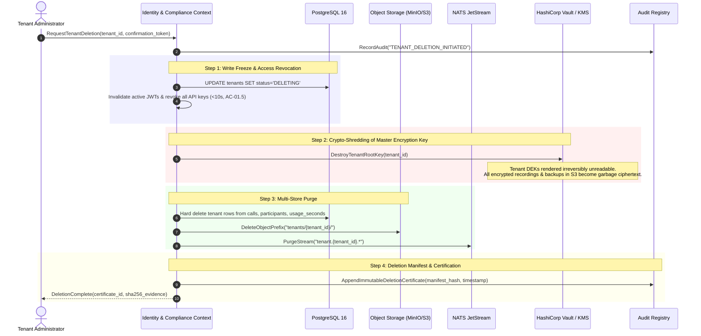

<!-- OpenSpec: TRD-HLD-06 -->
# Security, Isolation & Governance

## 1. Multi-Tenant Isolation Architecture (BR-01, FBR-R1-04, AC-01.1)

AtsaPBX enforces defense-in-depth tenant isolation across every layer of the platform:

```text
[Incoming ConnectRPC / REST / WSS Request]
                      │
                      ▼
[1. Authentication & Tenant Resolution Middleware]
  - Validates JWT signature (Ed25519 / RS256) or API Key hash (SHA-256)
  - Extracts claims: tenant_id, principal_id, roles, residency_zone
  - Enforces tenant status (ACTIVE vs SUSPENDED)
  - Injects immutable TenantContext into Go context.Context
                      │
                      ▼
[2. Application Layer / Bounded Contexts]
  - Handlers scope all command parameters to ctx.TenantID
  - In-memory caches are strictly partitioned by tenant_id
                      │
                      ▼
[3. Persistence Layer (PostgreSQL 16 RLS)]
  - Connection checked out from pool
  - Hook executes: SET LOCAL app.tenant_id = '<tenant_id>';
  - PostgreSQL Row-Level Security policies filter every SELECT, INSERT, UPDATE, DELETE
  - If app.tenant_id is unset or mismatched, query returns 0 rows (Fails Closed)
                      │
                      ▼
[4. Event & Storage Isolation]
  - NATS JetStream subjects scoped to tenant: tenant.<tenant_id>.*
  - MinIO / S3 object keys scoped: s3://bucket/tenants/<tenant_id>/...
  - Vault secrets scoped: secret/data/tenants/<tenant_id>/...
```

### 1.1 Tenant Context Invariants

1. **Zero Cross-Tenant Leakage (AC-01.1):** A user of Tenant A cannot see, reach, or infer the existence of Tenant B's data through any API response, search query, or error message (errors return generic `404 Not Found` rather than `403 Forbidden` for other-tenant resource IDs).
2. **Numbering Space Isolation (AC-01.2):** Extension numbers (e.g. `101`, `102`) and queue names are scoped to `tenant_id`. Overlapping extension numbers between different tenants never collide.
3. **Fail-Closed Guarantee:** Any repository query executed without an authenticated tenant context immediately aborts and logs a security violation.

---

## 2. T-9 Data Deletion & Crypto-Shredding (PRD T-9, BR-11)

In compliance with GDPR Article 17 ("Right to Erasure") and global data residency mandates, AtsaPBX implements a cryptographic deletion workflow that guarantees data becomes permanently unrecoverable across all replicas, search indices, and cold backups within the SLA window:



### 2.1 Backup Lifecycle & Residual Data

Database snapshots and cold storage backups inherently retain deleted rows until backup expiration. AtsaPBX guarantees zero residual exposure:
- All sensitive columns (call metadata, participant details, recording references) are encrypted at rest using tenant-specific keys wrapped by Vault.
- When the tenant key is destroyed in Vault (Crypto-Shredding), historical backups become cryptographically inaccessible without needing to restore, modify, and re-archive multi-terabyte backup media.

---

## 3. T-10 Recording Governance & Cryptographic Protection (PRD T-10, BR-03, BR-04, BR-15, EPIC-07)

```text
[Asterisk Recording Engine]
          │ (Raw PCM Audio)
          ▼
[Recording Stream Worker]
  - Generates Ephemeral AES-256 Data Encryption Key (DEK)
  - Streams encrypted chunks: AES-256-GCM (Authenticated Encryption)
  - Computes continuous SHA-256 checksum
          │
          ├──> Encrypted Audio (.bin) ──> MinIO / S3 Storage
          │
          └──> Wraps DEK with Tenant KMS Key via Vault Transit Engine
                    │
                    ▼
          Store in PostgreSQL:
          INSERT INTO recordings (
              id, tenant_id, call_id, storage_uri,
              wrapped_dek, sha256_hash, consent_state
          ) VALUES (...);
```

### 3.1 Governance & Compliance Policies

1. **Mandatory Consent Announcement Gate (BR-03, AC-07.1):** Where legal jurisdiction requires dual-party consent, the recording engine remains stopped while Asterisk plays the notification prompt. The Stasis controller verifies the `PlaybackFinished` event before issuing `ARI RecordChannel`.
2. **PCI-DSS Pause / Resume (AC-07.2):** When an agent enters card payment workflows, the agent UI triggers `PauseRecording`. The audio stream to the recording worker is replaced with zero-byte silence frames. Resuming verifies that the cardholder verification period has ended.
3. **Strict Access Audit (BR-04, AC-07.4):** Every playback or download request produces an immutable entry in `audit_logs` containing `actor_id`, `recording_id`, timestamp, and business reason. Staff have zero standing plaintext access.
4. **Short-Lived Playback Envelopes:** Audio playback uses pre-signed, short-lived URLs (TTL: 60 seconds) generated only after JWT authorization and consent policy evaluation.

---

## 4. Edge Security & Fraud Control (EPIC-08, BR-01, BR-05, BR-08)

### 4.1 Signaling & Network Hardening (AC-08.4, AC-08.5)

- **Topology Hiding:** Asterisk does not expose internal IP addresses, software version banners, or internal routing names in SIP headers (`User-Agent`, `Via`, `Server`).
- **Anonymous Signalling Refusal (BR-01):** Asterisk PJSIP rejects any inbound SIP request that does not match a configured carrier trunk IP ACL or possess valid SIP Digest credentials.
- **Port Minimization:** Edge servers expose only documented ingress points: TCP 443 (API & WSS WebRTC), TCP 5061 (SIP/TLS), and UDP 10000–20000 (RTP). Database, NATS, and management ports are strictly confined to the private network.

### 4.2 Rate Limiting & Spend Caps (AC-08.1, AC-08.2)

1. **Calls-Per-Second (CPS) Token Bucket:** Ingress call setups are rate-limited via a token bucket per tenant and per carrier trunk. Bursts beyond 150% of the provisioned CPS limit are delayed or rejected before Asterisk origination.
2. **Real-Time Spend Cap Engine:**
   - Every tenant and department can be assigned daily and monthly spend limits.
   - During the `Screening` lifecycle state, `compliance.EvaluateSpendCap()` checks current accrued cost plus pending rate against the cap.
   - If exceeded: new outbound calls are immediately blocked, an alert is dispatched within 60 seconds, and **calls currently in progress are allowed to finish naturally (AC-08.1, INV-03)**.
3. **Automated Toll-Fraud Anomaly Detection (AC-08.2):**
   - An anomaly detection worker monitors destination prefix frequencies.
   - If a tenant experiences a sudden spike in outbound call volume to high-cost international prefixes outside standard business hours, the system automatically suspends outbound calling for that tenant within 5 minutes.
   - An emergency incident is dispatched to the partner administrator with destination analysis and one-click reactivation.
4. **Destination Prefix Control:** Partner administrators define prefix whitelist/blacklist policies (e.g. blocking international satellite or premium 0900 ranges).

---

## 5. Verification & Security Acceptance Tests

1. **RLS Cross-Tenant Penetration Test:** Executes automated test suite with synthetic malicious queries attempting to access other tenant records using SQL injection, manipulated headers, and raw session variables; verifies 100% rejection rate.
2. **Crypto-Shredding Verification Test:** Purges a test tenant; verifies that the Vault DEK is destroyed and attempts to decrypt preserved recording chunks in S3 return cryptographic cipher errors.
3. **PCI-DSS Audio Verification Test:** Triggers pause recording during an automated WebRTC call; verifies by acoustic analysis of the stored recording that the paused interval contains zero decibel audio (pure silence).
4. **Fraud Anomaly Simulation Test:** Simulates 50 simultaneous outbound calls to premium-rate destinations outside business hours; verifies that automated tenant suspension triggers within 5 minutes (AC-08.2).


