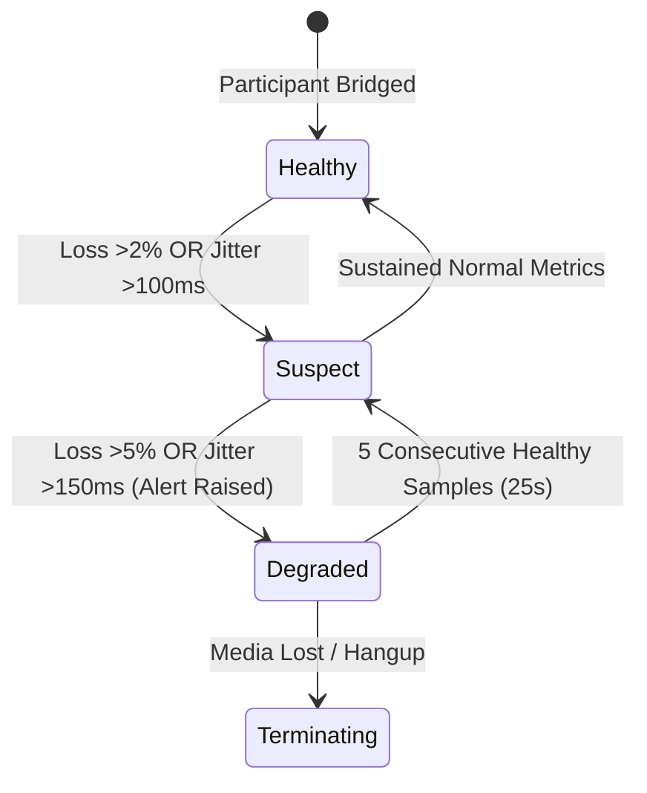

<!-- OpenSpec: TRD-HLD-08 -->
# Observability, Telemetry & Quality

## 1. T-11 Per-Participant Quality Measurement Architecture (PRD T-11, BRD FBR-R1-10)

To resolve partner billing disputes and carrier voice quality complaints within the mandatory **10-minute SLA** (AC-07.8, PRD §11), AtsaPBX measures voice quality on **100% of calls, for every participant**, rather than sampling.

```text
[Asterisk RTP Engine]
        │
        │ Periodic RTCP-XR Reports (RFC 3611, every 5s)
        ▼
[Asterisk Anti-Corruption Layer (ACL)]
        │ 1. Extracts: Jitter (ms), Loss (%), RTT (ms), Fraction Lost
        │ 2. Correlates Asterisk Channel -> ParticipantID
        ▼
[Quality Engine (telephony-core)]
        │ 1. Computes Mean Opinion Score (MOS, 1.00 - 5.00) via ITU-T G.107 E-Model
        │ 2. Evaluates Participant Quality State Machine
        │ 3. Batches 1-second ticks into usage_seconds table
        ▼
┌───────────────────────────────────────┬────────────────────────────────────────┐
│                                       │                                        │
▼                                       ▼                                        ▼
[PostgreSQL usage_seconds & CDR]       [Prometheus Voice Metrics]         [Live Telemetry Stream]
(Permanent dispute evidence)           (Alertmanager SLI/SLO)             (Agent & Supervisor UI)
```

### 1.1 ITU-T G.107 E-Model MOS Calculation

The quality engine calculates R-factor and MOS in real-time:
$$R = R_0 - I_s - I_d - I_e + A$$
$$\text{MOS} = 1 + 0.035 R + R(R - 60)(100 - R) \times 7 \times 10^{-6}$$

Where:
- $I_d$ is delay impairment (calculated from one-way latency + jitter buffer delay).
- $I_e$ is equipment impairment (derived from CODEC type — Opus vs G.711 — and burst packet loss).
- If calculated $R < 0 \implies \text{MOS} = 1.0$; if $R > 100 \implies \text{MOS} = 4.5$.

### 1.2 Quality State Machine



- **`Healthy`:** $\text{MOS} \ge 4.0$, packet loss $< 2\%$, jitter $< 100\text{ ms}$.
- **`Suspect`:** $\text{MOS } 3.5 - 3.9$, packet loss $2 - 5\%$, jitter $100 - 150\text{ ms}$.
- **`Degraded`:** $\text{MOS} < 3.5$, packet loss $> 5\%$, jitter $> 150\text{ ms}$.
  - Transition emits `event.call.degraded`.
  - Flags call in supervisor wallboards.
  - Pauses AI streaming features (INV-04) to conserve network bandwidth while preserving primary call audio.

---

## 2. Prometheus Metrics Catalog

All metric names follow standard Prometheus naming conventions. Metric label cardinality is strictly bounded (`tenant_id`, `direction`, `route_id`, `result`); high-cardinality values such as caller phone numbers are strictly prohibited (PRD T-11).

| Metric Name | Type | Labels | Description & SLO Threshold |
|---|---|---|---|
| `atsapbx_active_calls` | Gauge | `tenant_id, direction` | Count of currently active calls in bridge |
| `atsapbx_active_participants` | Gauge | `tenant_id, role` | Count of participants across all active calls |
| `atsapbx_call_attempts_total` | Counter | `tenant_id, destination_prefix, result` | Total inbound/outbound call setup attempts |
| `atsapbx_call_setup_duration_seconds` | Histogram | `tenant_id, route_id` | Call setup latency (SLO: P95 < 1.0s internal, < 1.5s external) |
| `atsapbx_rtcp_packet_loss_ratio` | Histogram | `tenant_id, direction` | RTP packet loss fraction (Warn: >0.02, Page: >0.05) |
| `atsapbx_rtcp_jitter_seconds` | Histogram | `tenant_id` | Jitter distribution (Warn: >0.100s, Page: >0.150s) |
| `atsapbx_rtcp_mos_score` | Histogram | `tenant_id` | Estimated MOS distribution (Target: P95 > 4.0) |
| `atsapbx_licensed_channels` | Gauge | `tenant_id` | Maximum concurrent channels licensed |
| `atsapbx_capacity_utilization_ratio` | Gauge | `tenant_id` | Active channels / Licensed channels (Alert at 0.80 and 1.00) |
| `atsapbx_outbox_queue_age_seconds` | Gauge | — | Age of oldest unpublished outbox row (Page: >30s) |
| `atsapbx_webhook_delivery_total` | Counter | `tenant_id, status` | Webhook attempts (`success`, `retrying`, `dlq`) |
| `atsapbx_ai_streamed_seconds_total` | Counter | `tenant_id, provider` | Total billable seconds streamed to external AI |

---

## 3. Structured Logging Specification (`slog`)

AtsaPBX uses Go `log/slog` emitting single-line JSON records to `stdout`:

```json
{
  "time": "2026-09-05T20:30:00.123Z",
  "level": "INFO",
  "service": "atsapbx-core",
  "tenant_id": "4a1d8212-32b0-4f5b-9d41-2a9bb4109121",
  "call_id": "9b1deb4d-3b7d-4bad-9bdd-2b0d7b3dcb6d",
  "participant_id": "b3e21820-2ef8-4791-bf92-6902263a0bfb",
  "correlation_id": "atsa-corr-992182",
  "trace_id": "4bf92f3577b34da6a3ce929d0e0e4736",
  "msg": "Participant answered and bridged to media",
  "role": "AGENT",
  "codec": "opus",
  "mos_initial": 4.38
}
```

### 3.1 PII & Secret Redaction Interceptor

The custom `slog.Handler` automatically redacts sensitive data:
- **Phone Numbers:** Masked in standard application logs (e.g. `+1555****0199`). Full unmasked numbers are stored only in tenant-isolated, encrypted database tables.
- **Tokens & Passwords:** Fields named `password`, `secret`, `api_key`, `token`, or `credential` are automatically replaced with `[REDACTED]`.
- **Zero Audio:** Audio payloads and transcript fragments are strictly barred from log lines.

---

## 4. Distributed Tracing (OpenTelemetry)

AtsaPBX instruments operations using OpenTelemetry (OTel) with W3C `traceparent` propagation:

```text
[HTTP/2 ConnectRPC Client] ──(traceparent: 00-4bf92...-01)──> [AtsaPBX Gateway]
                                                                      │
                                                     ┌────────────────┴────────────────┐
                                                     ▼                                 ▼
                                            [telephony-core Span]             [DB Transaction Span]
                                                     │                                 │
                                                     ▼                                 ▼
                                            [Asterisk ARI Span]               [Outbox Write Span]
                                         (Injects X-Atsa-TraceId)                      │
                                                                                       ▼
                                                                              [NATS Publish Span]
```

Spans cover ConnectRPC handler entry, tenant validation, database query execution, ARI channel origination, audio snoop initialization, and asynchronous webhook delivery.

---

## 5. Alertmanager Rules & Incident Triage

```yaml
groups:
  - name: atsapbx_alerts
    rules:
      - alert: HighCallSetupFailureRate
        expr: rate(atsapbx_call_attempts_total{result="failure"}[5m]) / rate(atsapbx_call_attempts_total[5m]) > 0.05
        for: 2m
        labels: { severity: critical }
        annotations:
          summary: "Call setup failure rate exceeds 5% on tenant {{ $labels.tenant_id }}"

      - alert: OutboxPublisherLagging
        expr: atsapbx_outbox_queue_age_seconds > 30
        for: 1m
        labels: { severity: page }
        annotations:
          summary: "Transactional outbox events delayed > 30s. NATS or publisher worker degraded."

      - alert: CarrierRouteDegraded
        expr: rate(atsapbx_call_attempts_total{result="carrier_timeout"}[5m]) > 3
        for: 1m
        labels: { severity: warning }
        annotations:
          summary: "Carrier route {{ $labels.route_id }} failing; auto-failover active."

      - alert: VoiceQualityDegraded
        expr: sum(atsapbx_rtcp_mos_score_bucket{le="3.5"}) / sum(atsapbx_rtcp_mos_score_count) > 0.05
        for: 3m
        labels: { severity: warning }
        annotations:
          summary: "More than 5% of active participants experiencing degraded voice quality."

      - alert: CapacityLimitExceeded
        expr: atsapbx_capacity_utilization_ratio >= 1.0
        for: 30s
        labels: { severity: warning }
        annotations:
          summary: "Tenant {{ $labels.tenant_id }} has reached 100% licensed channel capacity."
```

---

## 6. Verification & Observability Acceptance

1. **Telemetry Contract Test:** Asserts that every emitted log record, metric series, and trace span contains valid `tenant_id` and zero raw Asterisk channel identifiers.
2. **Quality Benchmark Simulation:** Feeds simulated RTCP-XR packet loss (6%) and jitter (160 ms) into the telephony core; verifies that the participant transitions to `Degraded` within 5 seconds, an alert is raised, and the Call aggregate marks `Degraded`.
3. **10-Minute Dispute Reconstruction Drill:** Given a synthetic `call_id` from 14 days prior, retrieves complete timeline (all participants, exact second-by-second MOS scores, packet loss samples, and route rule used) in under 2 seconds (AC-07.8).


