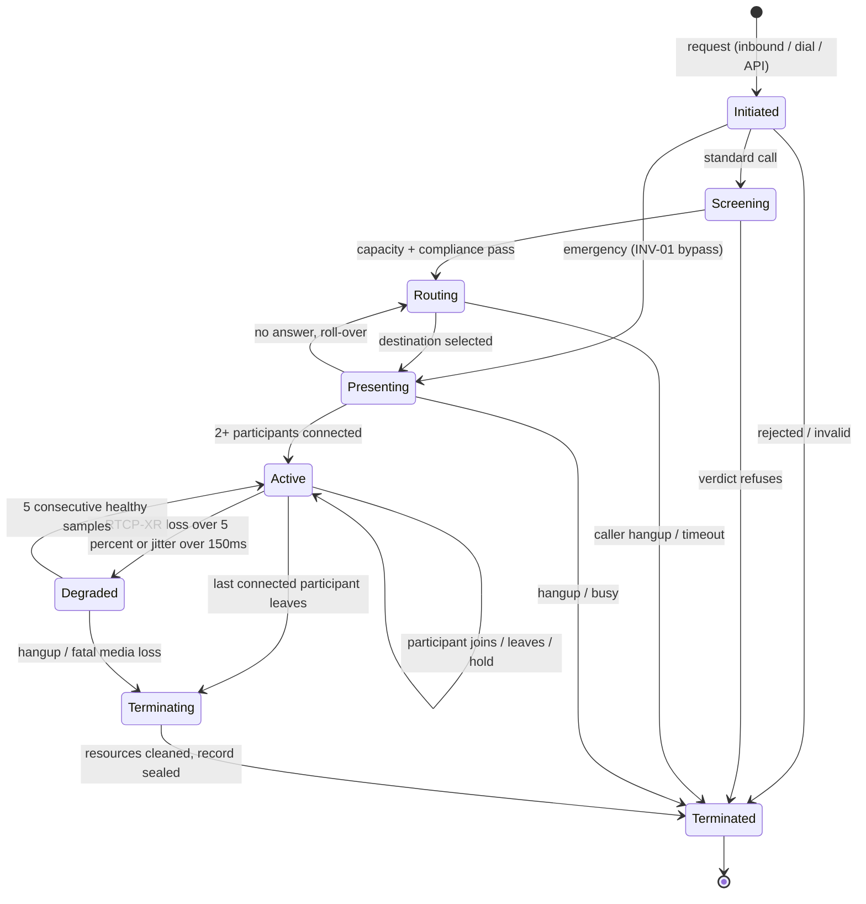
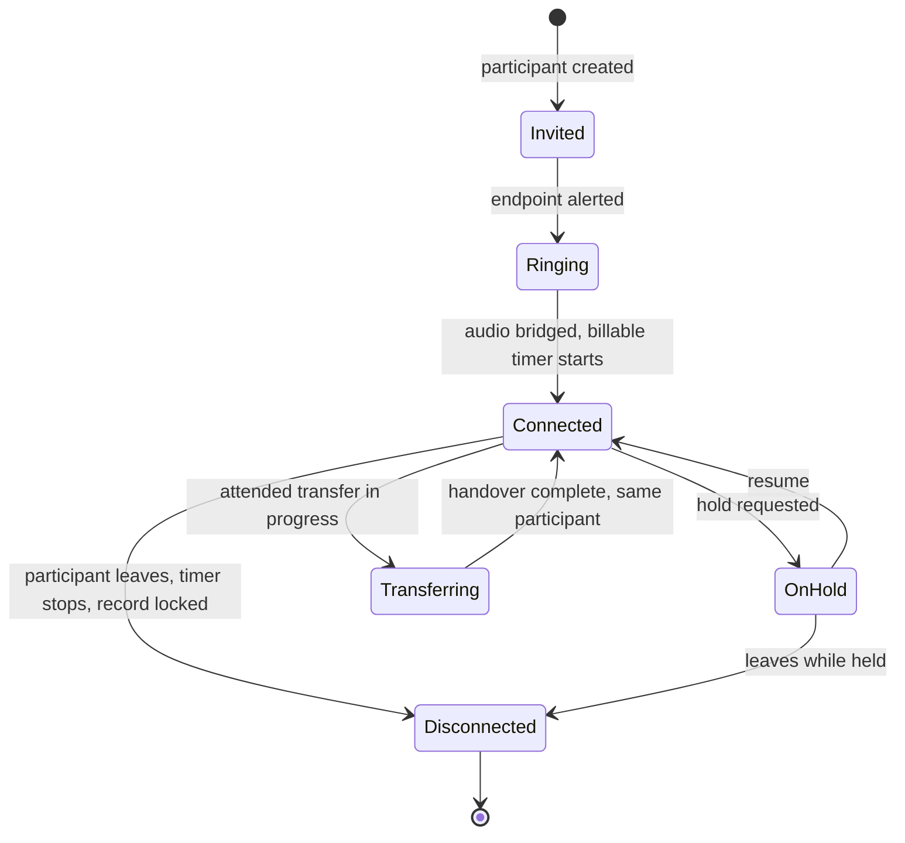

<!-- OpenSpec: TRD-HLD-17 -->
# Call Lifecycle State Machine

Visual companion to the authoritative state definitions in
[03-domain-model.md §2](03-domain-model.md#2-state-machines) and PRD §11.1.
This document visualizes and tabulates those states — it does not redefine
them. Where this file and [03](03-domain-model.md) disagree, [03](03-domain-model.md)
wins.

## 1. Design principles

- **Two-level model:** the `Call` has its own lifecycle; each
  `CallParticipant` has an independent sub-lifecycle. Participants joining
  or leaving never move the Call itself (PRD §11.1).
- **Two trigger families:** ARI WebSocket events (`StasisStart`,
  `ChannelStateChange`, `ChannelDestroyed`/`ChannelHangupRequest`) move
  participant and media-affecting call states; ConnectRPC commands
  (`InitiateCall`, `HoldParticipant`, `HangupCall`) request intent that the
  orchestrator validates before transitioning.
- **Ubiquitous language** (D-17/D-18/D-32): `CallParticipant` throughout;
  Asterisk channel IDs appear only inside the ACL (`channel_history`).

## 2. Call session states

## 3. Call transition matrix

| Current | Trigger source | Guard / condition | Action & side effects | Next |
|---|---|---|---|---|
| Initiated | ConnectRPC / inbound ARI | Request valid | INSERT `calls`;billable off, no recording, no AI stream | Screening (standard) / Presenting (emergency) / Terminated (invalid) |
| Screening | Ports (`LicenseManager`, `ComplianceEngine`) | Both verdicts permit | No external contact until pass | Routing / Terminated + reason |
| Routing | Orchestrator | Endpoint resolved | `channel_history` opened on originate | Presenting / Terminated |
| Presenting | ARI WS / timer | Answer within 20 s default | Participant `Ringing` → `Connected` | Active (2+ connected) / Routing (roll-over) / Terminated |
| Active | ARI WS / ConnectRPC | Conversation ongoing | Usage ticks per connected participant; recording/AI permitted; never ended by commercial state (INV-03); participant changes keep `Active` | Degraded / Terminating |
| Degraded | RTCP-XR sampling | Quality under threshold | AI features suspended; recording continues; no new participants; never terminated for degradation alone | Active / Terminating |
| Terminating | ARI WS / ConnectRPC | Last party leaving | Recording finalizes; joins refused | Terminated |
| Terminated | — | All parties gone, record sealed | Record immutable; billable durations final; usage events emitted | — (terminal) |

## 4. Participant sub-states

Notes:

- A transfer replaces Asterisk channels, never the participant: the ACL
  closes one `channel_history` row and opens another while identity and
  billable time continue unbroken (T-5, HLD [03](03-domain-model.md) §3).
- Mute is a media flag, not a lifecycle state — it does not appear here.
- Supervisor join (R2) and specialist dispatch (R3) are participant
  add/remove inside `Active`, needing no schema change (D-24 seam 2).

## 5. Failure recovery & disconnect rules

- **Process crash mid-call:** in-flight calls on that node end (accepted
  platform limitation, DECISIONS; LLD-01 §9). No resurrection on restart.
- **ARI event-stream gap, process alive:** reconnect loop reattaches; the
  in-memory registry survives; events emitted during the gap are not
  replayed — re-adoption/resync is tracked follow-up work, not this design.
- **Last participant leaves:** Call → `Terminating`; bridge destroyed and
  orphaned channels hung up via ARI; record sealed → `Terminated`.
- **Emergency path:** bypasses Screening with no Screening record; the CDR
  marks the bypass explicitly for the auditor (INV-01).
- **Degradation never kills:** neither quality loss nor AI/provider
  failure terminates a call (INV-03, INV-04).

## 6. Events published

Subjects follow `tenant.<tenant_id>.event.call.<action>` /
`...event.participant.<action>` (HLD [01](01-architecture.md) §3.2). No
payload carries an Asterisk channel ID — participants are identified by
`participant_id` only.

| Transition | Event | Subject | Payload |
|---|---|---|---|
| `[*]` → Initiated | `event.call.initiated` | `tenant.{id}.event.call.initiated` | `call_id`, `tenant_id`, `direction`, `timestamp` |
| → Active | `event.call.active` | `tenant.{id}.event.call.active` | `call_id`, `answered_at`, `timestamp` |
| Active ↔ Degraded | `event.call.degraded` | `tenant.{id}.event.call.degraded` | `call_id`, quality summary, `timestamp` |
| → Terminated | `event.call.terminated` | `tenant.{id}.event.call.terminated` | `call_id`, `ended_at`, final billable seconds, `termination_reason` |
| Participant joins/leaves | `event.participant.joined` / `event.participant.left` | `tenant.{id}.event.participant.joined` | `participant_id`, `call_id`, `role`, `timestamp` |

Only the events HLD [04](04-bounded-contexts.md) §1 publishes appear here —
no `ringing`/`answered`/`ended`/`failed` variants, no `routed`/`recovered`.

## 7. Traceability & verification

- Requirements: PRD §11.1 (lifecycle), §11.2 (licence states), EPIC-03
  (calling), EPIC-06 (capacity), INV-01/INV-03/INV-04/INV-06.
- Decisions: D-17/D-18/D-19 (participant, N-parties, correlation), D-32
  (naming), D-24 (seams), D-33 (ConnectRPC), D-39 (log fields).
- Related: [01](01-architecture.md) §§2–4, [02](02-system-context.md),
  [03](03-domain-model.md) §§2–3/5, [04](04-bounded-contexts.md) §§1/10,
  [09](09-failure-model.md), [LLD-01](../lld/LLD-01-telephony-core-walking-skeleton.md).

Checklist: both diagrams use plain `sequenceDiagram` / `stateDiagram-v2`
with simple labels; markers `TRD-HLD-16`/`TRD-HLD-17` present; Asterisk
appears only behind ARI; `CallParticipant` used throughout, `Leg` nowhere;
outbox + `FOR UPDATE SKIP LOCKED` explicit; timeouts, errors, events, and
traceability tables populated from documented values.
