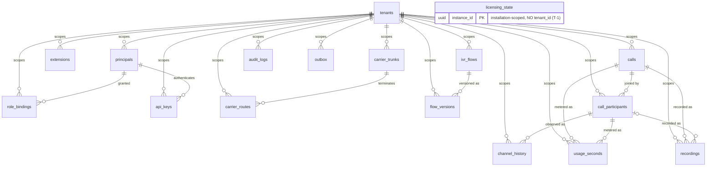
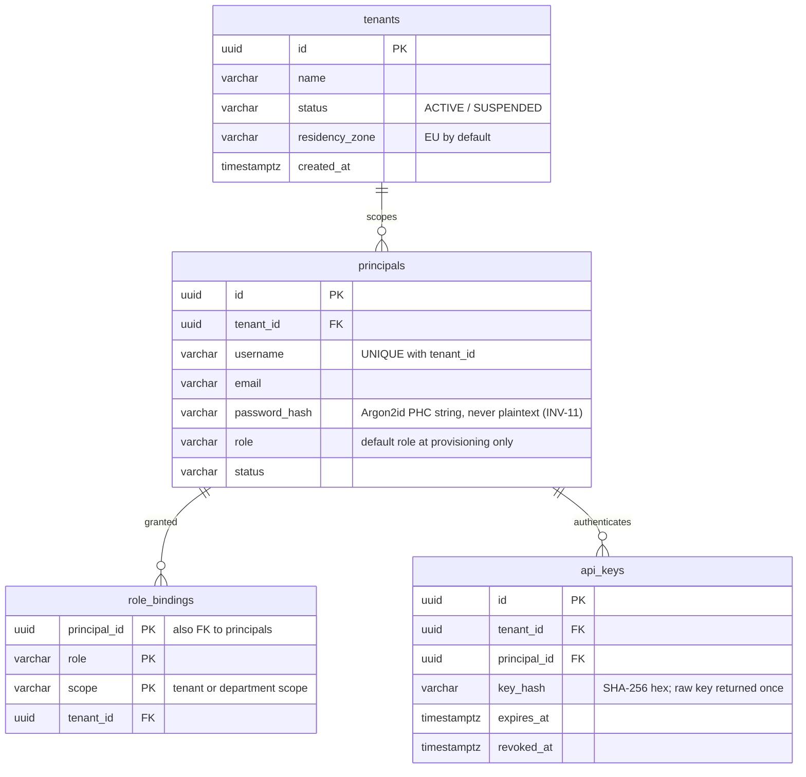
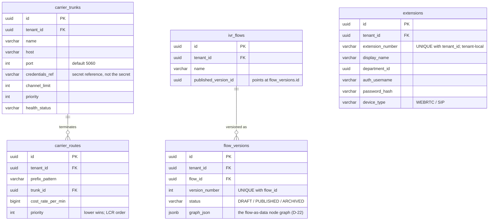
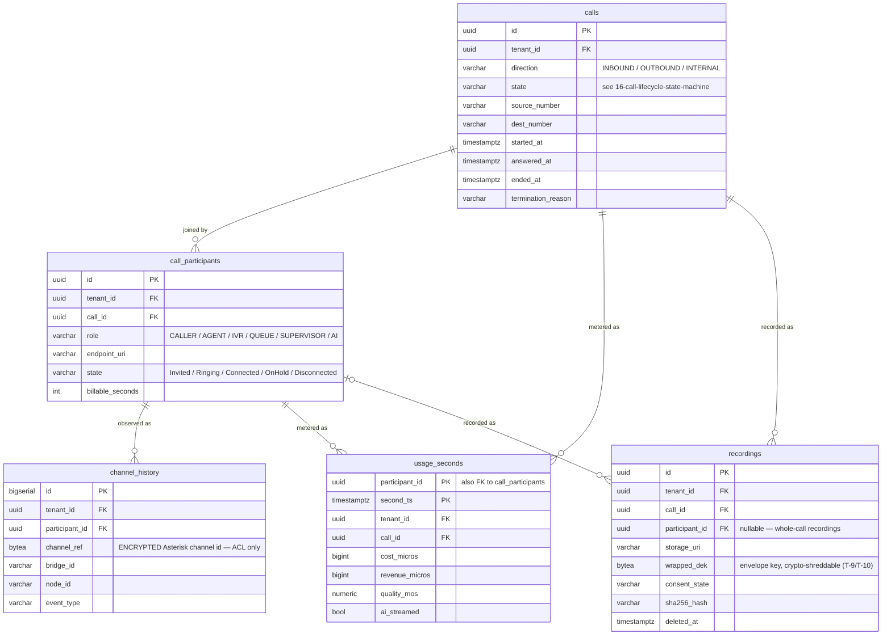
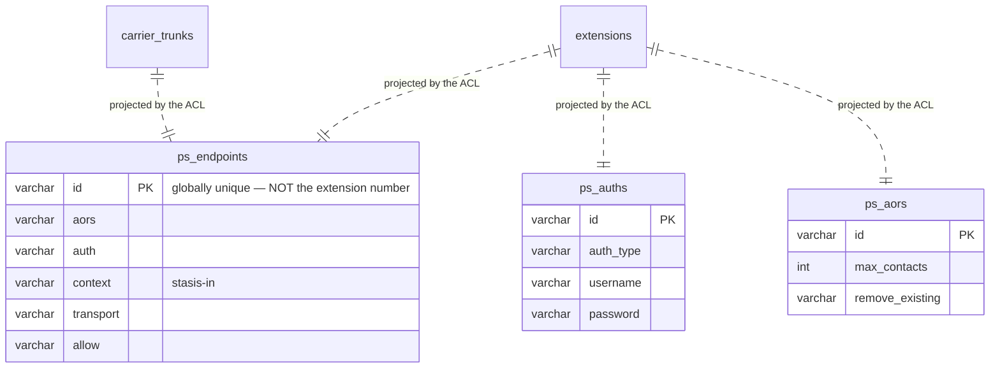
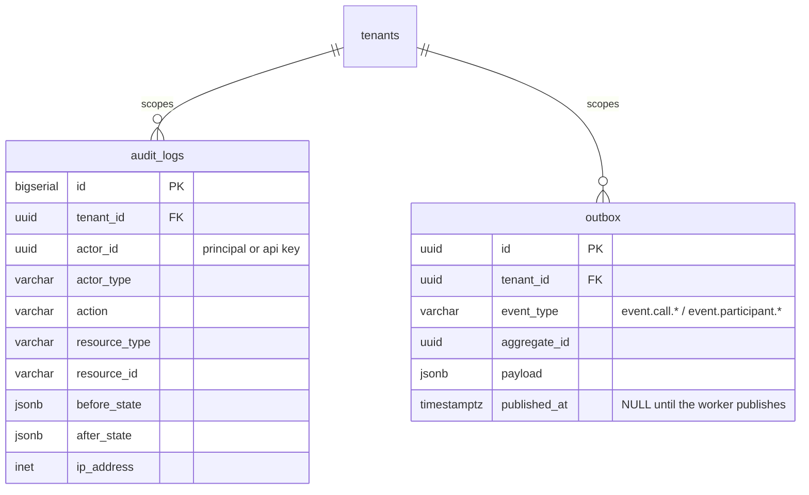

<!-- OpenSpec: TRD-HLD-18 -->
# Data Model — Entity Relationships

Visual companion to the authoritative DDL in
[03-domain-model.md §5](03-domain-model.md#5-comprehensive-relational-schema-postgresql-16).
This document draws those tables — it does not define them. Where this
file and [03](03-domain-model.md) disagree, [03](03-domain-model.md)
wins, and this file is the one that gets fixed.

Attributes shown are the keys and the columns that carry meaning for a
reader. Every table's full column list, defaults, and RLS policies live
in [03](03-domain-model.md) §5.

## 1. Reading rules

- **`tenant_id` is on every table but two.** `licensing_state` is
  installation-scoped, not tenant-scoped (T-1, D-24) — it has no
  `tenant_id` by construction, and RLS must never be applied to it. The
  ACL projection tables (§6) are the other exception, for a different
  reason given there. Every other table carries `tenant_id NOT NULL
  REFERENCES tenants(id)` with `ENABLE` **and** `FORCE ROW LEVEL
  SECURITY`.
- **`tenant_id` edges are omitted from the detail diagrams in §3–§5.**
  Drawing seventeen lines into `tenants` makes the diagram unreadable and
  says nothing the rule above does not. §2 shows them once; after that,
  assume them.
- **A dotted relationship (`..`) is not a foreign key.** It marks a
  correspondence something in code maintains — used only in §6, where
  the ACL projects domain rows into tables Asterisk owns.
- Ubiquitous language (D-17, D-18, D-32): the participant table is
  `call_participants`, never "legs". Asterisk channel identifiers appear
  only in `channel_history`, inside the ACL.

## 2. Overview — every table

`licensing_state` is drawn unattached on purpose. It has no relationship
to any other table, and adding one would be a design error: a licence
belongs to the installed instance, not to a tenant inside it.

## 3. Identity and tenancy

Implemented in `0003_identity.up.sql` (LLD-02).

Two things this diagram is meant to make hard to get wrong:

- **`role_bindings` is what authorizes, not `principals.role`.** The
  column on `principals` records the role a principal was provisioned
  with; the binding rows are what `AuthorizeAction` reads. A principal
  with no binding has no permission, whatever its `role` column says.
  This is enforced in `identity/application` and covered by test.
- **`api_keys` stores a SHA-256 digest, not the key.** The raw key is
  returned exactly once, at issue. A key is tenant-embedded
  (`atsa_<tenant-id>_<random>`) so the tenant context needed to satisfy
  RLS can be recovered before the lookup — without that, the lookup
  cannot find its own row.

## 4. Configuration — what the console writes

`extensions`, `carrier_trunks` and `carrier_routes` land in Phase A
(LLD-03). `ivr_flows` and `flow_versions` are Phase B, drawn here
because their shape constrains Phase A's routing columns.

`extensions.extension_number` is **tenant-local** — extension 1000 may
exist in every tenant. That is a product requirement, and it is what
forces the projected identifier in §6 to be something else.

`ivr_flows.published_version_id` is deliberately not a declared foreign
key: `ivr_flows` and `flow_versions` reference each other, and one
direction has to give. Publishing sets it under the same transaction
that flips the version's status.

## 5. Calls, usage and recordings

Implemented in `0001_telephony_core.up.sql` (LLD-01), except
`recordings` (Phase B).

`channel_history` is the **only** table that holds an Asterisk
identifier, it is encrypted at rest, and nothing outside
`internal/telephony/acl` reads it (HLD 01 §1.2, D-41). `usage_seconds`
is per participant per second — the seam D-24 requires for the R3 margin
ledger, populated from LLD-01 onwards even though nothing bills from it
yet.

## 6. The ACL projection (D-47)

Asterisk does not read the tables above. The ACL projects the domain row
into tables Asterisk owns the shape of, and Asterisk reads those via
PJSIP Realtime — no file generation, no reload.

Four properties of this boundary, each of which is a rule and not a
preference:

1. **The dotted lines are not foreign keys, and never become them.**
   `ps_*` has no reference to `extensions` and the domain has no
   reference to `ps_*`. The correspondence is maintained by the ACL,
   inside the transaction that writes the domain row.
2. **`ps_endpoints.id` is globally unique, derived from
   `extensions.id`.** `ps_*` is one flat namespace shared by every
   tenant, so two tenants' extension 1000 cannot both be `'1000'`. The
   number the user sees stays tenant-local; the projected identifier is
   never shown in any interface, API response, or error (PRD principle 4).
3. **`ps_*` is not under RLS.** Asterisk connects as its own database
   role and cannot set a tenant context, so a policy would simply hide
   every row from it. Isolation here is by construction — globally
   unique ids — and the control is the grant: that role gets `SELECT` on
   `ps_*` only, and nothing at all on the domain tables.
4. **`ps_contacts` is deliberately absent.** Registration contacts live
   in `astdb`, which is node-local and sufficient for a single node. The
   multi-node work (D-08) maps `ps_contacts` to realtime so any node
   knows where a phone is registered; Phase A does not need it and must
   not pretend to have solved it.

## 7. Cross-cutting tables

`audit_logs` is append-only: no `UPDATE`, no `DELETE`. `outbox` is the
durability boundary for domain events (INV-06) — a NATS restart delays
delivery, it never loses an event, because the row is committed with the
state change that produced it.

## 8. What exists at the end of each phase

| Table | Phase | Status today |
|---|---|---|
| `tenants`, `calls`, `call_participants`, `channel_history`, `usage_seconds`, `outbox` | pre-A | **Implemented** (`0001`, LLD-01) |
| `principals`, `role_bindings`, `api_keys`, `audit_logs` | pre-A | **Implemented** (`0003`, LLD-02) |
| `licensing_state` | **A** | Designed; LLD-02's licensing half |
| `extensions`, `carrier_trunks`, `carrier_routes` | **A** | Designed; LLD-03 |
| `ps_endpoints`, `ps_auths`, `ps_aors` | **A** | Decided (D-47); LLD-03 |
| `ivr_flows`, `flow_versions` | **B** | Designed |
| `recordings` | **B** | Designed |
| `ps_contacts` | multi-node | Deferred (D-08) |

Phase A therefore adds five tables to a schema that already has ten of
the seventeen in place.

## 9. Traceability and verification

- Authoritative DDL: [03-domain-model.md §5](03-domain-model.md#5-comprehensive-relational-schema-postgresql-16).
  Migrations: `api/migrations/0001_telephony_core.up.sql`,
  `api/migrations/0003_identity.up.sql`.
- Tenant isolation: [05-security.md](05-security.md); the RLS isolation
  test in LLD-01 is what proved `FORCE` is required, not just `ENABLE`.
- ACL projection: **D-47**; the boundary rule it rests on is HLD
  [01-architecture.md](01-architecture.md) §1.2 and D-41.
- Call and participant states shown as `state` columns here are defined
  in [16-call-lifecycle-state-machine.md](16-call-lifecycle-state-machine.md).
- Phase A journeys that write these tables:
  [18-phase-a-user-flows.md](18-phase-a-user-flows.md).
