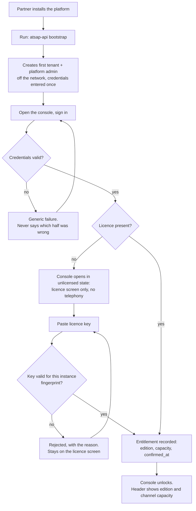
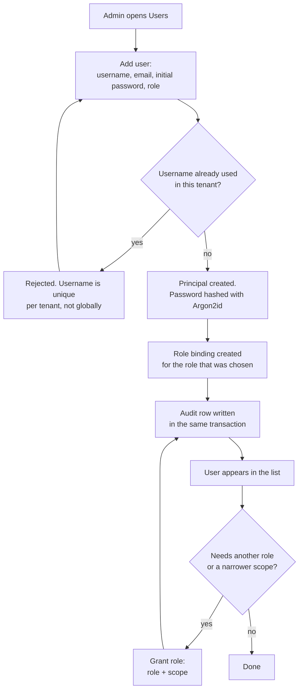
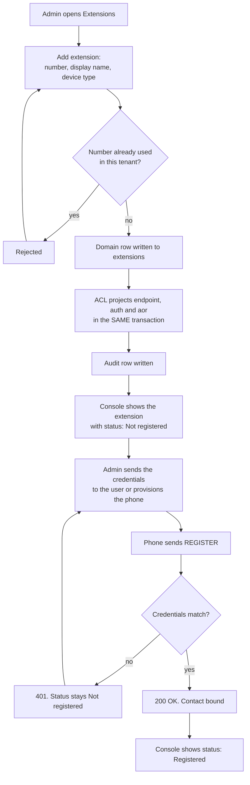
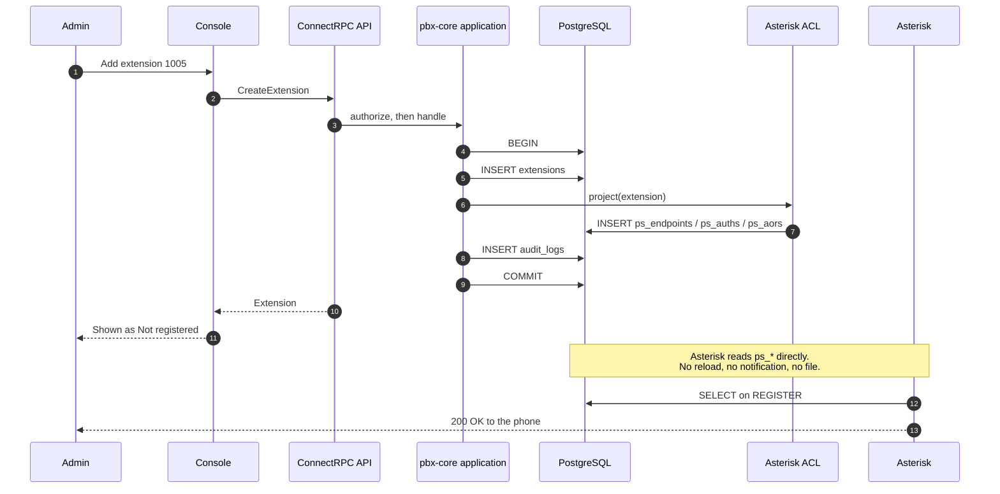
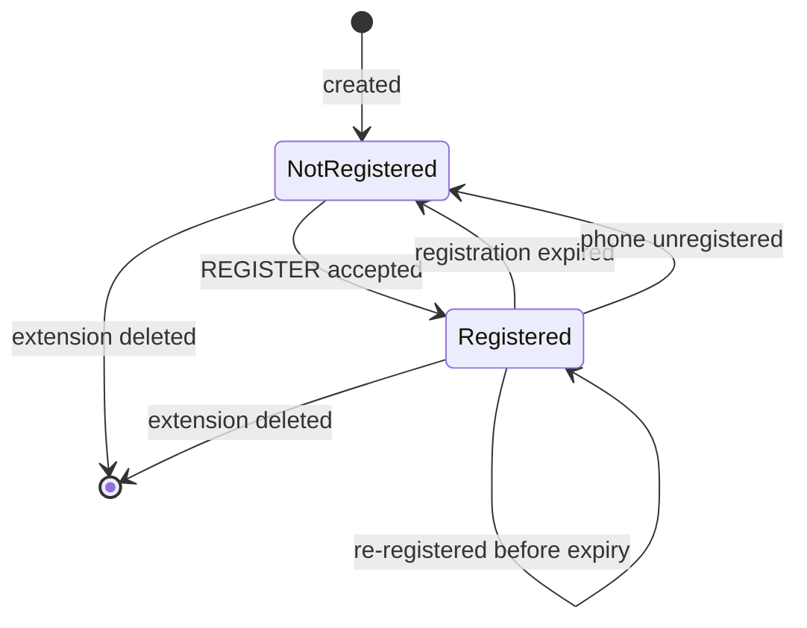
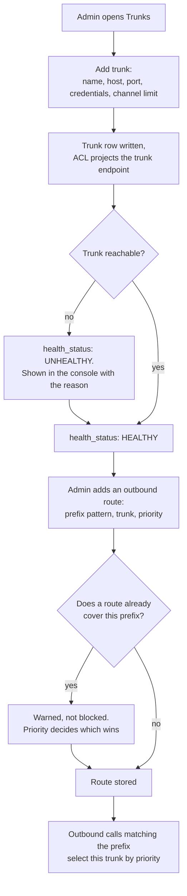
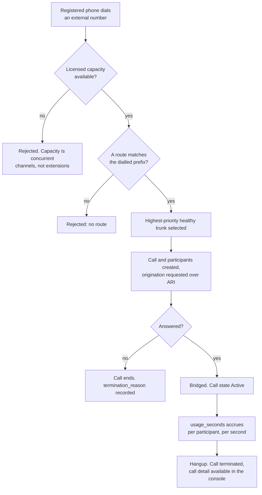

<!-- OpenSpec: TRD-HLD-19 -->
# Phase A User Flows

What an administrator actually does, in order, to get from a fresh
install to a working phone call — and what the system does at each step.
Phase A is defined by D-46: *install, licence, and make and receive real
calls, configured entirely in the UI.*

These are **user flows**, not sequence diagrams. They show the decisions
a person makes and the branches they can land in, including the ones
that fail. The wire-level ordering for call origination is
[15-call-origination-sequence.md](15-call-origination-sequence.md); the
states a call moves through are
[16-call-lifecycle-state-machine.md](16-call-lifecycle-state-machine.md);
the tables these flows write are
[17-data-model-erd.md](17-data-model-erd.md).

## 1. Rules every flow below obeys

- **The console uses only public endpoints** (D-43, AC-05.1, AC-10.7).
  Each flow lists the RPCs it needs and whether they exist yet. A screen
  that cannot be built from this list means the API is wrong, and it is
  fixed in Phase A rather than worked around.
- **Asterisk is never visible** (PRD principle 4). No flow shows a file,
  a CLI, a dialplan context, or an endpoint identifier. The admin says
  "extension 1005"; what the ACL calls it is not their business.
- **Extensions are unlimited; concurrent channels are licensed** (D-02).
  No flow below gates on capacity when creating an extension or a user —
  that would be the wrong product. Capacity is checked when a call is
  *placed*, in Screening.
- **Every mutation writes an audit row** (`audit_logs`) in the same
  transaction as the change it records.

## 2. Flow A1 — First run: install to first login

The only flow that starts outside the console, and the only one that
touches a command line — deliberately, because there is nobody to
authenticate as yet.

**Why bootstrap is a CLI and not a screen.** A first-run setup wizard on
the network is a window in which an unauthenticated caller can create
the platform administrator. Shipping a default credential is worse.
Doing it off the network on the box the partner already controls closes
both, and it is the one moment where a command line is defensible.

| Needs | Status |
|---|---|
| `atsap-api bootstrap` (CLI, not an RPC) | **Exists** |
| `AuthenticateUser` | **Exists** |
| `ApplyLicenseKey`, `GetLicenseStatus` | Pending — LLD-02 licensing half |

## 3. Flow A2 — Add a user and give them a role

**The subtle part.** Creating a principal must also create the binding
for the role it was given. The `principals.role` column alone authorizes
nothing — `AuthorizeAction` reads `role_bindings` — so a principal
created without a binding is a user who can log in and do nothing. That
was a real defect, caught by test, and it is why the binding step is
drawn as part of creation rather than an optional extra.

| Needs | Status |
|---|---|
| `ProvisionPrincipal` | **Exists** |
| `GrantRole` | **Exists** |
| `SetPrincipalStatus` (disable) | **Exists** |
| `ListAudit` | **Exists** |

## 4. Flow A3 — Add an extension a phone can register to

The flow that D-47 exists to serve.

**No apply step, no reload, no waiting.** Asterisk reads the projected
rows through PJSIP Realtime, so the extension is live the moment the
transaction commits — verified on Asterisk 22.8.2 (D-47). Deleting the
extension deprovisions it just as immediately.

The same transaction is what makes this safe: if the projection fails,
the domain row is not written either, so the console never shows an
extension that no phone could ever register to.

### 4.1 What happens under the console

One sequence, because this is the step where the architecture is easiest
to misread.

Nothing above the ACL knows Asterisk exists, and Asterisk is never
called during the write — which is why there is no failure mode where
the database says one thing and the engine says another.

### 4.2 Extension registration states

What the console badge means. This is device state, not configuration
state — the extension is configured and live from the moment it is
created.

A registration that is never renewed expires — the sip-ua sidecar's
renewal loop exists for exactly this reason, and its absence is what
made LLD-01's fixture drop off after an hour.

| Needs | Status |
|---|---|
| `CreateExtension`, `ListExtensions`, `UpdateExtension`, `DeleteExtension` | Pending — LLD-03 |
| Registration status on the extension resource | Pending — LLD-03; read from the engine, exposed as a domain-level status |

## 5. Flow A4 — Connect a SIP trunk and route outbound calls

**Health is observed, not configured.** The admin never sets
`health_status`; the platform probes and reports it. Showing a trunk as
healthy because someone ticked a box would be worse than showing
nothing.

Overlapping prefixes are a warning rather than an error on purpose —
overlap is how least-cost routing is expressed, and forbidding it would
forbid the feature.

| Needs | Status |
|---|---|
| `CreateCarrierTrunk`, `ListCarrierTrunks`, `UpdateCarrierTrunk`, `DeleteCarrierTrunk` | Pending — LLD-03 |
| `CreateCarrierRoute`, `ListCarrierRoutes` | Pending — LLD-03 |
| Trunk health on the trunk resource | Pending — LLD-03 |

## 6. Flow A5 — The first real call

The point of Phase A. Everything before this exists to make this
possible.

Inbound is the same picture with the ends swapped: the trunk presents
the call, the route decides which extension it reaches, and the
registered phone rings.

The wire-level detail of the origination half is
[15-call-origination-sequence.md](15-call-origination-sequence.md), which
is already implemented and e2e-proven from LLD-01.

| Needs | Status |
|---|---|
| Capacity check in Screening | **Exists** (stub port wired in LLD-01; real check with LLD-02 licensing) |
| Route selection | Pending — LLD-03 |
| `InitiateCall`, `HangupCall` on the wire | Port only today; LLD-03 decides, per D-43 |
| `GetCall` | **Exists** |

## 7. Console slice A, derived from the flows

D-46 gives Phase A a console slice. These flows define exactly what it
is — nothing more, and none of it optional:

| Screen | Serves |
|---|---|
| Sign in | A1 |
| Licence status and activation | A1 |
| Users, roles, permissions | A2 |
| Extensions, with registration status | A3 |
| Trunks and outbound routes, with health | A4 |
| Call history (read-only) | A5 |

Phase A is done when a partner can walk A1 → A5 without leaving the
console, without touching a configuration file, and without being told
what Asterisk is.

## 8. Traceability

- Phase definition and console slicing: **D-46**. Configuration
  translation: **D-47**. Unlimited extensions, licensed channels:
  **D-02**.
- PRD principle 4 (Asterisk is never user-facing), EPIC-01 (identity),
  EPIC-03 (telephony), EPIC-06 (licensing), EPIC-10 (console).
- BRD §16 R1.0 gate: every function demonstrated through the public API,
  with the console proven to use only those endpoints.
- Endpoint status columns above are the same inventory as
  [../API.md](../API.md) §1 and §3; if they disagree,
  [../API.md](../API.md) wins and this file is corrected.
