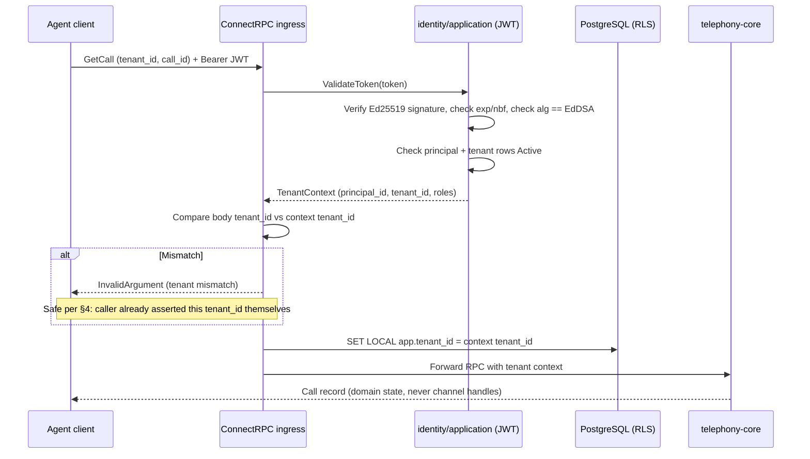
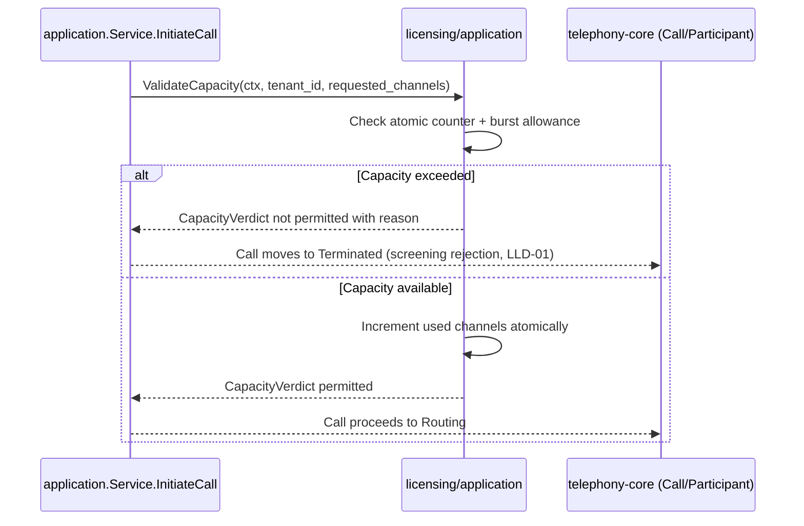
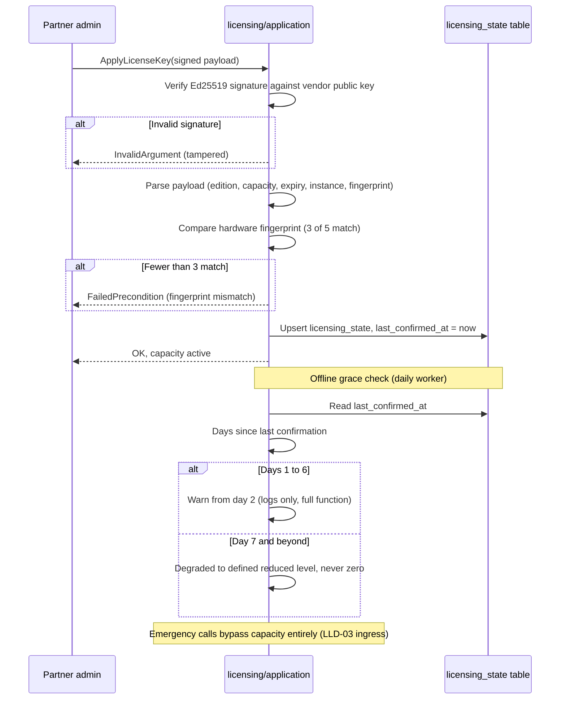

# LLD-02 — Identity & Licensing

| | |
|---|---|
| **Bounded contexts** | `identity`, `licensing` (both Tier 0 — see [`04-bounded-contexts.md` §10](../hld/04-bounded-contexts.md#10-bounded-context-build--dependency-graph)) |
| **Status** | Draft — not yet proposed as an OpenSpec change |
| **Traces to** | BRD FBR-R1-04/FBR-R1-08/FBR-R1-12/§10; PRD EPIC-01 (US-01.1–01.7, AC-01.1–01.7), EPIC-06 (US-06.1–06.7, AC-06.1–06.10), PRD §11.2 (licence states), INV-01/INV-03/INV-10/INV-11; TRD Domain model, extensibility seams; HLD [01-architecture.md](../hld/01-architecture.md), [03-domain-model.md](../hld/03-domain-model.md) §5, [04-bounded-contexts.md](../hld/04-bounded-contexts.md) §§4/7, [05-security.md](../hld/05-security.md) §1, [11-decisions.md](../hld/11-decisions.md) (T-1–T-3); DECISIONS D-11–D-14, D-24 |
| **Why this is LLD-02** | LLD-01 proved the media path against stub adapters whose files say, verbatim, "until LLD-02 lands." Every Tier 1 context needs `identity`'s tenant context (§10.1), and without real licensing there is no sellable product — capacity enforcement, not dialing features, is what makes the platform commercial. D-26 (dependency-first within a release) puts both here, ahead of `pbx-core`. |

## Document history

| Date | Change |
|---|---|
| 2026-09-07 | Initial draft. |
| 2026-09-07 | Amendment: dev-token three-layer guardrails (§5.2); distributed-capacity future direction (§8); change table with propose order (§9); Security & Compliance Invariants (§10); critical-path sequence diagrams (§11); DoD items 9–11. |
| 2026-09-07 | Review fixes: resolved the `ValidateCapacity` signature contradicting "zero telephony-core changes" (§4); `AuditEntry` shape now matches HLD 03 §5 exactly (§3); HLD 03 §5 gained `role_bindings`/`api_keys`/`licensing_state` DDL, closing the "not a new schema" gap (§5.1); DoD item 8 now states the `licensing_state` tenant_id exception explicitly; JWT implementation (stdlib-only, TTL, algorithm pinning) and Argon2id parameters specified (§5.3, §10.7); INV-10 reasoning added for the tenant-mismatch check (§4); failed-authentication logging added (§10.8); §11.1/§11.1a diagrams no longer imply `GetCall` triggers a capacity check; OWASP Top 10 (2021) traceability added (§10.9); DoD item 12. |

## 1. Scope

**In scope (this LLD only):**
- `identity`: tenant provisioning (replacing and **deleting** the `0002_dev_tenant_seed` migration — LLD-01: "deleted, not left in place"), principals with Argon2id password hashes, scoped RBAC (`AuthorizeAction`), API keys stored as SHA-256 hashes, JWT issue/validate, append-only audit log (AC-01.3), tenant-context middleware feeding RLS.
- `licensing`: the full HLD 04 §4 `LicenseManager` port (`ValidateCapacity`, `ReleaseCapacity`, `ApplyLicenseKey`, `VerifyDailyEntitlement`) — LLD-01 stubbed only `ValidateCapacity`; this LLD lands the other three methods on the same interface. Ed25519 licence tokens (T-1), atomic capacity counter + 10% burst allowance (T-2/T-3), weighted 3-of-5 hardware fingerprint with tolerance (D-13), 7-day offline grace with day-2 warnings and degrade-never-disable (D-12/D-14).
- Auth cutover for ConnectRPC: `Authorization: Bearer <JWT>` required on all RPCs; request `tenant_id` must equal the JWT tenant (mismatch → `InvalidArgument`). Proto unchanged — no `buf breaking` impact.
- Swapping both stubs behind their existing ports in `cmd/atsap-api` composition. **Zero `telephony-core` changes**: if this LLD requires editing anything under `internal/telephony/`, the seam failed and work stops.

**Explicitly out of scope (deferred to the LLD that owns it):**

| Deferred | Owning LLD | Why not now |
|---|---|---|
| Real DNC/hours/spend compliance | LLD-04 | `stub_compliance.go` stays permit-all; nothing consumes real verdicts yet |
| Inbound dial-in handling (incl. SIP `503`+`Retry-After` on capacity, emergency-number recognition/bypass) | LLD-03 (`pbx-core`) | No inbound path exists yet — every call today is originated by test/app, and originated calls are never emergency calls. INV-01 bypass is therefore untriggerable; LLD-03 owns both the recognition and the bypass wiring |
| Recording, RTCP-XR, `Degraded` transitions | LLD-04/07 | Unchanged from LLD-01 §1 |
| Webhooks, AI pipeline, dialer | LLD-05, LLD-06 | Tier 1/2 in the dependency graph |
| Partner-portal licence issuance UI | EPIC-10 surface (portal) | `ApplyLicenseKey` port + file/CLI application suffice here |

## 2. Go package layout

New bounded-context roots beside `telephony/` (HLD 01 §1.1), plus two shared-kernel IDs:

```
api/internal/
├── shared/
│   └── domain/          # ADD: PrincipalID, ApiKeyID (typed UUID wrappers, same pattern as TenantID)
├── identity/            # NEW bounded context root
│   ├── domain/          # NEW: Tenant (provisioning), Principal, RoleBinding, ApiKey, AuditEntry; pure password-policy helpers
│   ├── ports/           # NEW: IdentityService (exactly HLD 04 §7) + TenantContext carrier
│   └── application/     # NEW: orchestrator (provision/authenticate/authorize/audit), Argon2id hasher, JWT issuer/validator, ConnectRPC auth interceptor
├── licensing/           # NEW bounded context root
│   ├── domain/          # NEW: LicenseToken (Ed25519 verify, pure), HardwareFingerprint (weighted 3-of-5 match, pure), CapacityCounter (atomic + burst window), GraceTracker (pure state machine over timestamps)
│   ├── ports/           # NEW: full LicenseManager (all four HLD 04 §4 methods — supersedes LLD-01 §5.1's single-method stub port)
│   └── application/     # NEW: capacity monitor, daily entitlement worker, key-apply flow; DELETES telephony/application/stub_license.go by replacing its wiring
└── telephony/
    └── application/     # DELETE stub_license.go only (stub_compliance.go stays for LLD-04)
```

**Why two contexts, one LLD:** they are independently replaceable modules that share one build-order tier and one cutover (auth + entitlement activate together); splitting them into two LLDs would manufacture a fake dependency between Tier-0 peers.

## 3. Domain types

```go
// identity/domain
type Tenant struct {
    ID             shared.TenantID
    Name           string
    Status         TenantStatus // Active | Suspended
    ResidencyZone  string       // carried from LLD-01 tenants row, now enforced
}
type Principal struct {
    ID           PrincipalID
    TenantID     shared.TenantID
    Username     string        // UNIQUE(tenant_id, username) — AC-01.2 overlap lives here
    Email        string
    PasswordHash string        // Argon2id, never plaintext anywhere (INV-11)
    Role         string
    Status       PrincipalStatus // Active | Disabled
}
type RoleBinding struct {
    PrincipalID PrincipalID
    TenantID    shared.TenantID
    Role        string
    Scope       string          // e.g. "tenant", "department:<id>"
}
type ApiKey struct {
    ID          ApiKeyID
    TenantID    shared.TenantID
    PrincipalID PrincipalID
    KeyHash     string          // SHA-256 of the presented key; raw key shown once at creation
    ExpiresAt   *time.Time
    RevokedAt   *time.Time
}
type AuditEntry struct {
    ID           int64 // BIGSERIAL, append-only
    TenantID     shared.TenantID
    ActorID      uuid.UUID // HLD 03 §5: actor_id UUID NOT NULL. System-
                           // initiated entries (e.g. the daily entitlement
                           // worker) use a well-known sentinel
                           // (systemActorID, all-zero UUID) rather than
                           // NULL — ActorType distinguishes "principal"
                           // from "system".
    ActorType    string
    Action       string
    ResourceType string // HLD splits resource into type + id; kept split here
    ResourceID   string
    IPAddress    net.IP // nullable (HLD: ip_address INET) — absent for
                         // system-initiated entries
    BeforeJSON   []byte // nullable
    AfterJSON    []byte // nullable
    CreatedAt    time.Time
}
```

```go
// licensing/domain — pure where possible (D-21's shape, applied to licensing)
type LicenseToken struct {
    Edition    string
    Capacity   int       // concurrent channels
    ExpiresAt  time.Time
    InstanceID string
    Fingerprint [5]string // expected weighted attributes
}
func VerifyToken(payload, signature []byte, pubKey ed25519.PublicKey) (LicenseToken, error) // pure, T-1

type HardwareFingerprint struct{ Attrs [5]string }
func (f HardwareFingerprint) Matches(expected [5]string) bool // >=3 of 5 equal, D-13

type CapacityVerdict struct {
    Permitted bool
    Reason    string // distinct telemetry reason code (BR-05)
}
// CapacityCounter is atomic across threads (T-2); burst allowance is a
// 10%-over-capacity, 15-minute sliding window (T-3). Both live behind the
// LicenseManager port; telephony-core only ever sees the verdict.
type GraceTracker struct {
    LastConfirmedAt time.Time
    WarnSinceDay2   bool
}
// GraceState is a pure function of (now, lastConfirmedAt): Valid →
// EntitlementUnverified (warnings from day 2) → Degraded (reduced
// capacity, never disabled — D-12). Emergency calls connect in every
// state; that bypass lives with the caller (LLD-03), never here.
func GraceState(now, lastConfirmedAt time.Time) GraceStatus
```

Password hashing uses `golang.org/x/crypto/argon2` (already in `go.mod`/TOOLSET.md) — no new dependency. Ed25519 uses stdlib `crypto/ed25519` — no new dependency.

## 4. Ports (exactly HLD 04 §§4/7, superseding the LLD-01 stub subset)

```go
// identity/ports — exactly HLD 04 §7
type IdentityService interface {
    AuthenticateUser(ctx context.Context, username, password string) (*AuthToken, error)
    ValidateToken(ctx context.Context, tokenString string) (*TenantContext, error)
    AuthorizeAction(ctx context.Context, principal PrincipalID, action string, resource string) error
    RecordAudit(ctx context.Context, entry AuditEntry) error
}
// TenantContext carries tenant_id + principal_id + roles downstream into
// RLS (SET LOCAL app.tenant_id) and audit. Produced only by ValidateToken
// or API-key validation — never hand-constructed by callers.

// licensing/ports — HLD 04 §4's four methods; LLD-01 §5.1's single-method
// stub port is retired by this LLD, not extended beside it.
//
// ValidateCapacity keeps LLD-01's explicit tenantID parameter rather
// than adopting HLD 04 §4's literal 2-arg signature verbatim: dropping
// it would require editing ports.LicenseManager AND its one call site in
// telephony/application/service.go's InitiateCall — both live under
// internal/telephony/, which trips this LLD's own "zero telephony-core
// changes" tripwire (§1). InitiateCallCommand already carries TenantID
// explicitly (the walking skeleton's established pattern of threading
// tenant_id through Go signatures, not just DB rows — D-24 seam 1 applied
// to code, not only schema); a ctx-carried TenantContext would be a
// second, redundant source of truth for the same value, not a
// simplification. Deliberate, documented deviation from HLD 04 §4's
// exact text — same category of divergence as LLD-01's CallStore
// gaining RecordUsageTicks beyond HLD 04 §1's exact shape.
type LicenseManager interface {
    ValidateCapacity(ctx context.Context, tenantID shareddomain.TenantID, requestedChannels int) (CapacityVerdict, error)
    ReleaseCapacity(ctx context.Context, channels int) error
    ApplyLicenseKey(ctx context.Context, signedPayload []byte) error
    VerifyDailyEntitlement(ctx context.Context) (EntitlementStatus, error)
}
```

Auth enforcement point: a ConnectRPC unary+streaming interceptor in
`identity/application` (wired in `cmd/atsap-api`), calling
`ValidateToken`, rejecting missing/invalid tokens (`Unauthenticated`)
and body-tenant/JWT-tenant mismatch (`InvalidArgument`). `rpc/handler.go`
reads the tenant from context (falls back to body field only when no
auth context exists — i.e. in handler unit tests, never in production).

`InvalidArgument` here does not violate INV-10/AC-01.1's "no leak via
error messages, including to a caller who names another tenant" rule:
the caller already asserted that `tenant_id` themselves in their own
request body, so the response confirms nothing they didn't already
claim — no oracle for tenant existence is created. This is distinct from
(and does not replace) resource-level isolation: a request for a
`call_id` belonging to a different tenant than the authenticated one
returns a generic `not_found` via RLS filtering (established in LLD-01),
never a code that reveals the resource exists elsewhere.

## 5. Data model

### 5.1 Migration scope (`api/migrations/0003_identity.up.sql`, `golang-migrate`)

Exactly the HLD [03-domain-model.md §5](../hld/03-domain-model.md) tables
this LLD owns — **not a new schema**, the agreed one, same as LLD-01 §6.1.
`role_bindings`, `api_keys`, and `licensing_state` had no DDL there until
this LLD amended §5 to add them (their aggregates were already approved
in HLD 04 §§4/7 — RoleBinding, ApiKey, and licensing's own aggregates —
only the exact columns were missing); the claim is accurate as of that
amendment, not before it:

- `principals` (as HLD DDL: `id`, `tenant_id`, `username`, `email`,
  `password_hash`, `role`, `status`, `UNIQUE(tenant_id, username)`)
- `role_bindings` (as HLD DDL: `principal_id`, `tenant_id`, `role`,
  `scope`, `PRIMARY KEY (principal_id, role, scope)`)
- `api_keys` (as HLD DDL: `id`, `tenant_id`, `principal_id`, `key_hash`,
  `expires_at`, `revoked_at`)
- `audit_logs` (as HLD DDL: BIGSERIAL, `actor_id` UUID, `actor_type`,
  `action`, `resource_type`+`resource_id`, `before_state`/`after_state`
  JSONB, `ip_address` INET — **no UPDATE/DELETE policy path by
  construction**; RLS enabled + `tenant_isolation_audit` policy per the
  HLD-03 rule that no RLS table ships without its policy)
- `licensing_state` (as HLD DDL: `instance_id` PK, `fingerprint` JSONB,
  `edition`, `capacity`, `entitlement_status`, `last_confirmed_at`,
  `grace_started_at`) — the only durable licensing state; counters stay
  in memory. **No `tenant_id`, and never gains RLS**: installation-scoped
  by design (T-1), not tenant-scoped — see the table's own HLD comment.
- RLS enabled + `FORCE ROW LEVEL SECURITY` + `tenant_isolation_*`
  policies on every new table **except `licensing_state`** (the LLD-01
  RLS lesson, now the house rule)

### 5.2 Deletions and dev bootstrap

- **Delete** `api/migrations/0002_dev_tenant_seed.{up,down}.sql`
  (LLD-01: "deleted, not left in place"). No replacement seed: tests and
  the e2e create their own tenants (already the established pattern);
  local dev provisions via the new `AuthenticateUser` bootstrap flow
  documented in `docs/TESTING.md` §6 follow-up.
- **Dev-only token minting guardrails**: the development bootstrap flow
  (`ATSAPBX_DEV_TOKEN_*`) is protected by **three independent layers**,
  so existing UAT scripts and the e2e keep working after the auth
  cutover without any prod exposure:
  1. **Build tag**: `//go:build dev` keeps dev-token code out of
     production binaries entirely — implications: dev/rig builds
     (`Dockerfile`, `mise run`, CI dev jobs) pass `-tags dev`
     explicitly; default `go build ./...` never contains it.
  2. **Runtime environment**: the wire-up path refuses to run unless
     `ATSAPBX_ENV=development`, failing closed otherwise — a prod
     environment with the tag accidentally set still cannot mint.
  3. **Configuration isolation**: the dev issuer uses a separate,
     hardcoded Ed25519 key; config structs carry distinct `DevJWTKey`
     vs `ProdJWTKey` fields so the two keys can never be confused
     (INV-11).
  All three must fail together for a leak — defense in depth, not a
  single gate. The UAT runbook's `curl GetCall` examples gain the
  `Authorization: Bearer` header at that point.

### 5.3 Cryptographic parameters (closes TOOLSET §6 and OWASP A02/A07 gaps)

- **Password hashing (Argon2id, `golang.org/x/crypto/argon2`)**: memory
  19 MiB (19456 KiB), 2 iterations, 1 degree of parallelism — the current
  OWASP Password Storage Cheat Sheet minimum for Argon2id. Minimum
  password length 8 characters, maximum 64 (accepted as-is, no forced
  composition rules — NIST SP 800-63B §5.1.1.2: length beats complexity
  rules, which push predictable patterns). No breach-corpus check in R1
  (a `HaveIBeenPwned`-style lookup is a legitimate future hardening, not
  a blocker here — D-08: nothing over-built for year-three scale before
  R1 needs it).
- **JWT: hand-rolled on stdlib, no new dependency.** `crypto/ed25519` for
  signing/verification (same primitive as the licence token, T-1) +
  `encoding/json` + `encoding/base64` for the compact serialization —
  TOOLSET.md names no JWT library, and none is needed: a JWT is header +
  claims + Ed25519 signature, not a protocol requiring a framework. This
  closes the dependency-approval gap identified in review; if a future
  LLD needs JWKS rotation or OIDC federation, that is a new, separately
  proposed and TOOLSET §6-vetted dependency, not an extension of this
  code.
- **Algorithm pinning (OWASP A02/A07 — "alg confusion"/downgrade)**: the
  validator accepts exactly one algorithm, `EdDSA` (Ed25519), read from a
  fixed expectation — **never from the token's own `alg` header**. A
  token asserting `alg: none` or any other algorithm is rejected before
  signature verification even runs. There is no algorithm negotiation to
  attack because there is no algorithm choice at validation time.
- **Token lifetime**: access tokens are short-lived, 15 minutes, with no
  refresh-token flow in this LLD — re-authenticate on expiry. Machine
  clients (UAT scripts, the e2e suite) re-authenticate cheaply; a
  refresh-token rotation/revocation scheme is deferred to whichever LLD
  first has a human-facing session that needs one (the portal, HLD 12) —
  building it now for no current consumer is exactly the over-building
  D-08 rules out.
- **API key hashing stays SHA-256, not Argon2id**: unlike a password, an
  API key is a high-entropy, machine-generated random token (not a
  human-chosen, guessable secret) — slow hashing defends against
  brute-forcing a low-entropy secret, which does not apply here. SHA-256
  is the correct, fast, standard primitive for this shape (HLD 04 §7 already
  specifies "API keys stored as SHA-256 hashes").

## 6. ConnectRPC surface (this LLD: auth on existing methods + identity methods)

No `.proto` shape changes (no `buf breaking` impact — deliberate):
`GetCall` keeps its fields; auth arrives via metadata. New RPCs for
`AuthenticateUser` (username/password → short-lived JWT) and tenant
provisioning land here only if EPIC-01's stories need them over the wire
in R1.0 — otherwise identity stays a Go-port surface until the portal
slices (HLD 12) demand otherwise. (API-first (D-24) is satisfied either
way: every *capability* is reachable; the decision of wire-vs-port per
method is recorded in the proposing change, not smuggled in.)

## 7. Definition of Done

1. Tenant provision → principal → JWT → authenticated `GetCall` succeeds;
   bad password / expired token / unknown tenant all fail closed with
   distinct codes (AC-01.1–01.3).
2. Overlapping extension-number-style identity across tenants never
   collides: same username in two tenants are independent principals with
   independent sessions (AC-01.2 pattern).
3. Disabling a principal kills sessions/calls-within-10s behavior at the
   token-validation layer; suspending a tenant blocks new calls, leaves
   active calls running, fully reversible (AC-01.5/01.7 patterns).
4. Every admin mutation writes exactly one immutable `audit_logs` row
   (actor, timestamp, before/after); no role — including a second admin —
   can edit or delete it (AC-01.3/01.4).
5. Tampered licence payload rejected (`ApplyLicenseKey`); weighted
   fingerprint tolerates 2-of-5 drift, fails closed beyond it with
   warning-first behavior (AC-06.1/06.2/06.9).
6. Capacity counter exact under a 10× setup-rate race test, zero drift;
   burst allowance absorbs a 15-minute overage then rejects with the
   distinct telemetry reason; active calls never dropped at any point
   (AC-06.6/06.10, INV-03).
7. Grace state machine: unreachable entitlement service → full function
   with day-2+ warnings → degraded reduced capacity after day 7, never
   disabled (AC-06.4/06.5); daily worker covered by test with injected
   clock.
8. `go-arch-lint`/AST + `depguard` green with the two new contexts
   present; RLS isolation test extended to every new tenant-scoped table
   (`principals`, `role_bindings`, `api_keys`, `audit_logs`); `tenant_id`
   absent from no new row, event, or log except `licensing_state`, whose
   absence of `tenant_id` is itself asserted by a test — it is
   installation-scoped by design (T-1), the one deliberate exception to
   D-24 seam 1, not a gap in it (D-39).
9. **Security invariants verified**: `AuthorizeAction` is deny-by-default
   (no-match tuple test); no audit row contains `password_hash` or
   `key_hash` (constructor-redaction test); all SQL in the two new
   contexts uses parameter placeholders — enforced in review, since
   `depguard` matches import paths, not string shapes, and no gate may
   claim otherwise (D-28 honesty).
10. **Session invalidation tested**: disabling a principal causes the next
    RPC to fail (per-RPC validation leaves no window — only the already
    in-flight RPC completes); suspending a tenant blocks new calls while
    active calls drain, per the AC-01.5/AC-01.7 patterns in item 3.
11. **Rate-limiting readiness**: the auth interceptor documents the
    extension point where a limiter wraps it — documentation only, no
    stub limiter ships with this LLD.
12. **OWASP-driven checks (§10.7–10.9)**: a token with `alg: none` or any
    non-`EdDSA` value is rejected before signature verification runs
    (algorithm-pinning test); a failed `AuthenticateUser`/`ValidateToken`
    call produces exactly one `WARN`-level structured log entry
    containing no password material (failed-auth-visibility test);
    Argon2id is invoked with the §5.3 parameters, asserted directly
    against the hasher call, not inferred from behavior.

## 8. Known limitations of this LLD (carried, not introduced)

- Inbound dial-in handling does not exist yet, so SIP `503`+`Retry-After`
  rejection and emergency-number bypass have no path to trigger — both
  are LLD-03's ingress work reusing the verdicts built here.
- Single-node capacity counting: the atomic counter is per-process.
  Multi-node shared counting is a later scaling change, explicitly not
  this LLD (D-08: nothing over-built for year-three scale). If
  multi-node active-active scaling becomes necessary, a future LLD will
  replace the in-memory counter with a distributed lease mechanism
  consistent with the approved stack (e.g. PostgreSQL `SELECT ... FOR
  UPDATE` row-level contention, per the `SKIP LOCKED` patterns already
  in use) — never an unevaluated new dependency. The `LicenseManager`
  port abstraction allows this swap without affecting `telephony-core`.
- `compliance` stays a stub (LLD-04 owns real DNC/hours/spend).

## 9. OpenSpec handoff

When ready to implement: `/opsx:propose "identity provisioning, auth, and
licensing capacity/grace"` (Claude Code) or `/opsx-propose` (OpenCode).
`openspec/config.yaml`'s `context:` already surfaces the docs baseline;
point the agent at this file as the design source.

**Expected changes from this LLD** (implementation granularity per
`docs/lld/README.md`). Both contexts are Tier-0 peers with no hard build
dependency between them (HLD 04 §10.1) — the order below is a propose
sequence for integration coherence, not a dependency chain:

| Change ID | Scope | Sequencing note |
|---|---|---|
| `identity-auth-rbac` | Tenant provisioning, Argon2id hashing, JWT issuer/validator, ConnectRPC auth interceptor, RBAC `AuthorizeAction` | First: everything else integrates against tenants that exist |
| `licensing-capacity-grace` | Full `LicenseManager`, atomic counter, Ed25519 verify, 7-day grace tracker | Second: no hard dependency on the above (Tier-0 peer), ordered here so capacity tests run against real tenants |
| `licensing-apply-key` | `ApplyLicenseKey` RPC/CLI, hardware fingerprint collection & matching | After capacity-grace (keys set capacity) |
| `identity-bootstrap` | Dev-token minting, dev-seed-deletion follow-through, UAT script updates | After auth (replaces what it bypasses) |
| `auth-cutover-connectrpc` | Enforce JWT on all RPCs, tenant-match rule, dev-token issuer for the rig | Last: flips the switch only once providers and consumers exist |

Each change is proposed, applied, and archived independently.

## 10. Security & Compliance Invariants

This LLD lays the identity and licensing groundwork that later
regulatory posture (consent handling, residency enforcement,
payment-scope reduction — BRD §15) builds on. The following
invariants are **mandatory** here, enforced by the tests in §7 items
9–10 and by review:

### 10.1 Deny-by-default authorization
`AuthorizeAction` returns `PermissionDenied` unless a role binding
matches the (principal, action, resource) tuple exactly. Wildcards exist
only for explicit admin roles and only in the scoped forms `tenant:*`
or `system:*` — a new tightening introduced at LLD level, reviewable
per change.

### 10.2 Session invalidation (two layers)
`ValidateToken` checks both (1) the JWT itself — Ed25519 signature,
`exp`, `nbf` — and (2) live state: the principal and tenant rows must
both read `Active`. Suspension-time call blocking stays deferred to
LLD-03 with the rest of ingress (see §1, §8); until then a suspended
tenant fails closed at the API with no media path to protect.

### 10.3 Audit-log secret redaction
`before_json`/`after_json` MUST NOT contain `password_hash`, `key_hash`,
or key material. The `AuditEntry` constructor strips any field tagged
`sensitive:"true"` before marshal — redaction at construction, not at
read time, so no query path can leak (D-39, INV-11).

### 10.4 Mandatory parameterized queries
All SQL in `identity/*` and `licensing/*` uses pgx parameter
placeholders (`$1`, `$2`, …). String-built SQL is forbidden. (Stated
plainly: this is review-enforced — `depguard` matches import paths, not
string shapes, so no CI gate claims this check. See §7 item 9.)

### 10.5 Rate limiting (deferred)
Brute-force protection (e.g. fail-after-N) belongs at the connection
boundary — an edge proxy once HLD 06 lands one, or a dedicated
rate-limiting interceptor wrapping auth in a future LLD — never inside
the auth logic itself. This LLD documents the extension point only
(§7 item 11).

### 10.6 Data residency posture (deferred enforcement)
`Tenant.ResidencyZone` is populated at provisioning and immutable
thereafter. Actual storage routing lives at the deployment layer and is
enforced by a future LLD, not here — this LLD guarantees the field
exists, is carried in `TenantContext`, and can never be blanked.

### 10.7 Authentication algorithm and credential parameters
JWT validation accepts only `EdDSA`, read from a fixed expectation, never
from the token's own header (§5.3) — closes the "alg confusion"/downgrade
class of JWT vulnerability at the design level, not by convention.
Argon2id parameters (19 MiB / 2 iterations / parallelism 1) and password
length bounds (8–64) are specified in §5.3 rather than left to whatever
defaults a library ships with.

### 10.8 Failed-authentication visibility
Every `AuthenticateUser` and `ValidateToken` failure is logged at `WARN`
via the existing structured-logging path (D-39) — principal/tenant
identifiers only, never the attempted password — even though it is not
an `audit_logs` row (that table is for admin *mutations* on resources,
per HLD 04 §7's invariant; a failed login mutates nothing). Without this,
credential-stuffing and brute-force patterns are invisible until §10.5's
rate limiter lands in a later LLD; this is the minimum visibility that
should exist before then, not a substitute for that limiter.

### 10.9 OWASP Top 10 (2021) traceability
Not every category applies to this LLD's scope (e.g. A06 Vulnerable
Components is a `govulncheck`/CI concern, not a design one — `mise run
vuln`, unchanged by this LLD). The categories this LLD's design bears on:

| Category | How this LLD addresses it |
|---|---|
| A01 Broken Access Control | §10.1 deny-by-default `AuthorizeAction`; RLS tenant scoping (HLD 03 §5) makes cross-tenant resource access return `not_found`, never a partial-access response |
| A02 Cryptographic Failures | Argon2id (§5.3) for passwords, SHA-256 for high-entropy API keys (§5.3, HLD 04 §7), Ed25519 for JWT + licence tokens (T-1), algorithm pinning (§10.7) |
| A03 Injection | §10.4 mandatory parameterized queries, review-enforced |
| A04 Insecure Design | Dev-token minting's three independent, must-all-fail-together layers (§5.2) is this LLD's worked example of defense in depth, not a one-off |
| A07 Identification & Authentication Failures | §5.3 password/token parameters; §10.2 two-layer session invalidation; §10.5 rate-limiting extension point; §10.8 failed-auth logging |
| A08 Software & Data Integrity Failures | Ed25519 signature verification on every licence key application (§11.2) rejects a tampered payload before any parsing happens |
| A09 Security Logging & Monitoring Failures | §10.3 immutable, redacted audit log for mutations; §10.8 failed-auth visibility for non-mutating attempts |

## 11. Critical Path Sequence Diagrams

### 11.1 Auth check (every authenticated RPC, illustrated with `GetCall`)



### 11.1a Capacity check (call setup — `InitiateCall`, not yet a wire RPC)

`GetCall` above is read-only and never calls `ValidateCapacity`; this
diagram is illustrative of the port call `application.Service.InitiateCall`
already makes today (in-process, no ConnectRPC method exists for it in
this LLD — see LLD-01 §8 and this LLD's §6), so the shape below is what
this LLD's `LicenseManager` implementation must satisfy, not a wire
sequence that exists yet:



### 11.2 License key application & grace flow



`ApplyLicenseKey` takes no user input besides the payload: verification
is pure cryptography over bytes, so there is no injection surface in
this path by construction.
