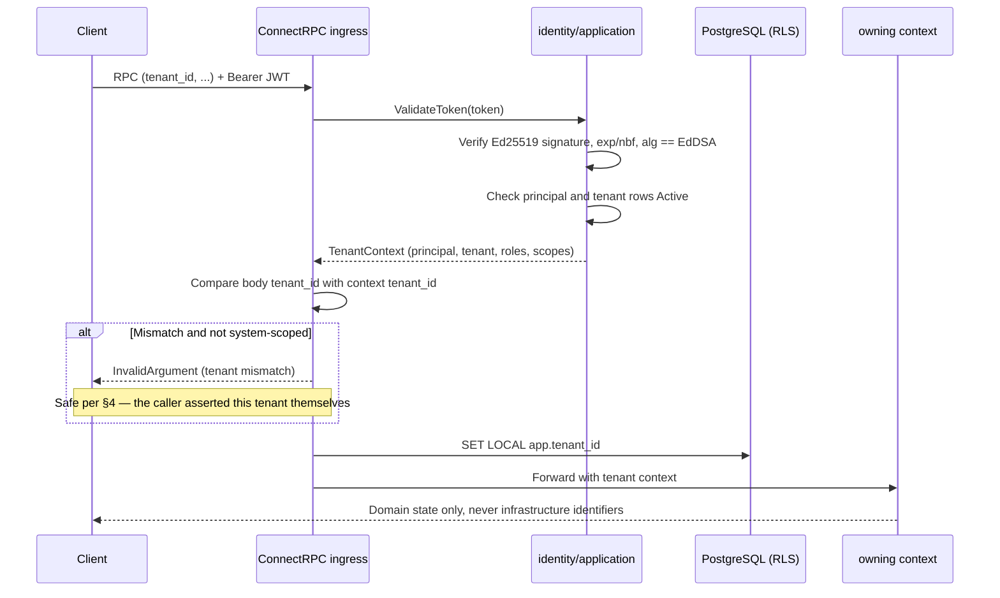

# LLD-02 — Identity

| | |
|---|---|
| **Bounded context** | `identity` (Tier 0 — see [`04-bounded-contexts.md` §10](../hld/04-bounded-contexts.md#10-bounded-context-build--dependency-graph)) |
| **Status** | **Implemented & archived.** Living specs [`identity/authentication`](../../openspec/specs/identity/authentication/spec.md), [`identity/access-control`](../../openspec/specs/identity/access-control/spec.md), [`identity/tenant-provisioning`](../../openspec/specs/identity/tenant-provisioning/spec.md), [`identity/audit-log`](../../openspec/specs/identity/audit-log/spec.md), [`identity/public-api`](../../openspec/specs/identity/public-api/spec.md) |
| **Traces to** | BRD FBR-R1-04/§10; PRD EPIC-01 (US-01.1–01.7, AC-01.1–01.7), INV-01/INV-10/INV-11; TRD domain model; HLD [01-architecture.md](../hld/01-architecture.md), [03-domain-model.md](../hld/03-domain-model.md) §5, [04-bounded-contexts.md](../hld/04-bounded-contexts.md) §7, [05-security.md](../hld/05-security.md) §1; DECISIONS D-24 |
| **Why this is LLD-02** | LLD-01 proved the media path against stub adapters whose files say, verbatim, "until LLD-02 lands." Every Tier 1 context needs `identity`'s tenant context (§10.1), so D-26 (dependency-first within a release) puts it here. |

## Document history

| Date | Change |
|---|---|
| 2026-09-07 | Initial draft. |
| 2026-09-07 | Amendment: dev-token guardrails (§5.2); change table with propose order (§9); Security & Compliance Invariants (§10); critical-path sequence diagram (§11); DoD items 9–11. |
| 2026-09-07 | Review fixes: `AuditEntry` shape matched to HLD 03 §5 (§3); HLD 03 §5 gained `role_bindings`/`api_keys` DDL (§5.1); JWT implementation (stdlib-only, TTL, algorithm pinning) and Argon2id parameters specified (§5.3, §10.7); INV-10 reasoning for the tenant-mismatch check (§4); failed-authentication logging (§10.8); OWASP Top 10 (2021) traceability (§10.9); DoD item 12. |
| 2026-09-09 | **§4a.1 added: the `MaxTenants` provisioning cap (D-51).** `CreateTenant` refuses with `FAILED_PRECONDITION` at the cap; reads are never gated; RLS stays mandatory in every mode. The entitlement is passed in through a port `identity` owns, so `identity` still depends on nothing. |
| 2026-09-08 | **Licensing split out into [LLD-08](LLD-08-licensing.md).** This document was `LLD-02-identity-licensing.md` and covered two bounded contexts. `docs/lld/README.md` states an LLD covers "one bounded context at a time", and HLD 04 §10.1 lists `identity` and `licensing` as separate Tier-0 contexts depending on nothing. The merge had been justified as sharing "one cutover (auth + entitlement activate together)"; delivery disproved it — identity shipped in three archived changes while licensing shipped nothing. |
| 2026-09-08 | Status → implemented. `auth-cutover-connectrpc` landed, closing the unauthenticated-`GetCall` concession §1 deferred; `identity-bootstrap` closed as unnecessary (§5.2, §9). |

## 1. Scope

**In scope:** tenant provisioning (replacing and **deleting** the
`0002_dev_tenant_seed` migration — LLD-01: "deleted, not left in place"),
principals with Argon2id password hashes, scoped RBAC
(`AuthorizeAction`), API keys stored as SHA-256 hashes, JWT issue and
validation, an append-only audit log (AC-01.3), and the tenant-context
middleware that feeds RLS.

Also in scope, and now landed: the ConnectRPC auth cutover —
`Authorization: Bearer <JWT>` required on every RPC in every service,
with the request's `tenant_id` required to match the token's.

**Zero `telephony-core` changes.** Swapping the LLD-01 stub behind its
existing port was the whole integration; if this LLD had required editing
anything under `internal/telephony/`, the seam would have failed.

**Explicitly out of scope (owned elsewhere):**

| Deferred | Owner | Why not here |
|---|---|---|
| Everything licensing | [LLD-08](LLD-08-licensing.md) | A separate Tier-0 context that shares no code and no table with this one |
| Real DNC / hours / spend compliance | LLD-04 | `stub_compliance.go` stays permit-all; nothing consumes real verdicts yet |
| Inbound dial-in handling, emergency-number bypass | LLD-03 `pbx-core` | No inbound path existed when this was written; **delivered** by `pbx-inbound-and-emergency` |
| Recording, RTCP-XR, `Degraded` transitions | LLD-09 | Unchanged from LLD-01 §1 |
| Webhooks, AI pipeline, dialer | LLD-05, LLD-10, LLD-06 | Tier 1/2 in the dependency graph |

## 2. Go package layout

```
api/internal/
├── shared/
│   └── domain/          # ADD: PrincipalID, ApiKeyID (typed UUID wrappers)
└── identity/            # bounded context root
    ├── domain/          # Tenant, Principal, RoleBinding, ApiKey,
    │                    # AuditEntry; pure password-policy helpers
    ├── ports/           # IdentityService (exactly HLD 04 §7) +
    │                    # TenantContext carrier
    ├── application/     # orchestrator (provision/authenticate/authorize/
    │                    # audit), Argon2id hasher, JWT issuer/validator,
    │                    # the ConnectRPC auth interceptor
    ├── postgres/        # stores
    ├── rpc/             # IdentityService handlers
    └── bootstrap/       # first-administrator creation, off the network
```

## 3. Domain types

```go
// identity/domain
type Tenant struct {
    ID            shared.TenantID
    Name          string
    Status        TenantStatus // Active | Suspended
    ResidencyZone string       // immutable once provisioned
}
type Principal struct {
    ID           PrincipalID
    TenantID     shared.TenantID
    Username     string          // UNIQUE(tenant_id, username) — AC-01.2
    Email        string
    PasswordHash string          // Argon2id, never plaintext (INV-11)
    Role         string
    Status       PrincipalStatus // Active | Disabled
}
type RoleBinding struct {
    PrincipalID PrincipalID
    TenantID    shared.TenantID
    Role        string
    Scope       string          // "tenant", "system", or "department:<id>"
}
type ApiKey struct {
    ID          ApiKeyID
    TenantID    shared.TenantID
    PrincipalID PrincipalID
    KeyHash     string          // SHA-256; raw key shown once at creation
    ExpiresAt   *time.Time
    RevokedAt   *time.Time
}
type AuditEntry struct {
    ID           int64     // BIGSERIAL, append-only
    TenantID     shared.TenantID
    ActorID      uuid.UUID // system-initiated entries use a well-known
                           // sentinel rather than NULL; ActorType
                           // distinguishes "principal" from "system"
    ActorType    string
    Action       string
    ResourceType string    // HLD splits resource into type + id
    ResourceID   string
    IPAddress    net.IP    // nullable — absent for system-initiated entries
    BeforeJSON   []byte    // nullable
    AfterJSON    []byte    // nullable
    CreatedAt    time.Time
}
```

Password hashing uses `golang.org/x/crypto/argon2` (already in
`go.mod`/TOOLSET.md) — no new dependency. JWTs use stdlib
`crypto/ed25519` — no new dependency (§5.3).

## 4. Ports

```go
// identity/ports — exactly HLD 04 §7
type IdentityService interface {
    AuthenticateUser(ctx context.Context, tenantID shared.TenantID, username, password string) (*AuthToken, error)
    ValidateToken(ctx context.Context, tokenString string) (*TenantContext, error)
    AuthorizeAction(ctx context.Context, principal PrincipalID, action, resource string) error
    RecordAudit(ctx context.Context, entry AuditEntry) error
}
```

`TenantContext` carries tenant, principal, roles and scopes downstream
into RLS (`SET LOCAL app.tenant_id`), authorization and audit. It is
produced only by `ValidateToken` or API-key validation — never
hand-constructed, because a hand-built one is an authorization decision
made in the wrong place.

**Auth enforcement point:** a ConnectRPC unary+streaming interceptor in
`identity/application`, wired in `cmd/atsap-api`, calling `ValidateToken`,
rejecting a missing or invalid token (`Unauthenticated`) and a
body-tenant/JWT-tenant mismatch (`InvalidArgument`).

`InvalidArgument` on a mismatch does not violate INV-10's "no leak via
error messages": the caller already asserted that `tenant_id` in their
own request body, so the response confirms nothing they did not already
claim, and no oracle for tenant existence is created. That is distinct
from resource-level isolation — a request for a resource belonging to a
different tenant returns a generic `not_found` via RLS filtering, never a
code revealing it exists elsewhere.

## 4a. How this context interacts with the others

`identity` depends on **nothing** (HLD 04 §10.1). Every interaction is
someone else depending on it:

| Consumer | Through | What it gets |
|---|---|---|
| Every ConnectRPC service | The auth interceptor | Authentication, and the body-vs-token tenant rule |
| `pbx-core` (LLD-03) | `AuthorizeAction`, `AppendAuditTx` | Permission checks, and an audit row written **inside the caller's transaction** so a mutation and its record commit together |
| `telephony-core` | `TenantContext` (passive) | The tenant that scopes RLS |
| Every tenant-scoped table | `SET LOCAL app.tenant_id` | RLS enforcement |

`AppendAuditTx` was added by `pbx-extensions-projection`: `audit_logs`
belongs to identity, so another context writing it directly would be a
cross-context table write (HLD 04 §10.1). A transaction-aware method
keeps the table with its owner while still giving callers atomicity.

**`identity` and `licensing` never call each other.** They are Tier-0
peers sharing no code and no table — the reason they are two LLDs.

### 4a.1 The tenant cap is enforced here, but not decided here (D-51)

`MaxTenants` lives in the signed licence payload and is published by
`licensing` (LLD-08 §3). Provisioning a tenant is the only place that
knows how many tenants already exist, so the refusal happens here — but
`identity` may not call `licensing` to ask, and must not.

The entitlement is therefore supplied **to** `identity`, not fetched by
it: `CreateTenant` takes the tenant cap as an input, from a port
`identity` owns, satisfied at the composition root or by the Tier-1
`entitlement` context (D-50). The dependency direction is unchanged —
`identity` still depends on nothing.

| Rule | Behaviour |
|---|---|
| `MaxTenants = 1` and one tenant exists | `CreateTenant` refuses with **`FAILED_PRECONDITION`** and an entitlement reason |
| `MaxTenants = 0` | Unlimited; no check |
| `MaxTenants = n > 1` | Refuses once `n` tenants exist |
| **Reads** — `ListTenants`, `GetTenant` | **Never gated.** A single-tenant installation has one tenant and its console must show it |

**Not `PERMISSION_DENIED`.** The caller holds the permission; the
installation lacks the entitlement. Returning an authorization error for a
licensing condition would put licence denials into the RBAC audit trail,
so an access-control investigation would surface events that have nothing
to do with access control — and it would tell an administrator to check
their roles when they need to check their licence. AC-06.14 requires a
distinct entitlement reason.

**Row-level security is unaffected.** RLS stays enabled and forced on
every tenant-scoped table in every mode, single-tenant included. There is
no single-tenant schema and no single-tenant build (D-51): `MaxTenants`
constrains provisioning, never isolation.

**Nothing implemented today is wrong.** No cap is enforced now, so this is
an addition to `identity/tenant-provisioning`, not a correction of it —
and the only new refusal occurs on an installation that has no second
tenant to lose.

## 5. Data model

### 5.1 Migration scope (`api/migrations/0003_identity.up.sql`)

Exactly the [HLD 03 §5](../hld/03-domain-model.md#5-comprehensive-relational-schema-postgresql-16)
tables this LLD owns — not a new schema, the agreed one. `role_bindings`
and `api_keys` had no DDL there until this LLD amended §5 to add them.

- `principals` — `UNIQUE(tenant_id, username)`, so two tenants may each
  have an "admin" and they are unrelated principals (AC-01.2)
- `role_bindings` — `PRIMARY KEY (principal_id, role, scope)`
- `api_keys` — SHA-256 `key_hash`; the raw key is returned once, at issue
- `audit_logs` — BIGSERIAL, JSONB before/after, INET address, and **no
  UPDATE or DELETE path by construction**; immutability enforced by the
  absence of a method is stronger than by a check (AC-01.3/01.4)
- RLS `ENABLE` **and** `FORCE` plus a `tenant_isolation_*` policy on every
  table — the LLD-01 lesson, now the house rule

### 5.2 Deletions and the first administrator

- **Deleted** `0002_dev_tenant_seed.{up,down}.sql`, tombstoned rather than
  removed so a database at version 2 can still migrate forward.
- **The first administrator is created off the network** by
  `atsap-api bootstrap`, never by a seeded default credential. A
  first-run setup wizard on the network is a window in which an
  unauthenticated caller can create the platform administrator; shipping
  a default credential is worse.
- **Dev-token minting was designed here and never built.** §5.2
  originally specified a three-layer guarded `ATSAPBX_DEV_TOKEN_*` path
  so the rig would keep working after the auth cutover. It proved
  unnecessary: the cutover's e2e obtains a **real** token by seeding a
  fixture operator and calling `AuthenticateUser`, which proves more than
  a minted token would — a dev token shows the rig can reach the API, not
  that a caller can. A second minting path would also be a second thing
  to keep secure, and a second thing that can be left enabled in
  production by accident. Closed by `auth-cutover-connectrpc` design D4.

### 5.3 Cryptographic parameters

- **Argon2id**: memory 19 MiB (19456 KiB), 2 iterations, parallelism 1 —
  the OWASP Password Storage Cheat Sheet minimum. Password length 8–64,
  no forced composition rules (NIST SP 800-63B §5.1.1.2: length beats
  complexity rules, which push users toward predictable patterns).
- **JWT: hand-rolled on stdlib, no new dependency.** `crypto/ed25519` +
  `encoding/json` + `encoding/base64`. A JWT is header, claims and an
  Ed25519 signature — not a protocol needing a framework. If a future LLD
  needs JWKS rotation or OIDC federation, that is a separately proposed
  and TOOLSET §6-vetted dependency, not an extension of this code.
- **Algorithm pinning**: the validator accepts exactly one algorithm,
  `EdDSA`, from a fixed expectation — **never from the token's own `alg`
  header**. A token asserting `alg: none` is rejected before signature
  verification runs. There is no algorithm negotiation to attack because
  there is no algorithm choice at validation time.
- **Token lifetime**: 15 minutes, no refresh flow. Machine clients
  re-authenticate cheaply; a refresh/rotation scheme is deferred to
  whichever LLD first has a human-facing session needing one (the
  console, HLD 12).
- **API keys stay SHA-256, not Argon2id.** Unlike a password, an API key
  is a high-entropy machine-generated token; slow hashing defends against
  brute-forcing a low-entropy secret, which does not apply.

## 6. ConnectRPC surface

**The rule (D-43):** a capability gets an RPC in the change that builds it
when it has a named R1.0 consumer; otherwise it stays a port and the
change records why.

| Capability | Wire? | Reason |
|---|---|---|
| `AuthenticateUser` | **RPC** | Console login, partner developers, and every test harness need a token, and nothing else can mint one in production |
| `ProvisionTenant`, `ProvisionPrincipal` | **RPC** | EPIC-01 admin stories; the console's first screens |
| `SetTenantStatus`, `SetPrincipalStatus` | **RPC** | AC-01.5/01.7 suspend and disable are console actions |
| `GrantRole`, `IssueApiKey`, `RevokeApiKey`, `ListAudit` | **RPC** | EPIC-01 RBAC, partner key self-service, audit review |
| `ValidateToken`, `AuthorizeAction`, `AuthenticateAPIKey` | Port only | Mechanism, not capability — what the interceptor does *for* a caller. Exposing `ValidateToken` hands out a token-validity oracle; a client asking "may I?" separately from doing the thing invites TOCTOU |
| `RecordAudit` | Port only | A write path used by provisioning. Partners *read* audit; they do not author it |

**Corrected 2026-09-07.** This section previously argued API-first was
"satisfied either way" because every capability is *reachable*. That was
wrong, and reviewing it surfaced a concrete defect: reachable by
in-process Go code is not reachable by a console, a partner, or a test
harness — and §9's sequence ended with the auth cutover requiring a JWT
while the only way to obtain one was a Go method. **The cutover would
have locked the API with the key inside the building.** `identity-api`
was pulled ahead as a result.

## 7. Definition of Done

1. Tenant provision → principal → JWT → authenticated RPC succeeds; bad
   password, expired token and unknown tenant all fail closed with
   distinct codes (AC-01.1–01.3).
2. The same username in two tenants yields independent principals with
   independent sessions (AC-01.2).
3. Disabling a principal takes effect on its next request; suspending a
   tenant blocks new access and is fully reversible, and neither
   terminates a call already active (AC-01.5/01.7, INV-03).
4. Every admin mutation writes exactly one immutable `audit_logs` row; no
   role — including a second admin — can edit or delete it (AC-01.3/01.4).
5. `depguard` green with the new context present; the RLS isolation test
   covers every new tenant-scoped table; `tenant_id` absent from no new
   row, event or log.
6. **Security invariants verified**: `AuthorizeAction` is deny-by-default
   (no-match tuple test); no audit row contains `password_hash` or
   `key_hash` (constructor-redaction test); all SQL uses placeholders —
   review-enforced, and no gate claims otherwise (D-28 honesty).
7. **Session invalidation tested**: disabling a principal causes the next
   RPC to fail; per-RPC validation leaves no window beyond the already
   in-flight call.
8. **Rate-limiting readiness**: the interceptor documents where a limiter
   wraps it. Documentation only — no stub limiter ships.
9. **OWASP-driven checks**: a token with `alg: none` or any non-`EdDSA`
   value is rejected before signature verification (algorithm-pinning
   test); a failed authentication produces exactly one `WARN` log
   containing no password material; Argon2id is invoked with the §5.3
   parameters, asserted against the hasher call rather than inferred.

## 8. Known limitations

- Rate limiting is deferred (§10.5) — the extension point is documented,
  the limiter is not built.
- Data-residency enforcement is deferred (§10.6): the field exists, is
  immutable and is carried in `TenantContext`; storage routing is a
  deployment-layer concern for a later LLD.
- No refresh-token flow (§5.3). Deliberate until a human-facing session
  needs one.

## 9. OpenSpec handoff — delivered

| Change ID | Scope | Status |
|---|---|---|
| `identity-auth-rbac` | Tenant provisioning, Argon2id hashing, JWT issuer/validator, auth interceptor, RBAC | **Archived** 2026-09-07 |
| `identity-api` | `IdentityService` proto (9 RPCs), auth enforced on this service, first-administrator bootstrap, generated OpenAPI | **Archived** 2026-09-07 — pulled ahead, since nothing external could call anything until it landed |
| ~~`identity-bootstrap`~~ | ~~Dev-token minting for the rig~~ | **Closed as unnecessary** — see §5.2 |
| `auth-cutover-connectrpc` | JWT enforced on every RPC including `TelephonyService`; tenant-match rule | **Archived** 2026-09-08 |

This LLD's Definition of Done is met. Further identity work is proposed
against the living specs, which are now the record of current behaviour —
not against this document.

## 10. Security & Compliance Invariants

### 10.1 Deny-by-default authorization
`AuthorizeAction` denies unless a role binding matches the
(principal, action, resource) tuple. Wildcards exist only for explicit
admin roles and only in scoped forms — no unscoped match-everything grant.

### 10.2 Session invalidation (two layers)
`ValidateToken` checks the JWT itself (Ed25519 signature, `exp`, `nbf`,
pinned `alg`) **and** live state: the principal and tenant rows must both
read `Active`. Disabling an account therefore takes effect on the next
request rather than at token expiry.

### 10.3 Audit-log secret redaction
`before_json`/`after_json` must not contain `password_hash`, `key_hash`
or key material. The `AuditEntry` constructor strips sensitive fields
before marshal — redaction at construction, not at read time, so no query
path can leak it and no call site can forget (D-39, INV-11).

### 10.4 Mandatory parameterized queries
All SQL in `identity/*` uses pgx placeholders. String-built SQL is
forbidden. Stated plainly: this is **review-enforced** — `depguard`
matches import paths, not string shapes, so no CI gate claims it.

### 10.5 Rate limiting (deferred)
Brute-force protection belongs at the connection boundary — an edge proxy,
or a dedicated interceptor wrapping auth in a future LLD — never inside
the auth logic. This LLD documents the extension point only.

### 10.6 Data residency posture (deferred enforcement)
`Tenant.ResidencyZone` is set at provisioning and immutable thereafter.
Storage routing is enforced by a later LLD; this one guarantees the field
exists, is carried in `TenantContext`, and can never be blanked.

### 10.7 Authentication algorithm and credential parameters
JWT validation accepts only `EdDSA` from a fixed expectation, never from
the token's header (§5.3) — closing the "alg confusion"/downgrade class at
the design level rather than by convention. Argon2id parameters and
password bounds are specified rather than left to library defaults.

### 10.8 Failed-authentication visibility
Every `AuthenticateUser` and `ValidateToken` failure is logged at `WARN` —
principal and tenant identifiers only, never the attempted password — even
though it is not an `audit_logs` row (that table is for admin *mutations*;
a failed login mutates nothing). Without it, credential-stuffing patterns
are invisible until §10.5's limiter lands. This is the minimum visibility
before then, not a substitute for the limiter.

### 10.9 OWASP Top 10 (2021) traceability

| Category | How this LLD addresses it |
|---|---|
| A01 Broken Access Control | §10.1 deny-by-default; RLS tenant scoping makes cross-tenant access return `not_found`, never a partial response |
| A02 Cryptographic Failures | Argon2id for passwords, SHA-256 for high-entropy API keys, Ed25519 for JWTs, algorithm pinning (§10.7) |
| A03 Injection | §10.4 parameterized queries, review-enforced |
| A04 Insecure Design | The first administrator is created off the network, not by a seeded default credential (§5.2) |
| A07 Identification & Authentication Failures | §5.3 parameters; §10.2 two-layer invalidation; §10.5 extension point; §10.8 failed-auth logging |
| A09 Security Logging & Monitoring Failures | §10.3 immutable redacted audit log; §10.8 failed-auth visibility |

## 11. Critical path sequence diagram

### 11.1 Auth check — every authenticated RPC


