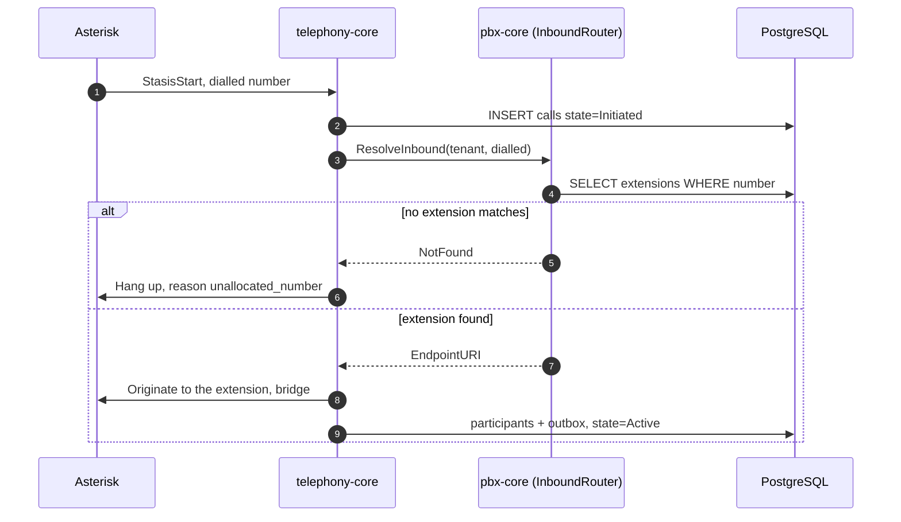
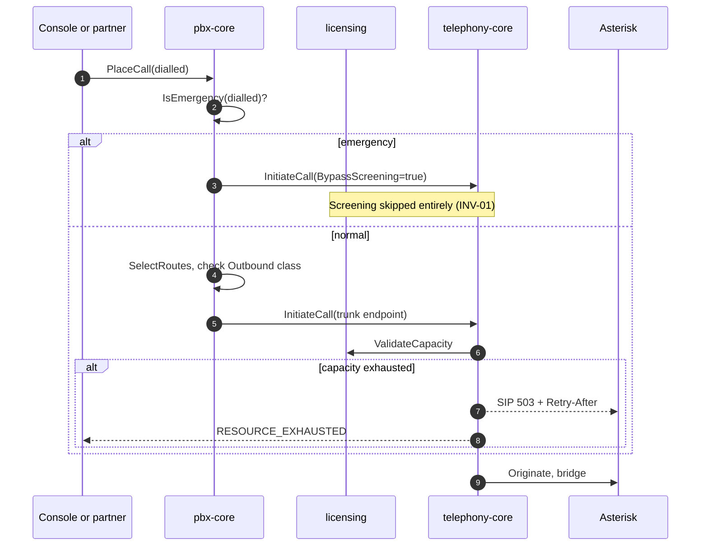

# LLD-03 — PBX Core

| | |
|---|---|
| **Bounded context** | `pbx-core` (Tier 1 — see [`04-bounded-contexts.md` §10](../hld/04-bounded-contexts.md#10-bounded-context-build--dependency-graph)) |
| **Status** | Draft — not yet proposed as an OpenSpec change |
| **Traces to** | BRD FBR-R1-01/§16; PRD principle 4, EPIC-03 (US-03.1–03.10, AC-03.1–03.10), EPIC-10 (console), INV-01/INV-03/INV-10; TRD domain model; HLD [01-architecture.md](../hld/01-architecture.md) §1.2, [03-domain-model.md](../hld/03-domain-model.md) §5, [04-bounded-contexts.md](../hld/04-bounded-contexts.md) §2, [05-security.md](../hld/05-security.md), [17-data-model-erd.md](../hld/17-data-model-erd.md), [18-phase-a-user-flows.md](../hld/18-phase-a-user-flows.md); DECISIONS D-02, D-22, D-24, D-41, D-43, D-46, D-47 |
| **Why this is LLD-03** | LLD-01 proved the media path and LLD-02 landed identity; neither made a single extension exist. Every remaining LLD needs configuration that Asterisk can act on: `compliance` gates dialling that `pbx-core` routes, `reporting` reports on calls `pbx-core` places, and the console (D-46) has nothing to configure until this exists. D-26 (dependency-first) puts it here. |

## Document history

| Date | Change |
|---|---|
| 2026-09-07 | Initial draft. |

## 1. Scope

`pbx-core` is a large context and is **not** built in one pass. D-46
splits it across two delivery phases, and this LLD is written for the
whole context with the phase marked on every part.

**Phase A (in scope now):**

- **Extensions.** Tenant-local numbers, generated SIP credentials,
  WebRTC and desk-phone device types, registration status surfaced as a
  domain-level state (never an Asterisk one).
- **Carrier trunks.** BYOT SIP trunks, per-trunk channel limits, observed
  health.
- **Basic routing.** Prefix-matched outbound route selection by priority
  (the first, deliberately simple, form of LCR), and inbound resolution
  from a dialled number to an extension.
- **Emergency-number recognition and bypass** (INV-01) — deferred to this
  LLD by LLD-02 §1, because no inbound path existed to trigger it.
- **Capacity rejection at the SIP edge**: `503` with `Retry-After` when
  licensing declines a call — also deferred here by LLD-02 §1.
- **The Asterisk projection** (D-47): domain rows become live PJSIP
  Realtime state inside the same transaction.
- **The ConnectRPC surface** for all of the above, because every one of
  these is a console screen (§6).

**Phase B (designed here, built later):**

| Deferred to Phase B | Why it is designed now anyway |
|---|---|
| IVR flow execution (`FlowInterpreter`, flow-as-data per D-22) | Its node graph constrains the routing columns Phase A writes; getting `carrier_routes` wrong now is expensive later |
| Auto-attendant, business hours, holidays | Same table, same matcher, one more condition |
| ACD queues | `Queue` is a `pbx-core` aggregate (HLD 04 §2); leaving it out of the design invites a competing one |
| Voicemail (US-03.5) | Needs recording governance, which is Phase B |
| Desk-phone zero-touch provisioning (US-03.6, AC-03.5) | Needs the encrypted provisioning endpoint in the edge gateway |

**Explicitly out of scope (owned elsewhere):**

| Deferred | Owning LLD | Why not here |
|---|---|---|
| Real DNC / calling hours / spend verdicts | LLD-04 | `stub_compliance.go` stays permit-all; `pbx-core` consumes verdicts, it does not author them |
| Call detail reporting and quality views | LLD-04 | Reads the rows this LLD writes; no shared code |
| Predictive and power dialling | LLD-06 | Tier 2; `dialer` calls `pbx-core`, never the reverse |
| Multi-node registration visibility (`ps_contacts` in realtime) | Multi-node work (D-08) | Single node does not need it, and D-47 records the exact gap |

## 2. Go package layout

```
api/internal/
├── shared/
│   └── domain/          # ADD: ExtensionID, TrunkID, RouteID (typed UUID wrappers)
├── pbx/                 # NEW bounded context root
│   ├── domain/          # NEW: Extension, Trunk, CarrierRoute, Destination,
│   │                    #      prefix matcher, emergency matcher, credential
│   │                    #      generation — all pure, no I/O
│   ├── ports/           # NEW: ConfigService, RoutePlanner (exactly HLD 04 §2),
│   │                    #      ExtensionStore, TrunkStore, RouteStore,
│   │                    #      EndpointProjector
│   ├── application/     # NEW: configuration orchestrator, route planner,
│   │                    #      inbound resolver, call placer
│   ├── acl/
│   │   └── asterisk/    # NEW: the PJSIP Realtime projector. The ONLY package
│   │                    #      in the codebase that names ps_endpoints,
│   │                    #      ps_auths or ps_aors (D-41, D-47)
│   ├── postgres/        # NEW: stores for the domain tables
│   └── rpc/             # NEW: PbxService ConnectRPC handlers
└── telephony/
    ├── ports/           # CHANGED: adds the InboundRouter port and a screening
    │                    #          bypass field — see §4.3
    └── application/     # CHANGED: Stasis inbound path consults InboundRouter
```

**`pbx/acl/asterisk/` is an ACL, and the same rules apply to it as to
`telephony/acl/`.** It is the only place Asterisk's table shapes are
named, it exports domain-shaped operations, and `depguard` gets a rule
saying so (§8 item 7). Nothing in `pbx/domain`, `pbx/application` or
`pbx/rpc` may reference a `ps_*` table or a projected identifier.

## 3. Domain types

```go
// pbx/domain — pure; no database, no engine, no clock except injected
type Extension struct {
    ID           shared.ExtensionID
    TenantID     shared.TenantID
    Number       string        // tenant-local; UNIQUE(tenant_id, number)
    DisplayName  string
    DepartmentID *uuid.UUID
    AuthUsername string        // generated, never the number (§10.3)
    SecretDigest string        // MD5 HA1, never plaintext, never Argon2id (§7.3)
    DeviceType   DeviceType    // WebRTC | SIP
    Outbound     OutboundClass // Internal | National | International (§10.2)
}

type Trunk struct {
    ID             shared.TrunkID
    TenantID       shared.TenantID
    Name           string
    Host           string
    Port           int
    CredentialRef  string        // reference; the secret is fetched, not stored here
    ChannelLimit   int
    Priority       int
    Health         TrunkHealth   // Healthy | Degraded | Unhealthy — observed, never set by a user
}

type CarrierRoute struct {
    ID             shared.RouteID
    TenantID       shared.TenantID
    PrefixPattern  string
    TrunkID        shared.TrunkID
    CostPerMinute  int64         // micros
    Priority       int           // lower wins
}

// Destination is what routing returns: a domain answer, never an
// Asterisk endpoint name. The ACL turns it into one.
type Destination struct {
    Kind        DestinationKind // Extension | Trunk
    ExtensionID *shared.ExtensionID
    TrunkID     *shared.TrunkID
    DialledE164 string
}
```

Three pure functions carry the logic that must be testable without a
database, in the shape D-21 sets for `compliance`:

```go
// Longest-prefix wins; ties broken by Priority, then by cost. Deterministic
// for a given input set — the same list always yields the same order.
func SelectRoutes(dialled string, routes []CarrierRoute, trunks []Trunk) []CarrierRoute

// INV-01. Matched BEFORE any other evaluation, on the digits as dialled.
func IsEmergency(dialled string, set EmergencyNumberSet) bool

// Generates the SIP credential and its digest together; the plaintext is
// returned once, for display, and is never persisted (§7.3).
func NewExtensionCredential(username, realm string, rand io.Reader) (plaintext string, digest string, err error)
```

## 4. Ports and the dependency direction

This is the part of LLD-03 most likely to be got wrong, so it is stated
before anything else is designed around it.

`pbx-core` is **Tier 1 and depends on `telephony-core`** (HLD 04 §10.1).
`telephony-core` must never import `pbx-core`. Outbound and inbound calls
reach that rule from opposite sides, and they get different answers.

### 4.1 Outbound needs no new telephony-core port

For an outbound call, `pbx-core` is the **caller**. It resolves the
dialled number to a trunk, builds the endpoint URI, and calls
`telephony-core`'s existing `CallService.InitiateCall`. The import points
from `pbx-core` to `telephony-core`, which is the legal direction, and
`InitiateCallCommand` already carries `SourceEndpointURI` and
`DestEndpointURI` — LLD-01 wrote them for exactly this and said so.

Nothing about outbound requires `telephony-core` to change.

### 4.2 Inbound requires one new outbound port

For an inbound call the trigger is inside `telephony-core`: Asterisk
delivers the channel to Stasis and the event loop creates the `Call`.
Something must then decide which extension it reaches, and that decision
is `pbx-core`'s. `telephony-core` cannot call `pbx-core` directly.

The answer is the same dependency inversion already used for
`LicenseManager` and `ComplianceEngine`: **`telephony-core` declares the
port, `pbx-core` implements it, the composition root wires it.**

```go
// telephony/ports — ADDED by LLD-03
type InboundRouter interface {
    ResolveInbound(ctx context.Context, tenantID shareddomain.TenantID, dialled string) (InboundDestination, error)
}

type InboundDestination struct {
    EndpointURI string // opaque to telephony-core, produced by pbx-core
    NotFound    bool   // no extension matched; caller gets a clean rejection
}
```

**The alternative was rejected on latency and failure modes.** Publishing
`event.call.initiated` and having `pbx-core` react over NATS would keep
the import graph untouched, but it makes call setup asynchronous: a lost
or delayed event becomes a call that rings nowhere, and the setup budget
does not tolerate a round trip through JetStream. Call setup is
synchronous; only the record of it is not.

**This strains HLD 04 §10.1 and the tension is stated, not absorbed.**
That row says `telephony-core` must not depend on `pbx-core`, and at
runtime this design has it calling a `pbx-core` implementation. Two things
resolve it, and both are load-bearing:

1. **The rule is an import rule.** §10.1's own enforcement sentence reads
   "adds an *import* violating this table fails the Dependency Invariant
   Test." No such import is added: `telephony-core` declares the
   interface, `pbx-core` implements it, and `cmd/atsap-api` wires them.
   This is the identical shape §10.1 already permits for `licensing` and
   `compliance`, which `telephony-core` also calls at runtime through
   ports it owns.
2. **`telephony-core` must still work without one.** A default
   `NoInboundRouter` ships alongside the port and returns `NotFound`, the
   same way `stub_license.go` and `stub_compliance.go` let LLD-01 run
   before either context existed. `telephony-core`'s own tests and its
   walking-skeleton e2e run against that default, with no `pbx-core` in
   the binary at all. If that ever stops being true, the seam has failed
   and this design is wrong — DoD item 15 asserts it.

If a reviewer judges that runtime coupling alone breaks §10.1 regardless
of imports, that is an architectural reversal and routes to a new
`DECISIONS.md` entry, not to a quiet change here.

### 4.3 Emergency bypass requires one field, and it is not on the wire

INV-01 says emergency calls bypass every check. The **decision** is
`pbx-core`'s — it owns the dial plan and the emergency number set. The
**enforcement point** is inside `telephony-core`'s Screening, which is
what would otherwise reject the call.

```go
// telephony/ports — InitiateCallCommand gains one field
type InitiateCallCommand struct {
    // ...existing fields unchanged...

    // BypassScreening skips capacity, compliance and suspension checks.
    // Set ONLY by pbx-core's application layer from its own emergency
    // matcher (domain.IsEmergency). It is not a request field, is never
    // decoded from a wire message, and any RPC handler that sets it is a
    // defect — see §10.1.
    BypassScreening bool
}
```

**A caller-settable bypass would be a licence-evasion hole**, so the
field's provenance is a security invariant with its own test (§8 item 9),
not a comment.

### 4.4 pbx-core's own ports

```go
// pbx/ports — inbound
type ConfigService interface {
    CreateExtension(ctx context.Context, cmd CreateExtensionCommand) (ExtensionResult, error)
    UpdateExtension(ctx context.Context, cmd UpdateExtensionCommand) error
    DeleteExtension(ctx context.Context, tenantID shared.TenantID, id shared.ExtensionID) error
    ListExtensions(ctx context.Context, tenantID shared.TenantID, page Page) ([]ExtensionView, error)
    // Trunk and route operations mirror these exactly.
}

// Exactly HLD 04 §2 — no methods added, no signatures changed.
type RoutePlanner interface {
    SelectOutboundRoute(ctx context.Context, tenantID shared.TenantID, destination string) ([]TrunkRoute, error)
    ReportRouteHealth(ctx context.Context, trunkID shared.TrunkID, statusCode int, latency time.Duration) error
}

// pbx/ports — outbound
type ExtensionStore interface { /* CRUD within a caller-supplied transaction */ }
type TrunkStore interface     { /* ... */ }
type RouteStore interface     { /* ... */ }

// EndpointProjector is implemented by pbx/acl/asterisk. Every method takes
// the caller's transaction, because the projection is not allowed to
// succeed or fail independently of the domain write (§7.2).
type EndpointProjector interface {
    ProjectExtension(ctx context.Context, tx pgx.Tx, ext domain.Extension) error
    RemoveExtension(ctx context.Context, tx pgx.Tx, id shared.ExtensionID) error
    ProjectTrunk(ctx context.Context, tx pgx.Tx, trunk domain.Trunk, secret []byte) error
    RemoveTrunk(ctx context.Context, tx pgx.Tx, id shared.TrunkID) error
    RegistrationStatus(ctx context.Context, ids []shared.ExtensionID) (map[shared.ExtensionID]RegistrationStatus, error)
}
```

`RegistrationStatus` deliberately takes a slice: the extensions list
screen needs status for a page of rows, and a per-row call would be N
queries against the engine's own state for one screen.

## 5. Data model

### 5.1 Migration `0004_pbx_core.up.sql`

Three domain tables, exactly as [HLD 03 §5](../hld/03-domain-model.md#5-comprehensive-relational-schema-postgresql-16)
defines them (`extensions`, `carrier_trunks`, `carrier_routes`), each with
`tenant_id`, `ENABLE` **and** `FORCE ROW LEVEL SECURITY`, and a
`tenant_isolation_*` policy — the pattern `0003_identity` established.

Two additions this LLD makes to HLD 03 §5, which must land in the HLD in
the same change (the precedent is LLD-02 adding `role_bindings`):

- **`emergency_numbers`** (`tenant_id`, `number`, `description`). INV-01
  needs a per-tenant set, because emergency numbers are jurisdictional
  and a partner in one country cannot be given another's. Ships with a
  seeded default set per residency zone; a tenant may add, never remove
  below the seeded set.
- **`extensions.password_hash` is renamed `secret_digest`** and its
  comment corrected. See §7.3 — the current name states something that
  cannot be true for SIP.

### 5.2 The projection tables

`ps_endpoints`, `ps_auths`, `ps_aors` are created by the same migration
but are **not domain tables** (D-47, [HLD 17 §6](../hld/17-data-model-erd.md)):

- No `tenant_id`, and **no RLS** — Asterisk connects as its own role and
  cannot set a tenant context, so a policy would hide every row from the
  engine that must read them.
- Isolation is by construction: `ps_endpoints.id` is derived from
  `extensions.id` (a UUID), never from the tenant-local extension number.
- No foreign key in either direction. The ACL maintains the
  correspondence; the database does not know about it.

### 5.3 The Asterisk database role

```sql
CREATE ROLE asterisk_engine LOGIN PASSWORD :'engine_password';
GRANT USAGE ON SCHEMA public TO asterisk_engine;
GRANT SELECT ON ps_endpoints, ps_auths, ps_aors TO asterisk_engine;
-- and nothing else, ever
```

The engine gets `SELECT` on three tables and no access whatsoever to any
domain table. This is the isolation control that replaces RLS for `ps_*`,
so it is asserted by a test that connects as `asterisk_engine` and proves
`SELECT` on `extensions`, `principals` and `calls` all fail (§8 item 8).

## 6. ConnectRPC surface

Per D-43, a capability gets an RPC when it has a named R1.0 consumer.
Every configuration operation here has one: the Phase A console slice
(D-46), which by AC-10.7 may use **only** public endpoints.

| Capability | Wire? | Consumer |
|---|---|---|
| `CreateExtension`, `ListExtensions`, `UpdateExtension`, `DeleteExtension` | **RPC** | Console extensions screen (flow A3) |
| `CreateTrunk`, `ListTrunks`, `UpdateTrunk`, `DeleteTrunk` | **RPC** | Console trunks screen (flow A4) |
| `CreateRoute`, `ListRoutes`, `DeleteRoute` | **RPC** | Console outbound routing (flow A4) |
| `PlaceCall`, `HangupCall` | **RPC** | The UAT harness, which BRD §16 requires to demonstrate Phase A **through the public API**; the Phase B agent UI is the second consumer |
| `SelectOutboundRoute`, `ReportRouteHealth` | Port only | Mechanism. A client asking "which trunk would you pick" separately from placing the call is an oracle, and the answer can change between the two |
| `ResolveInbound` | Port only | Called by `telephony-core`, never by a client |
| `IsEmergency` | Port only | A pure function inside the dial plan. Exposing it would invite a client to decide, and INV-01 is not delegable |

**All of this lands on a new `PbxService`,** not on `TelephonyService`.
`PlaceCall` is a dial-plan operation — it needs routing before it needs a
channel — and putting it on `TelephonyService` would force
`internal/telephony/rpc` to import `pbx`, which §4 forbids.

`TelephonyService.GetCall` stays where it is. Splitting the call read and
the call write across two services is genuinely awkward, and it is
recorded here as a known cost rather than hidden: consolidation is a
Phase B decision, taken when the agent UI shows which grouping a real
client wants. It is not reopened before then.

`docs/API.md` §1 and §3 are updated by the change that lands each RPC, not
by this document.

## 7. How configuration becomes live Asterisk state

D-47 settled the mechanism. This section settles the details that D-47
deliberately left to the LLD.

### 7.1 Identifier derivation

```
ps_endpoints.id = "e_" + hex(extensions.id)      // extension endpoints
ps_endpoints.id = "t_" + hex(carrier_trunks.id)  // trunk endpoints
ps_auths.id     = same value
ps_aors.id      = same value
```

Globally unique because the source is a UUID; prefixed so the two kinds
never collide and so an operator reading the engine's own state can tell
what they are looking at. **This identifier never appears in an API
response, a console field, a log line a user can see, or an error
message** (PRD principle 4, and the same rule `telephony-core` applies to
channel IDs).

### 7.2 Transactionality

Every configuration write is one transaction:

```
BEGIN
  INSERT/UPDATE/DELETE the domain row
  project into ps_endpoints / ps_auths / ps_aors     (same tx)
  INSERT audit_logs                                   (same tx)
COMMIT
```

If the projection fails, the domain row is not written. The console
therefore cannot show an extension that no phone could register to, and
there is no state where the database and the engine disagree about what
exists.

This is why `EndpointProjector` takes a `pgx.Tx` rather than opening its
own connection. A projector that could commit independently would
reintroduce exactly the split-brain that choosing Realtime over
generate-and-reload was meant to remove.

**Reconciliation still ships**, because a transaction protects against
our own bugs, not against someone editing the database by hand. A
`atsap-api pbx reconcile` command diffs `ps_*` against the domain tables
and reports (with `--fix` to repair), treating the domain as the only
truth. It runs on demand, not on a timer: a silent periodic repair would
hide the bug that caused the drift.

### 7.3 SIP credentials never persist in plaintext — tested

`extensions.password_hash` in HLD 03 §5 implies the same treatment
`principals` gets: Argon2id. **That is impossible for SIP.** Digest
authentication requires the server to hold either the plaintext or the
MD5 HA1 (`MD5(username:realm:password)`); a one-way slow hash cannot
answer a digest challenge. Shipping the column as named would either not
work or quietly become plaintext.

The decision: store the **HA1 only**, project it into `ps_auths.md5_cred`
with `auth_type = md5`, and never write the plaintext anywhere.

Verified against our own Asterisk 22.8.2 on 2026-09-07, with a row that
had a NULL `password` column:

| Test | Result |
|---|---|
| `ps_auths` row with `auth_type=md5`, `md5_cred` set, `password` empty | Row confirmed to hold no plaintext |
| Real SIP `REGISTER` with the correct password | `401` challenge, then **`200 OK`** |
| Same `REGISTER` with a wrong password | `401 Unauthorized` |

Three constraints follow, and they are requirements, not notes:

1. **The realm is pinned.** HA1 is computed over the realm, so changing
   it invalidates every stored credential. It is configuration, set once,
   and changing it is a migration.
2. **Credentials are generated, never chosen.** `NewExtensionCredential`
   produces high-entropy secrets from `crypto/rand`. An HA1 is
   password-equivalent and offline-crackable, so a user-chosen password
   would be the weak link; a generated one gives an attacker nothing
   reusable elsewhere.
3. **The plaintext is shown exactly once**, at creation, in the API
   response — the same contract as `IssueApiKey`. It cannot be retrieved
   later; the console offers regeneration instead.

### 7.4 Trunk credentials are readable by the engine, and this is stated plainly

Outbound registration to a carrier requires Asterisk to authenticate *as
us*, so the engine must be able to read a usable credential. There is no
arrangement in which Asterisk holds a one-way hash of a secret it has to
present. FreePBX has the same property; it writes the credential into
`pjsip.conf`.

So: the trunk secret is at rest in `ps_auths`, readable by
`asterisk_engine`. The controls are the ones that actually apply —
`asterisk_engine` can read three tables and nothing else (§5.3), the
credential never appears in an API response after creation, never in a
log or audit row (§10.4), and `carrier_trunks.credential_ref` holds a
reference so the domain table itself carries no secret. This is a real
residual risk, recorded rather than argued away.

## 8. Definition of Done

1. An extension created through `CreateExtension` is registrable by a
   real SIP client with no reload, no file, and no restart; deleting it
   makes registration fail immediately (flow A3, D-47).
2. Extension numbers are tenant-local: the same number in two tenants
   yields two independent extensions with independent credentials, and
   neither tenant can see or reach the other's (INV-10, AC-01.2 pattern).
3. A trunk plus a route places a real outbound call end to end, and an
   inbound call on that trunk rings the mapped extension — both through
   the public API only (BRD §16).
4. **INV-01 holds**: with the tenant suspended, capacity exhausted **and**
   compliance denying, an emergency number still connects. Tested as
   three separate rejections plus the combination, because passing one
   does not prove the bypass.
5. **INV-03 holds**: deleting an extension, changing a route, or marking
   a trunk unhealthy never drops a call in progress. Tested with a live
   call across each mutation.
6. Capacity rejection surfaces as SIP `503` with `Retry-After`, not as a
   dropped INVITE or a silent failure (LLD-02 §1's deferral, closed).
7. `depguard` proves `ps_endpoints`/`ps_auths`/`ps_aors` are named nowhere
   outside `internal/pbx/acl/asterisk`, and that `internal/telephony` does
   not import `internal/pbx` in any direction (HLD 04 §10.1, D-41).
8. A connection as `asterisk_engine` can `SELECT` the three `ps_*` tables
   and **fails** on `extensions`, `principals` and `calls` — the test that
   makes §5.3 a control rather than an intention.
9. `BypassScreening` is proven unreachable from the wire: a test decodes a
   `PlaceCall` request with every field set and asserts the flag is false
   unless `domain.IsEmergency` matched.
10. Projection is atomic: an injected projector failure leaves no
    `extensions` row, and an injected domain-write failure leaves no
    `ps_*` row. Both directions, both asserted.
11. `reconcile` detects a hand-edited `ps_*` row, reports it, and repairs
    it with `--fix` to match the domain.
12. RLS isolation test extended to `extensions`, `carrier_trunks`,
    `carrier_routes` and `emergency_numbers`; `ps_*` asserted to have **no**
    RLS and no `tenant_id`, deliberately, the way `licensing_state`'s
    exception is asserted (D-24, D-39).
13. No Asterisk identifier — projected id, endpoint name, or dialplan
    context — appears in any API response, console field, or user-visible
    error (PRD principle 4). Asserted by test over the RPC surface, the
    way LLD-01 asserts it for channel IDs.
14. Route selection is deterministic and covered by property-based tests
    over prefix sets, including overlapping prefixes and the tie-break
    order.
15. **`telephony-core` still builds, tests and runs its walking-skeleton
    e2e with no `pbx-core` in the binary**, against the default
    `NoInboundRouter` (§4.2). This is the seam check: if it fails, the
    inbound design has coupled the two contexts and must be reworked
    before the change lands.

## 9. Known limitations of this LLD

- **Routing is prefix-and-priority, not true LCR.** `cost_per_minute`
  exists and is stored, and `SelectRoutes` breaks ties on it, but there is
  no rate table, no time-of-day banding, and no per-destination rate
  import. Real least-cost routing needs a rating model that
  `reporting`/billing (LLD-04) owns; building it here would put a pricing
  engine in the wrong context.
- **Registration status is read from the engine on demand**, so a large
  extensions list costs one query against engine state per page. Adequate
  for Phase A; a presence cache is Phase B work, alongside AC-03.3's
  3-second presence requirement, which this LLD does not attempt.
- **Trunk health is a coarse three-state observation**, not the
  failover-quality signal `09-failure-model.md` describes. Carrier
  failover across trunks mid-setup is designed but not built here.
- **Single-node assumptions carried from LLD-02** apply unchanged:
  capacity counting is per-process, and registration contacts live in
  node-local `astdb` (D-08, D-47).
- **No voicemail, no queues, no IVR execution.** Phase B, per §1.

## 10. Security invariants

### 10.1 The bypass flag is provenance-controlled

`BypassScreening` (§4.3) is the only field in the system whose value is
allowed to disable a commercial control. It is set in exactly one place —
`pbx/application`, from `domain.IsEmergency` — and DoD item 9 proves the
wire cannot reach it. Any future RPC that accepts it is a defect, not a
feature.

### 10.2 Toll fraud

A compromised extension dialling premium-rate international numbers is
the classic PBX loss, and it is a *configuration* control, not a
detection one:

- `Extension.Outbound` classifies each extension as internal, national or
  international, and routing refuses a class the extension does not hold.
  The default for a new extension is **national**, not international.
- Per-trunk `channel_limit` caps the blast radius of any single
  compromise.
- Spend caps are `compliance`'s (LLD-04); this LLD provides the hook and
  does not fake the verdict.

### 10.3 Credentials

Covered in §7.3 and §7.4: generated not chosen, HA1 not plaintext, shown
once, realm pinned, engine role restricted to three tables. The auth
username is generated and is **not** the extension number, so knowing
that a tenant has extension 1005 does not tell an attacker what to
authenticate as.

### 10.4 Audit and logging redaction

Every configuration mutation writes one `audit_logs` row with before and
after state. The `secret_digest`, the generated plaintext, and any trunk
credential are redacted at the constructor, the same mechanism LLD-02 uses
for `password_hash` and `key_hash` — not filtered at the log sink, where
one missed call site leaks.

### 10.5 Input validation

Extension numbers, prefix patterns and trunk hosts are all attacker-
influenced strings that end up in engine configuration. Each is validated
against an explicit allowlist pattern in `pbx/domain` before it can be
stored, and all SQL uses parameter placeholders. A prefix pattern is not
a regular expression — it is digits and a small fixed wildcard set — so
there is no expression to abuse.

### 10.6 OWASP Top 10 (2021) traceability

| Risk | Where addressed |
|---|---|
| A01 Broken access control | Every RPC authorized through `identity.AuthorizeAction`; tenant match enforced; `asterisk_engine` grants (§5.3) |
| A02 Cryptographic failures | §7.3 HA1 not plaintext, generated credentials; §7.4 residual trunk-secret risk stated |
| A03 Injection | §10.5 allowlist validation, parameterized queries |
| A04 Insecure design | §4.3 bypass provenance; §10.2 toll-fraud defaults deny more than they allow |
| A05 Security misconfiguration | §5.3 least-privilege engine role, asserted by test (DoD 8) |
| A08 Software and data integrity | §7.2 atomic projection; `reconcile` for hand-edited state |
| A09 Logging failures | §10.4 audit row per mutation, redaction at construction |

## 11. Critical path sequence diagrams

The configuration write path is drawn in
[18-phase-a-user-flows.md §4.1](../hld/18-phase-a-user-flows.md) and is not
repeated. The two paths below are the ones that path does not cover.

### 11.1 Inbound call resolution



`telephony-core` never learns why an endpoint URI has the value it does,
and `pbx-core` never touches a channel.

### 11.2 Outbound with the emergency path



## 12. OpenSpec handoff

When ready to implement: `/opsx:propose "pbx-core: <one slice>"`.
`openspec/config.yaml`'s `context:` already surfaces the docs baseline;
point the agent at this file as the design source.

**Expected changes.** Phase A is the first four; Phase B follows only
after the Phase A console slice exists, per D-46.

| Change ID | Phase | Scope | Sequencing note |
|---|---|---|---|
| `pbx-extensions-projection` | A | Extension domain + store + the `pbx/acl/asterisk` projector, migration `0004`, `asterisk_engine` role, `CreateExtension`/`List`/`Update`/`Delete` RPCs | First: it establishes the projection pattern every later change reuses, and it is the smallest slice that produces a registrable phone |
| `pbx-trunks-routes` | A | Trunk and route domain, health observation, CRUD RPCs, `SelectRoutes` | Second: needs the projector from the first change |
| `pbx-call-placement` | A | `PlaceCall`/`HangupCall` RPCs, outbound path into `telephony-core`, `Outbound` class enforcement | Third: needs routes to route to |
| `pbx-inbound-and-emergency` | A | `InboundRouter` port on `telephony-core`, Stasis inbound wiring, `emergency_numbers`, `BypassScreening`, SIP `503` + `Retry-After` | Fourth, and the only change that edits `telephony-core`. Isolated deliberately: it is the riskiest slice and the one a reviewer must look at hardest |
| `pbx-ivr-flows` | B | `FlowInterpreter`, flow-as-data execution, publish/version/rollback (AC-03.7, AC-03.8) | Phase B opens here |
| `pbx-queues` | B | ACD queues, agent state | After IVR |

Each change is proposed, applied, and archived independently. **Do not
start a change until the previous one's tests pass** — per D-26 and the
rule in [`README.md`](README.md).
