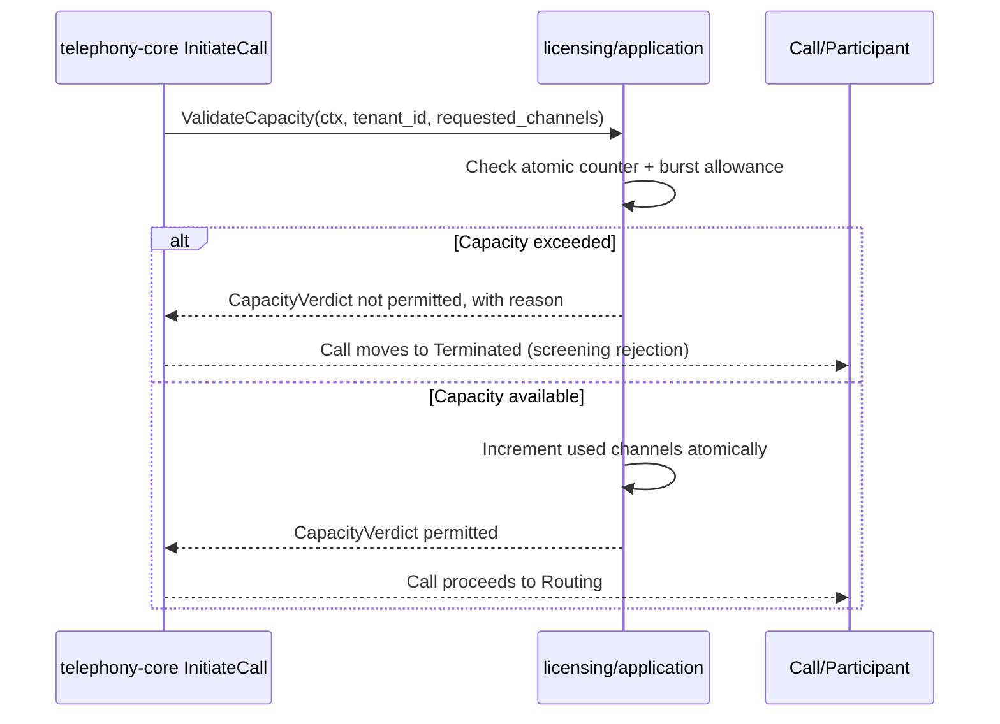
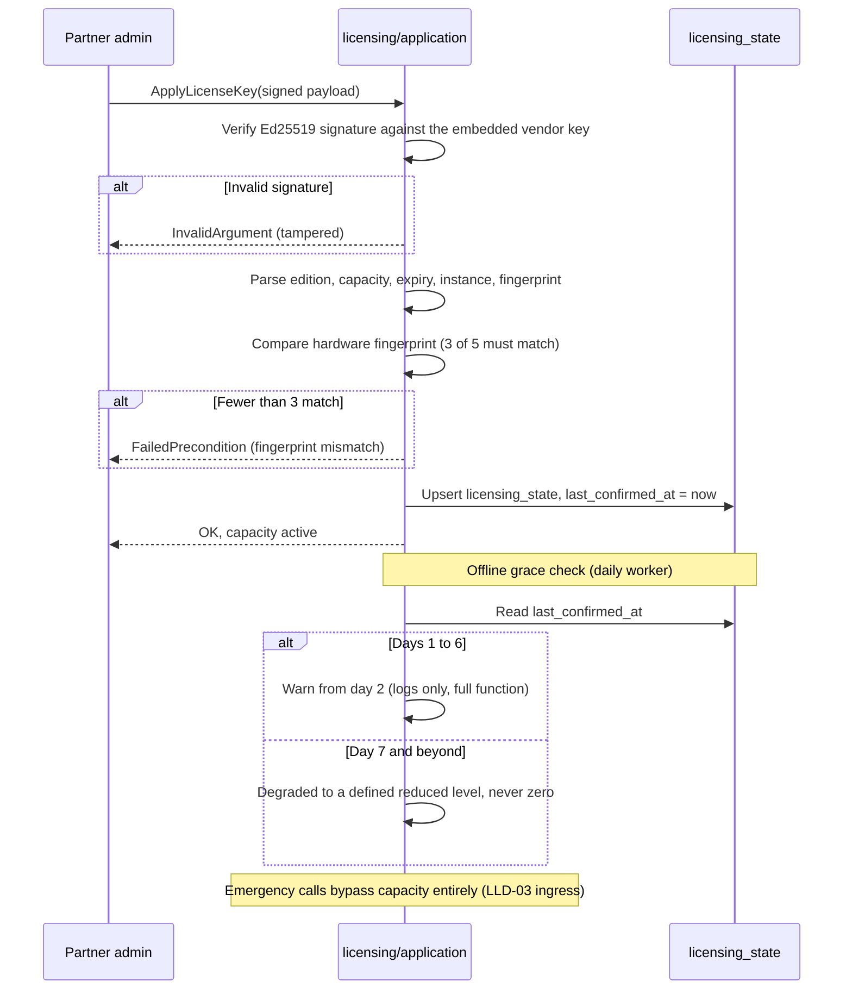

# LLD-08 — Licensing

| | |
|---|---|
| **Bounded context** | `licensing` (Tier 0 — see [`04-bounded-contexts.md` §10](../hld/04-bounded-contexts.md#10-bounded-context-build--dependency-graph)) |
| **Status** | Draft — nothing built. `api/internal/licensing/` does not exist; `telephony-core` still runs against `stub_license.go` |
| **Traces to** | BRD FBR-R1-08/FBR-R1-12/§10; PRD EPIC-06 (US-06.1–06.7, AC-06.1–06.10), PRD §11.2 (licence states), INV-01/INV-03; HLD [04-bounded-contexts.md](../hld/04-bounded-contexts.md) §4, [03-domain-model.md](../hld/03-domain-model.md) §5, [11-decisions.md](../hld/11-decisions.md) (T-1–T-3); DECISIONS D-11–D-14, D-24 |
| **Why a separate LLD** | Split out of LLD-02 on 2026-09-08 — see Document history |

## Document history

| Date | Change |
|---|---|
| 2026-09-07 | Written as the licensing half of `LLD-02-identity-licensing.md`. |
| 2026-09-08 | **Split into its own LLD.** `docs/lld/README.md` states that an LLD covers "one bounded context at a time", and HLD 04 §10.1 lists `identity` and `licensing` as separate Tier-0 contexts, each depending on nothing. LLD-02 §2 had justified combining them as sharing "one cutover (auth + entitlement activate together)". Delivery disproved that: identity shipped in three archived changes (`identity-auth-rbac`, `identity-api`, `auth-cutover-connectrpc`) while licensing shipped nothing. They never activated together and never could have. Content is carried over unchanged except where marked. |

## 1. Scope

**In scope:** the full HLD 04 §4 `LicenseManager` port — `ValidateCapacity`,
`ReleaseCapacity`, `ApplyLicenseKey`, `VerifyDailyEntitlement`. LLD-01
stubbed only the first; this LLD lands all four behind the same
interface. Ed25519 licence tokens (T-1), an atomic capacity counter with
a 10% burst allowance (T-2/T-3), a weighted 3-of-5 hardware fingerprint
with tolerance (D-13), and a 7-day offline grace with day-2 warnings that
**degrades and never disables** (D-12/D-14).

Also in scope: replacing `telephony/application/stub_license.go` by
wiring the real adapter behind the existing port in `cmd/atsap-api`.

**Zero `telephony-core` changes.** If this LLD requires editing anything
under `internal/telephony/` beyond deleting the stub's wiring, the seam
LLD-01 built has failed and work stops. That tripwire is the reason
`ValidateCapacity` keeps its signature (§3).

**Explicitly out of scope:**

| Deferred | Owner | Why not here |
|---|---|---|
| Emergency-number bypass of capacity (INV-01) | LLD-03 `pbx-core` | The bypass is a dial-plan decision made before Screening; licensing supplies the verdict, it does not decide who skips it |
| SIP `503` + `Retry-After` on rejection | LLD-03 `pbx-core` | That is ingress shaping; licensing returns a domain verdict, not a SIP response |
| Partner-facing licence issuance UI | EPIC-10 console | `ApplyLicenseKey` over the API plus a CLI is the whole surface this LLD needs |
| Multi-node shared capacity counting | Multi-node work (D-08) | See §7 |

## 2. Go package layout

```
api/internal/
└── licensing/                # NEW bounded context root
    ├── domain/               # NEW: LicenseToken (Ed25519 verify, pure),
    │                         #      HardwareFingerprint (weighted 3-of-5,
    │                         #      pure), CapacityCounter (atomic +
    │                         #      burst window), GraceTracker (pure
    │                         #      state machine over timestamps)
    ├── ports/                # NEW: the full LicenseManager — HLD 04 §4's
    │                         #      four methods. LLD-01's single-method
    │                         #      stub port is RETIRED by this LLD, not
    │                         #      extended beside it
    ├── application/          # NEW: capacity monitor, daily entitlement
    │                         #      worker, key-apply flow
    └── postgres/             # NEW: licensing_state persistence
```

`telephony/application/stub_license.go` is deleted by replacing its
wiring. `stub_compliance.go` stays — LLD-04 owns that.

## 3. Domain types and the port

```go
// licensing/domain — pure where possible (D-21's shape, applied here)
type LicenseToken struct {
    Edition     string
    Capacity    int       // concurrent channels
    ExpiresAt   time.Time
    InstanceID  string
    Fingerprint [5]string // expected weighted attributes
}
func VerifyToken(payload, signature []byte, pubKey ed25519.PublicKey) (LicenseToken, error) // pure, T-1

type HardwareFingerprint struct{ Attrs [5]string }
func (f HardwareFingerprint) Matches(expected [5]string) bool // >=3 of 5 equal, D-13

type CapacityVerdict struct {
    Permitted bool
    Reason    string // distinct telemetry reason code (BR-05)
}

// GraceState is a pure function of (now, lastConfirmedAt): Valid →
// EntitlementUnverified (warnings from day 2) → Degraded (reduced
// capacity, never disabled — D-12).
func GraceState(now, lastConfirmedAt time.Time) GraceStatus
```

```go
// licensing/ports — HLD 04 §4's four methods.
type LicenseManager interface {
    ValidateCapacity(ctx context.Context, tenantID shareddomain.TenantID, requestedChannels int) (CapacityVerdict, error)
    ReleaseCapacity(ctx context.Context, channels int) error
    ApplyLicenseKey(ctx context.Context, signedPayload []byte) error
    VerifyDailyEntitlement(ctx context.Context) (EntitlementStatus, error)
}
```

**`ValidateCapacity` keeps LLD-01's explicit `tenantID` parameter** rather
than HLD 04 §4's literal two-argument signature. Dropping it would mean
editing `ports.LicenseManager` *and* its call site in
`telephony/application/service.go`, both under `internal/telephony/` —
which trips this LLD's own zero-changes tripwire (§1).
`InitiateCallCommand` already carries `TenantID` explicitly, and a
ctx-carried `TenantContext` would be a second source of truth for the
same value rather than a simplification. A deliberate, documented
deviation, the same category as LLD-01's `CallStore` gaining
`RecordUsageTicks` beyond HLD 04 §1's exact shape.

Ed25519 uses stdlib `crypto/ed25519` — no new dependency.

## 4. How this context interacts with the others

`licensing` depends on **nothing** (HLD 04 §10.1). Every interaction is
someone else calling *it*, through a port they own:

| Caller | Through | When | What must stay true |
|---|---|---|---|
| `telephony-core` | `ports.LicenseManager.ValidateCapacity` | Screening, before any external contact | Returns a verdict, never a SIP code and never a decision about emergency calls |
| `telephony-core` | `ReleaseCapacity` | Call teardown | An active call is **never** dropped by a licence state (INV-03) |
| `pbx-core` (LLD-03) | Consumes the verdict at ingress | Inbound call setup | Emergency numbers bypass Screening entirely before licensing is consulted (INV-01) |
| Operator / console | `ApplyLicenseKey`, `GetLicenseStatus` | Licence application, entitlement display | EPIC-06 |

**`licensing` and `identity` never call each other.** They are Tier-0
peers with no shared code and no shared table — which is exactly why
they are two LLDs and not one.

## 5. Data model

One table, `licensing_state`, whose DDL already exists in
[HLD 03 §5](../hld/03-domain-model.md#5-comprehensive-relational-schema-postgresql-16)
but which **no migration has yet created** — this LLD's migration adds it.

`instance_id` PK, `fingerprint` JSONB, `edition`, `capacity`,
`entitlement_status`, `last_confirmed_at`, `grace_started_at`.

**No `tenant_id`, and it never gains RLS.** Licensing is
installation-scoped, not tenant-scoped (T-1): one licence token per
installed instance, not per tenant sub-account. This is the one
deliberate exception to D-24 seam 1's "every table carries `tenant_id`",
and the exception is asserted by test so it can never be mistaken later
for an oversight — the same treatment `ps_*` gets in LLD-03 §5.2.

Capacity counters stay **in memory**. `licensing_state` is the only
durable licensing state.

## 6. ConnectRPC surface

Per D-43, a capability gets an RPC when it has a named R1.0 consumer.

| Capability | Wire? | Consumer |
|---|---|---|
| `ApplyLicenseKey` | **RPC** | Partner licence application (EPIC-06); the console's licence screen (Phase A slice, D-46) |
| `GetLicenseStatus` | **RPC** | Entitlement display — the console header shows edition and channel capacity (HLD 18 flow A1) |
| `ValidateCapacity`, `ReleaseCapacity` | Port only | Mechanism. `telephony-core` calls them per call; a client asking "have I capacity" separately from placing a call is an oracle whose answer changes between the two |
| `VerifyDailyEntitlement` | Port only | A scheduled worker's job, not a caller's |

`docs/API.md` §3 already lists the two RPCs as pending; the change that
lands them updates §1 in the same commit.

## 7. Known limitations

- **Single-node capacity counting.** The atomic counter is per process.
  Multi-node active-active counting is a later scaling change, explicitly
  not this LLD (D-08: nothing over-built for year-three scale). If it
  becomes necessary, a future LLD replaces the in-memory counter with a
  distributed lease consistent with the approved stack — PostgreSQL
  `SELECT ... FOR UPDATE`, following the `SKIP LOCKED` patterns already in
  use — never an unevaluated new dependency. The `LicenseManager` port
  abstraction allows that swap without touching `telephony-core`.
- **Entitlement service availability is a business risk, by design.**
  D-14 records it: a short offline grace makes our entitlement service
  critical infrastructure, and this LLD implements the 7-day window that
  decision settled on. It does not build the service's own HA.

## 8. Definition of Done

1. A tampered licence payload is rejected by `ApplyLicenseKey` before any
   parsing happens — signature verification precedes interpretation
   (AC-06.1, OWASP A08).
2. The weighted fingerprint tolerates 2-of-5 drift and fails closed
   beyond it, warning first (AC-06.2/06.9, D-13).
3. Capacity counter exact under a 10× setup-rate race test, zero drift;
   the burst allowance absorbs a 15-minute overage then rejects with the
   distinct telemetry reason (AC-06.6/06.10, T-2/T-3).
4. **No active call is dropped at any point** by any licence state,
   capacity limit or entitlement failure (INV-03) — asserted with a live
   call across each transition, not inferred.
5. Grace state machine: unreachable entitlement service → full function
   with day-2+ warnings → degraded reduced capacity after day 7, **never
   disabled** (AC-06.4/06.5, D-12). Covered by test with an injected
   clock.
6. `licensing_state` is asserted to have **no `tenant_id` and no RLS**,
   deliberately (D-24, D-39) — the exception proven, not assumed.
7. `stub_license.go` is gone and `telephony-core` runs against the real
   adapter with **no change under `internal/telephony/`** beyond the
   composition root; `git diff --stat api/internal/telephony/` is empty.
8. All SQL uses parameter placeholders. Stated plainly as review-enforced:
   `depguard` matches import paths, not string shapes, so no CI gate
   claims this check (D-28 honesty).

## 9. OpenSpec handoff

`/opsx:propose "licensing: <one feature slice>"`. Point the agent at this
file as the design source.

| Change ID | Scope | Sequencing |
|---|---|---|
| `licensing-capacity-grace` | Full `LicenseManager`, atomic counter with burst, Ed25519 verify, 7-day grace tracker, `licensing_state` migration | First — capacity is what `telephony-core` already calls |
| `licensing-apply-key` | `ApplyLicenseKey`/`GetLicenseStatus` RPCs and CLI, hardware fingerprint collection and matching | After: keys set the capacity the counter enforces |

No hard dependency on `identity` in either direction. Ordering against
identity's changes is a matter of convenience, not correctness.

## 10. Security invariants

- **Ed25519 signature verification precedes parsing** on every licence
  key application. A tampered payload is rejected before any field is
  read, so there is no parser to attack (OWASP A08).
- **`ApplyLicenseKey` has no injection surface by construction** — its
  only input is a signed byte payload, and verification is pure
  cryptography over bytes.
- **Parameterized queries only** in `licensing/*` (OWASP A03).
- **The vendor public key is embedded, never fetched.** A key retrieved
  at runtime is a key an attacker can substitute.
- **Degrade, never disable** (D-12): no licence state may produce a
  system that refuses an emergency call. That path is `pbx-core`'s to
  bypass (INV-01), and licensing must never be positioned as able to
  block it.

## 11. Critical path sequence diagrams

### 11.1 Capacity check at call setup

`telephony-core`'s `InitiateCall` already makes this port call today
against the stub; this is the shape the real implementation must satisfy.



### 11.2 Licence key application and the grace flow


