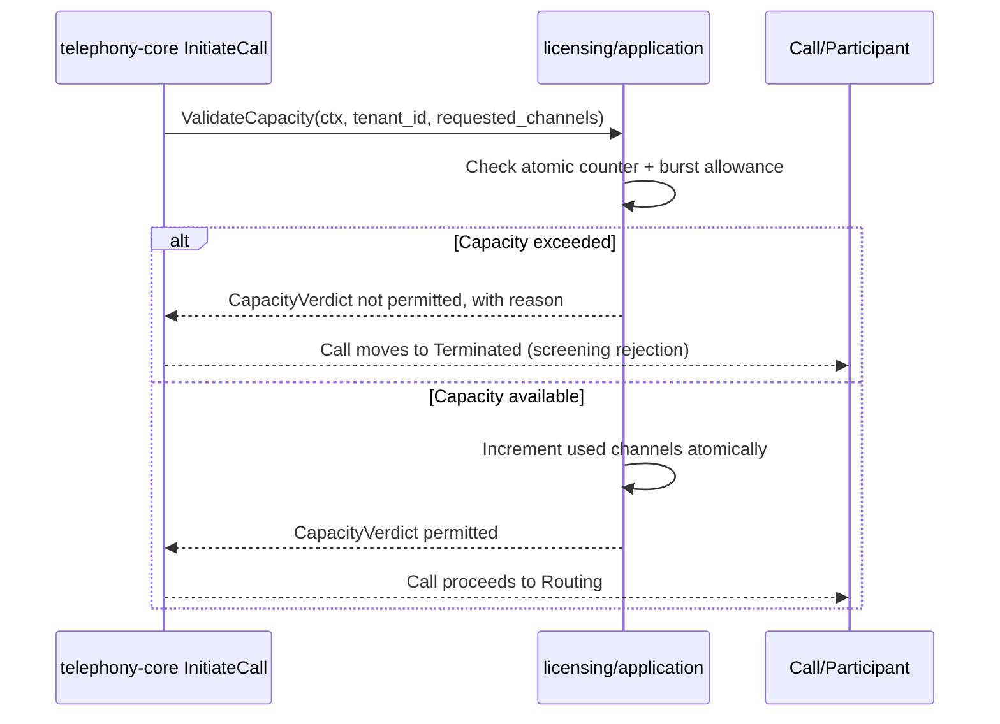
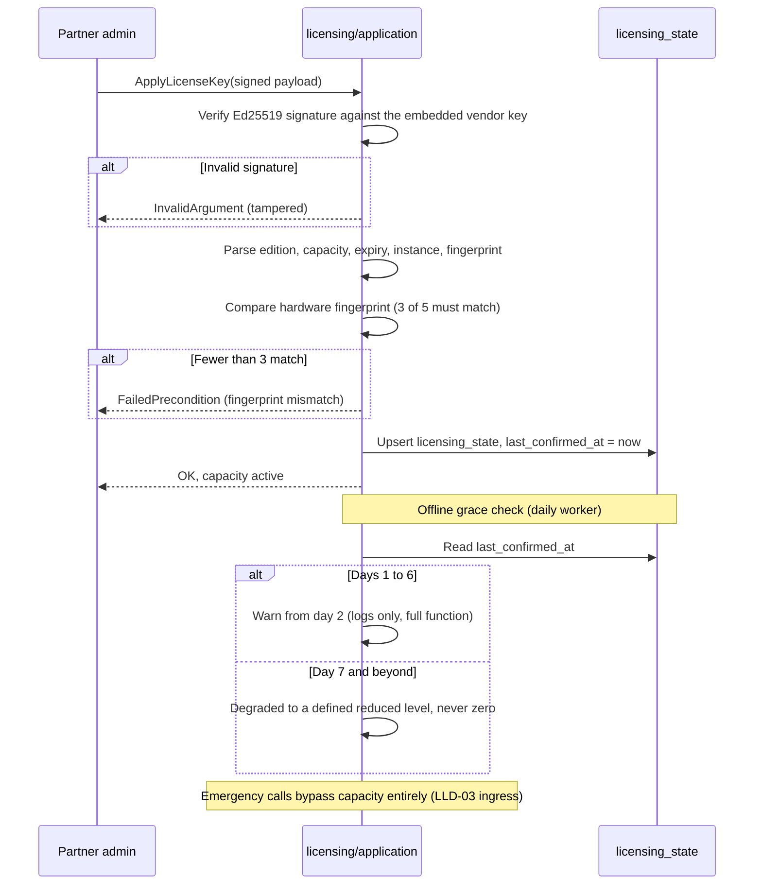

# LLD-08 — Licensing

| | |
|---|---|
| **Bounded context** | `licensing` (Tier 0 — see [`04-bounded-contexts.md` §10](../hld/04-bounded-contexts.md#10-bounded-context-build--dependency-graph)) |
| **Status** | Draft — nothing built. `api/internal/licensing/` does not exist; `telephony-core` still runs against `stub_license.go` |
| **Traces to** | BRD FBR-R1-08/FBR-R1-12/§10; PRD EPIC-06 (US-06.1–06.7, AC-06.1–06.10), PRD §11.2 (licence states), INV-01/INV-03; HLD [04-bounded-contexts.md](../hld/04-bounded-contexts.md) §4, [03-domain-model.md](../hld/03-domain-model.md) §5, [11-decisions.md](../hld/11-decisions.md) (T-1–T-3); DECISIONS D-11–D-14, D-24 |
| **Why a separate LLD** | Split out of LLD-02 on 2026-09-08 — see Document history |

## Document history

| Date | Change |
|---|---|
| 2026-09-07 | Written as the licensing half of `LLD-02-identity-licensing.md`. |
| 2026-09-09 | **The degradation floor gained a number, then the never-activated case was separated from it.** D-49 set the floor at 4 channels / 10 extensions / 1 tenant. D-52 then established that a never-activated installation is **Setup** with no call path — *not* that floor — and D-53/D-54 changed how the entitlement is stored and verified. See the scope note in §1, which is authoritative over this row. |
| 2026-09-08 | **§3.1 added, correcting §2.** The inherited text said licensing's port *retires* `telephony/ports.LicenseManager`; that contradicted this LLD's own §1 tripwire and DoD 7, and the obvious way to honour it would have made `licensing` import `telephony/ports` — forbidden by HLD 04 §10.1. Both ports stay; the composition root adapts between them. |
| 2026-09-08 | **Split into its own LLD.** `docs/lld/README.md` states that an LLD covers "one bounded context at a time", and HLD 04 §10.1 lists `identity` and `licensing` as separate Tier-0 contexts, each depending on nothing. LLD-02 §2 had justified combining them as sharing "one cutover (auth + entitlement activate together)". Delivery disproved that: identity shipped in three archived changes (`identity-auth-rbac`, `identity-api`, `auth-cutover-connectrpc`) while licensing shipped nothing. They never activated together and never could have. Content is carried over unchanged except where marked. |

## 1. Scope

> **Two corrections landed after this document was written. Read them
> first — they change the shape of the context, not just its numbers.**
>
> **The floor has a number (D-49).** Where this document says "a defined
> reduced level" or "reduced capacity", it means **4 simultaneous
> calls** — the Free Community floor. Expiry, elapsed grace and tampering
> are three routes to it, distinguished by reason code, not by three
> behaviours (BR-LIC-02). Only the **channel** floor is enforced here;
> the extension cap (10) and tenant cap (`MaxTenants: 1`) are entitlement
> data this context *publishes*, enforced where extensions and tenants
> are created. Degrading never removes an already-provisioned tenant or
> extension (AC-06.13).
>
> **There is no unsigned entitlement, and no zero-config tier (D-52).**
> A never-activated installation is in **Setup**: administration console
> only, **no call path**, and it is never the target of degradation. The
> free tier is perpetual and costs nothing but is still an activated,
> signed token obtained by registering. So this context has **no
> "missing row means 4 channels" branch** — a missing row means Setup.
> The floor constants remain — named `Free*` — as the degradation floor
> and as the Free Community entitlement's values, never as a fallback for
> absence.
>
> **The stored entitlement is the signed payload, re-verified on load
> (D-53).** `licensing_state`'s claim columns are a display cache and are
> never read to make a decision — see §5.

**In scope:** the full HLD 04 §4 `LicenseManager` port — `ValidateCapacity`,
`ReleaseCapacity`, `ApplyLicenseKey`, `VerifyDailyEntitlement`. LLD-01
stubbed only the first; this LLD lands all four behind the same
interface. Ed25519 licence tokens (T-1), an atomic capacity counter with
a 10% burst allowance (T-2/T-3), a weighted 3-of-5 hardware fingerprint
with tolerance (D-13), and a 7-day offline grace with day-2 warnings that
**degrades and never disables** (D-12/D-14).

Also in scope: replacing `telephony/application/stub_license.go` by
wiring the real adapter behind the existing port in `cmd/atsap-api`.

**Near-zero `telephony-core` changes — and the tripwire has already
fired once.** This rule was originally "zero changes: if this LLD
requires editing anything under `internal/telephony/` beyond deleting the
stub's wiring, the seam LLD-01 built has failed and work stops."

It fired during `licensing-capacity-grace`, for a reason no document
anticipated: **`ReleaseCapacity` had zero occurrences in the codebase.**
It is named in HLD 04 §4 and in §3's port here, but
`telephony/ports.LicenseManager` declared only `ValidateCapacity`, and
nothing anywhere released. LLD-01 built the half of the seam its
always-permit stub needed. A real counter against that code produces a
number that only rises, until every call is refused and none is ever
dropped to correct it.

The two ways to avoid touching `telephony-core` are both forbidden by
HLD 04 §10.1 (`licensing` may depend on **nothing**): subscribing to
call-lifecycle events, or reading `telephony-core`'s tables. Shipping
without release is a defect, not a limitation.

**The narrowed rule:** `telephony-core` may gain *port methods it owns
and their call sites*, and nothing else. Specifically permitted, once:
`ReleaseCapacity` on `telephony/ports.LicenseManager` and one call in
`finalizeTermination`. Everything else under `internal/telephony/`
remains out of bounds, and DoD 7 asserts the diff lists exactly those two
files. The seam's direction is untouched — `telephony-core` still calls a
port it owns and still never imports `licensing`, which is what the
tripwire actually existed to protect.

**Explicitly out of scope:**

| Deferred | Owner | Why not here |
|---|---|---|
| Emergency-number bypass of capacity (INV-01) | LLD-03 `pbx-core` | The bypass is a dial-plan decision made before Screening; licensing supplies the verdict, it does not decide who skips it |
| SIP `503` + `Retry-After` on rejection | LLD-03 `pbx-core` | That is ingress shaping; licensing returns a domain verdict, not a SIP response |
| Partner-facing licence issuance UI | EPIC-10 console | `ApplyLicenseKey` over the API plus a CLI is the whole surface this LLD needs |
| Multi-node shared capacity counting | Multi-node work (D-08) | See §7 |

## 2. Go package layout

```
api/internal/
└── licensing/                # NEW bounded context root
    ├── domain/               # NEW: LicenseToken (Ed25519 verify, pure),
    │                         #      HardwareFingerprint (weighted 3-of-5,
    │                         #      pure), CapacityCounter (atomic +
    │                         #      burst window), GraceTracker (pure
    │                         #      state machine over timestamps)
    ├── ports/                # NEW: the full LicenseManager — HLD 04 §4's
    │                         #      four methods, with licensing's own
    │                         #      CapacityVerdict. It does NOT replace
    │                         #      telephony's one-method port — §3.1
    ├── application/          # NEW: capacity monitor, daily entitlement
    │                         #      worker, key-apply flow
    └── postgres/             # NEW: licensing_state persistence
```

`telephony/application/stub_license.go` is deleted by replacing its
wiring. `stub_compliance.go` stays — LLD-04 owns that.

## 3. Domain types and the port

```go
// licensing/domain — pure where possible (D-21's shape, applied here)
type LicenseToken struct {
    Edition       string
    Capacity      int       // concurrent channels
    MaxTenants    int       // D-51: 1 = single-tenant, 0 = unlimited, >1 = that many
    MaxExtensions int       // D-49: 10 on the free tier, 0 = unlimited
    ExpiresAt     time.Time
    InstanceID    string
    Fingerprint   [5]string // expected weighted attributes
}
func VerifyToken(payload, signature []byte, keys KeySet) (LicenseToken, error) // pure, T-1, D-54

type HardwareFingerprint struct{ Attrs [5]string }
func (f HardwareFingerprint) Matches(expected [5]string) bool // >=3 of 5 equal, D-13

type CapacityVerdict struct {
    Permitted bool
    Reason    string // distinct telemetry reason code (BR-05)
}

// GraceState is a pure function of (now, lastConfirmedAt): Valid →
// EntitlementUnverified (warnings from day 2) → Degraded (reduced
// capacity, never disabled — D-12).
func GraceState(now, lastConfirmedAt time.Time) GraceStatus
```

```go
// licensing/ports — HLD 04 §4's four methods.
type LicenseManager interface {
    ValidateCapacity(ctx context.Context, tenantID shareddomain.TenantID, requestedChannels int) (CapacityVerdict, error)
    ReleaseCapacity(ctx context.Context, callID shareddomain.CallID) error // keyed by call, so idempotent (D-58)
    ApplyLicenseKey(ctx context.Context, signedPayload []byte) error
    VerifyDailyEntitlement(ctx context.Context) (EntitlementStatus, error)
}
```

**`ValidateCapacity` keeps LLD-01's explicit `tenantID` parameter** rather
than HLD 04 §4's literal two-argument signature. Dropping it would mean
editing `ports.LicenseManager` *and* its call site in
`telephony/application/service.go`, both under `internal/telephony/` —
which trips this LLD's own zero-changes tripwire (§1).
`InitiateCallCommand` already carries `TenantID` explicitly, and a
ctx-carried `TenantContext` would be a second source of truth for the
same value rather than a simplification. A deliberate, documented
deviation, the same category as LLD-01's `CallStore` gaining
`RecordUsageTicks` beyond HLD 04 §1's exact shape.

Ed25519 uses stdlib `crypto/ed25519` — no new dependency.

**`MaxTenants` and `MaxExtensions` are published, never enforced here**
(D-49, D-51). This context reads them from the signed payload and exposes
them on the entitlement; the refusal happens where a tenant or an
extension is created, because that is the only place that knows how many
already exist. `licensing` counts channels because channels are transient
and it holds the counter; it does not count rows in another context's
tables.

`0` means unlimited in both fields, so an unlicensed installation is
`MaxTenants: 1, MaxExtensions: 10` and every licensed edition is `0, 0`.

**The zero-value hazard this creates is closed by construction, not by
care.** `0` meaning unlimited would be dangerous if a zero-valued
`LicenseToken` could ever reach an entitlement decision — an absent or
malformed licence would read as unlimited. It cannot: `LicenseToken` is
only ever produced by `VerifyToken`, so an unverified licence yields *no
token* rather than an empty one, and the unlicensed path is built from the
named `Unregistered*` constants instead. A test asserts that a
zero-valued `LicenseToken` is never accepted as an entitlement, so the
guarantee survives a later refactor that adds a second constructor.

### 3.1 Two ports, deliberately — and why the alternative is forbidden

An earlier draft of this section said LLD-01's single-method port is
"RETIRED by this LLD, not extended beside it". **That was wrong, and it
contradicted this LLD's own §1.** Retiring
`telephony/ports.LicenseManager` means editing
`api/internal/telephony/ports/ports.go`, which is precisely what the
zero-changes tripwire forbids and what DoD 7 asserts against.

Both ports stay:

| Port | Owner | Shape | Purpose |
|---|---|---|---|
| `telephony/ports.LicenseManager` | the **consumer** | `ValidateCapacity` only | The narrow view `telephony-core` actually needs at Screening |
| `licensing/ports.LicenseManager` | the **provider** | all four methods | The full contract HLD 04 §4 specifies |

That is the ordinary Go idiom — a consumer declares the smallest
interface it uses — not duplication to be tidied away later.

**The tempting shortcut is an architecture violation, so it is named
here before someone reaches for it.** `telephony/ports.LicenseManager`
returns *telephony's* `CapacityVerdict` (`ports.go:133`). For a licensing
adapter to satisfy that interface directly, `licensing` would have to
import `telephony/ports` — a Tier-0 context depending on a Tier-0 peer,
which HLD 04 §10.1 denies outright ("`licensing` may depend on: nothing").

**The composition root adapts instead.** `cmd/atsap-api` holds a small
struct wrapping `licensing/application`'s manager and translating one
verdict type into the other. The composition root is the one place
permitted to know both contexts, which is what §1's "beyond the
composition root" carve-out already anticipated. Neither context imports
the other, and `git diff --stat api/internal/telephony/` stays empty.

**This is gated, not merely written down.** `.golangci.yml` has no rule
covering `licensing` yet, because the package does not exist. The change
that creates it adds a `licensing-imports-nothing` depguard rule denying
`atsap-api/internal/telephony`, `.../pbx` and `.../identity` from
`**/internal/licensing/**`, and fault-injects it once to prove it fails —
the same treatment `pbx-acl-boundary` got. A rule that has never rejected
anything is a rule nobody has tested (D-28).

## 4. How this context interacts with the others

`licensing` depends on **nothing** (HLD 04 §10.1). Every interaction is
someone else calling *it*, through a port they own:

| Caller | Through | When | What must stay true |
|---|---|---|---|
| `telephony-core` | `ports.LicenseManager.ValidateCapacity` | Screening, before any external contact | Returns a verdict, never a SIP code and never a decision about emergency calls |
| `telephony-core` | `ReleaseCapacity` | Call teardown | An active call is **never** dropped by a licence state (INV-03) |
| `pbx-core` (LLD-03) | Consumes the verdict at ingress | Inbound call setup | Emergency numbers bypass Screening entirely before licensing is consulted (INV-01) |
| Operator / console | `ApplyLicenseKey`, `GetLicenseStatus` | Licence application, entitlement display | EPIC-06 |

**`licensing` and `identity` never call each other.** They are Tier-0
peers with no shared code and no shared table — which is exactly why
they are two LLDs and not one.

## 5. Data model

One table, `licensing_state`, whose DDL already exists in
[HLD 03 §5](../hld/03-domain-model.md#5-comprehensive-relational-schema-postgresql-16)
but which **no migration has yet created** — this LLD's migration adds it.

`instance_id` PK, **`signed_payload` BYTEA, `signature` BYTEA**,
`fingerprint` JSONB, `edition`, `capacity`, `max_tenants`,
`max_extensions`, `entitlement_status`, `last_confirmed_at`,
`grace_started_at`.

**`signed_payload` and `signature` are the entitlement of record
(D-53).** Everything after them is a denormalised cache for display and
support and is **never** read to make an entitlement decision. The
platform runs on the partner's hardware, so they hold the database: if
`capacity` were trusted, one `UPDATE` would grant any capacity without
forging a signature or defeating the fingerprint.

The load path is therefore: read the row → verify the signature over
`signed_payload` → parse → cache the result in memory. Verification
happens **on load and on `ApplyLicenseKey`, never during call setup**
(AC-06.3). A row whose signature does not verify degrades to the 4-call
floor with the tamper reason; it is never honoured and never disables the
system.

**No `tenant_id`, and it never gains RLS.** Licensing is
installation-scoped, not tenant-scoped (T-1): one licence token per
installed instance, not per tenant sub-account. This is the one
deliberate exception to D-24 seam 1's "every table carries `tenant_id`",
and the exception is asserted by test so it can never be mistaken later
for an oversight — the same treatment `ps_*` gets in LLD-03 §5.2.

Capacity counters stay **in memory**. `licensing_state` is the only
durable licensing state.

## 6. ConnectRPC surface

Per D-43, a capability gets an RPC when it has a named R1.0 consumer.

| Capability | Wire? | Consumer |
|---|---|---|
| `ApplyLicenseKey` | **RPC** | Partner licence application (EPIC-06); the console's licence screen (Phase A slice, D-46) |
| `GetLicenseStatus` | **RPC** | Entitlement display — the console header shows edition and channel capacity (HLD 18 flow A1) |
| `ValidateCapacity`, `ReleaseCapacity` | Port only | Mechanism. `telephony-core` calls them per call; a client asking "have I capacity" separately from placing a call is an oracle whose answer changes between the two |
| `VerifyDailyEntitlement` | Port only | A scheduled worker's job, not a caller's |

`docs/API.md` §3 already lists the two RPCs as pending; the change that
lands them updates §1 in the same commit.

## 7. Known limitations

- **Single-node capacity counting.** The atomic counter is per process.
  Multi-node active-active counting is a later scaling change, explicitly
  not this LLD (D-08: nothing over-built for year-three scale). If it
  becomes necessary, a future LLD replaces the in-memory counter with a
  distributed lease consistent with the approved stack — PostgreSQL
  `SELECT ... FOR UPDATE`, following the `SKIP LOCKED` patterns already in
  use — never an unevaluated new dependency. The `LicenseManager` port
  abstraction allows that swap without touching `telephony-core`.
- **Entitlement service availability is a business risk, by design.**
  D-14 records it: a short offline grace makes our entitlement service
  critical infrastructure, and this LLD implements the 7-day window that
  decision settled on. It does not build the service's own HA.

## 8. Definition of Done

1. A tampered licence payload is rejected by `ApplyLicenseKey` before any
   parsing happens — signature verification precedes interpretation
   (AC-06.1, OWASP A08).
2. The weighted fingerprint tolerates 2-of-5 drift and fails closed
   beyond it, warning first (AC-06.2/06.9, D-13).
3. Capacity counter exact under a 10× setup-rate race test, zero drift;
   the burst allowance absorbs a 15-minute overage then rejects with the
   distinct telemetry reason (AC-06.6/06.10, T-2/T-3).
4. **No active call is dropped at any point** by any licence state,
   capacity limit or entitlement failure (INV-03) — asserted with a live
   call across each transition, not inferred.
5. Grace state machine: unreachable entitlement service → full function
   with day-2+ warnings → degraded to the **Unregistered floor of 4
   channels** after day 7, **never disabled** (AC-06.4/06.5, D-12, D-49).
   Covered by test with an injected clock, asserting the floor value and
   that an already-provisioned estate is untouched (AC-06.13).
6. `licensing_state` is asserted to have **no `tenant_id` and no RLS**,
   deliberately (D-24, D-39) — the exception proven, not assumed.
7. `stub_license.go` is gone and `telephony-core` runs against the real
   adapter, with the change under `internal/telephony/` confined to the
   **`ports` and `application` packages** and, among production files,
   to exactly two: `ports/ports.go` (the port it owns) and
   `application/service.go` (its call sites).

   *Amended 2026-09-09, when the tripwire fired.* This item originally
   read "no change under `internal/telephony/`; `git diff --stat` is
   empty", which was unmeetable by the same change that mandates it:
   deleting `stub_license.go` **is** a change under
   `internal/telephony/`, and a port signature change necessarily
   updates the test doubles that implement it. Asserting an empty diff
   would have failed on its own requirement.

   The rule it was protecting is intact and is what is asserted now:
   nothing under `acl/`, `domain/`, `postgres/`, `rpc/`, `mediatest/` or
   `e2e/` changes, `telephony-core` never imports `licensing`, and the
   composition root is the only place that knows both contexts.

   Two production files, not one, because `ValidateCapacity` also gained
   a `callID` parameter. Reservation and release must share a key for
   release to be idempotent rather than a blind decrement (D-58), and
   the failure direction is why it was worth the wider change:
   under-counting permits calls that should be refused, which is licence
   leakage no test notices.
8. All SQL uses parameter placeholders. Stated plainly as review-enforced:
   `depguard` matches import paths, not string shapes, so no CI gate
   claims this check (D-28 honesty).
9. A `licensing-imports-nothing` depguard rule exists and has been
   fault-injected once to prove it rejects — `licensing` importing
   `telephony`, `pbx` or `identity` fails the build (§3.1, HLD 04 §10.1).
10. **Editing a claim column changes no entitlement decision** (D-53,
    AC-06.16). Asserted by writing a larger `capacity` and a
    `max_tenants` of `0` directly to `licensing_state` and showing the
    entitlement in force is unchanged, and that the row is reported as
    tampered. This is the test whose absence made the exposure possible.
11. **Setup is not Degraded** (D-52). A never-activated installation has
    no call path; a degraded one has 4 channels and live calls. Asserted
    in both directions, so a later refactor cannot collapse them and
    silently disable a working system on expiry.

## 9. OpenSpec handoff

`/opsx:propose "licensing: <one feature slice>"`. Point the agent at this
file as the design source.

| Change ID | Scope | Sequencing |
|---|---|---|
| `licensing-capacity-grace` | `VerifyToken` and the trusted key set, `ApplyLicenseKey` as a domain operation, `ATSAPBX_LICENSE_TOKEN` intake, signed-payload storage with load-time re-verification, atomic counter with burst, 7-day grace tracker, `licensing_state` migration, and the `stub_license.go` cutover | First |
| `licensing-apply-key` | The `ApplyLicenseKey`/`GetLicenseStatus` **RPCs** and CLI, hardware fingerprint collection and 3-of-5 matching, console licence screen | After: gives the token a portal, an operator interface and machine binding |

**Re-sliced 2026-09-09.** Token intake moved into the first change
because D-52 removed the unsigned path: with no token applied an
installation has no call path at all, so a first change without intake
would have shipped something unable to place a call, with an unmeetable
Definition of Done and two failing e2e suites. The split is now
"activate from configuration" then "activate from a portal", and both
halves remain independently shippable.

No hard dependency on `identity` in either direction. Ordering against
identity's changes is a matter of convenience, not correctness.

## 10. Security invariants

- **Ed25519 signature verification precedes parsing** on every licence
  key application. A tampered payload is rejected before any field is
  read, so there is no parser to attack (OWASP A08).
- **`ApplyLicenseKey` has no injection surface by construction** — its
  only input is a signed byte payload, and verification is pure
  cryptography over bytes.
- **Parameterized queries only** in `licensing/*` (OWASP A03).
- **The vendor public key is embedded, never fetched.** A key retrieved
  at runtime is a key an attacker can substitute.
- **Verification always runs; only the trusted key set varies** (D-54).
  There is no flag, variable or build tag that skips verification. A
  production build trusts one key; a development build additionally
  trusts a development key injected via `-ldflags`, empty by default so
  a forgotten flag yields the strict binary. `ATSAP_LICENSE_TOKEN`
  carries a signed token, never a mode — a development-signed token is
  rejected by a production binary exactly as a forgery is.
- **No private key material in the repository** (D-39). Unit tests
  generate an ephemeral Ed25519 keypair in-process; only the dev stack's
  pre-signed token is committed, and it is worthless against a
  production binary.
- **Degrade, never disable** (D-12): no licence state may produce a
  system that refuses an emergency call. That path is `pbx-core`'s to
  bypass (INV-01), and licensing must never be positioned as able to
  block it.

## 11. Critical path sequence diagrams

### 11.1 Capacity check at call setup

`telephony-core`'s `InitiateCall` already makes this port call today
against the stub; this is the shape the real implementation must satisfy.



### 11.2 Licence key application and the grace flow


