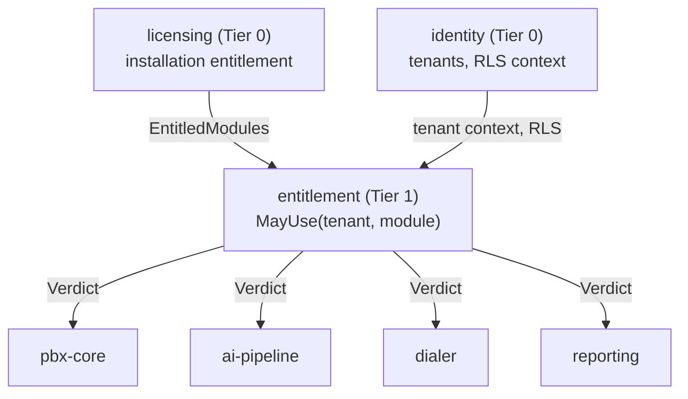

# LLD-11 — Entitlement

| | |
|---|---|
| **Bounded context** | `entitlement` (Tier 1 — see [`04-bounded-contexts.md` §9a](../hld/04-bounded-contexts.md) and [§10](../hld/04-bounded-contexts.md#10-bounded-context-build--dependency-graph)) |
| **Status** | Draft — nothing built. `api/internal/entitlement/` does not exist |
| **Traces to** | BRD §9 BR-17, §10.4 BR-LIC-03, §12.2, §12.4, §16 R-12; PRD EPIC-06 (US-06.5, AC-06.14), EPIC-10; DECISIONS D-49, D-50, D-51, D-53 |
| **Why it exists** | `identity` and `licensing` are Tier-0 peers that may not call each other, so neither can answer "may tenant T use module M?" — D-50 |

## Document history

| Date | Change |
|---|---|
| 2026-09-09 | Written, following D-50. Created together with HLD 04 §9a and the `tenant_module_grants` table in HLD 03 §5. |

## 1. Scope

**In scope:** one question and the invariant that makes it safe.

> **May tenant T use module M?**

Answering it requires two facts that live in two contexts which cannot
call each other:

| Fact | Owner | Scope |
|---|---|---|
| Is the **installation entitled** to M? | `licensing` (LLD-08) | Installation — one signed token, no `tenant_id`, no RLS |
| Has **this tenant enabled** M? | `entitlement` (here), beside the tenant record | Tenant — `tenant_id` and RLS, like every other tenant-scoped table |

**The invariant: enablement never exceeds entitlement.** Enabling a
module for a tenant when the installation is not entitled to it fails,
and it fails here — once — rather than in each of the four consumers.

**Explicitly out of scope:**

| Deferred | Owner | Why not here |
|---|---|---|
| Issuing, verifying or storing the licence token | `licensing` (LLD-08) | This context consumes a published entitlement; it never parses a payload or holds a key |
| The `MaxTenants` provisioning refusal | `identity` (LLD-02 §4a.1) | Tenant creation is identity's operation; only the *count* cap applies and it is not a module |
| The `MaxExtensions` cap | `pbx-core` (LLD-03) | Same reasoning — enforced where extensions are created |
| Deciding *what* each edition contains | BRD §12.2 | Commercial, not technical. This context reads the edition; it does not define the catalogue |
| The console's "upgrade" affordance | EPIC-10 console | The API returns the verdict and the reason; the interface renders them |

## 2. Go package layout

```
api/internal/
└── entitlement/             # NEW bounded context root
    ├── domain/              # NEW: Module, Verdict, Reason; the pure
    │                        #      rule combining entitlement + enablement
    ├── ports/               # NEW: EntitlementChecker (consumed), plus
    │                        #      the two inbound ports this context
    │                        #      owns and has satisfied for it
    ├── application/         # NEW: the checker, and the grant/revoke flow
    └── postgres/            # NEW: tenant_module_grants persistence
```

## 3. Domain types and ports

```go
// entitlement/domain — pure; no I/O, no clock, no database.
type Module string // "ai_pipeline", "dialer", "recording", "webhooks", ...

type Reason string
const (
    ReasonPermitted        Reason = "permitted"
    ReasonNotEntitled      Reason = "installation_not_entitled" // buy something
    ReasonNotEnabled       Reason = "tenant_not_enabled"        // click something
)

type Verdict struct {
    Permitted bool
    Reason    Reason
}

// Decide is the whole rule, as a pure function of two booleans, so it is
// exhaustively testable and cannot acquire an I/O dependency later.
func Decide(installationEntitled, tenantEnabled bool) Verdict
```

**`ReasonNotEntitled` and `ReasonNotEnabled` must stay distinct.** They
send an operator to two different places: buy the module, or switch it on
for that tenant. Collapsing them into a single "forbidden" is the kind of
simplification that generates support tickets, and AC-06.14 requires the
API to say which applies.

```go
// entitlement/ports — what this context OFFERS.
type EntitlementChecker interface {
    MayUse(ctx context.Context, tenantID shareddomain.TenantID, module Module) (domain.Verdict, error)
}

type GrantManager interface {
    // Enable fails with ErrNotEntitled when the installation is not
    // entitled to module — the invariant, enforced on the write path as
    // well as the read path.
    Enable(ctx context.Context, tenantID shareddomain.TenantID, module Module) error
    Disable(ctx context.Context, tenantID shareddomain.TenantID, module Module) error
    List(ctx context.Context, tenantID shareddomain.TenantID) ([]Module, error)
}
```

```go
// entitlement/ports — what this context NEEDS, declared here as the
// consumer so neither Tier-0 context is edited to serve it.
type InstallationEntitlement interface {
    // Modules the installation's current licence covers. Satisfied by an
    // adapter over licensing/ports.LicenseManager at the composition
    // root, exactly as LLD-08 §3.1 does for CapacityVerdict.
    EntitledModules(ctx context.Context) (map[Module]bool, error)
}
```

**Consumer-declared ports, both directions.** `entitlement` declares the
narrow interface it needs from `licensing` rather than importing
`licensing/ports` — the same pattern and the same reason as LLD-08 §3.1.
The composition root adapts. `licensing` is not edited, and `entitlement`
does not inherit licensing's whole four-method surface to read one map.

## 4. How this context interacts with the others



| Direction | Through | What must stay true |
|---|---|---|
| `entitlement` → `licensing` | `InstallationEntitlement`, satisfied at the composition root | Read-only. This context never applies, verifies or stores a token |
| `entitlement` → `identity` | Tenant context and `SET LOCAL app.tenant_id` | Grants are tenant-scoped rows under RLS, like every other tenant table |
| `pbx-core`, `ai-pipeline`, `dialer`, `reporting` → `entitlement` | `EntitlementChecker.MayUse` | Called in the **service performing the operation**, never in the console (BRD §16 R-12) |

**Nothing depends on `entitlement` from Tier 0**, so it can be built,
changed or removed without touching `identity` or `licensing`.

## 5. Data model

One table, `tenant_module_grants` (HLD 03 §5), **tenant-scoped with RLS
enabled and forced** — the ordinary rule, and deliberately the opposite of
`licensing_state`'s documented exception:

`tenant_id` + `module` as the composite primary key, `enabled_at`,
`enabled_by`.

**A grant row means "this tenant has switched it on", never "this tenant
is allowed".** Allowance is the conjunction with the installation
entitlement, computed at read time. A stored grant for a module the
licence no longer covers therefore becomes inert on its own — no
migration, no sweep, no cleanup job — and becomes live again if the
licence is restored. That is the behaviour a partner expects when they
downgrade and later upgrade, and it falls out of not caching the
conjunction.

**Absence of a row is "not enabled", never "enabled".** The zero value of
this table must be the safe one (the same hazard LLD-08 §3 closes for
`MaxTenants`).

## 6. ConnectRPC surface

Per D-43, a capability gets an RPC when it has a named R1.0 consumer.

| Capability | Wire? | Consumer |
|---|---|---|
| `ListTenantModules` | **RPC** | The console's per-tenant feature screen (EPIC-10); a partner automating tenant setup (US-05.1) |
| `EnableTenantModule` / `DisableTenantModule` | **RPC** | Same |
| `MayUse` | **Port only** | Mechanism. A client asking "may I" separately from doing the thing is an oracle whose answer changes between the two calls — the same reasoning that keeps `ValidateCapacity` off the wire (LLD-08 §6) |

The change that lands these updates `docs/API.md` §1 in the same commit.

## 7. Known limitations

- **The conjunction is computed per call, not cached.** That is
  deliberate (D-56: authorization state is never cached), and it costs a
  read. If it ever becomes measurable, the fix is an in-process cache
  invalidated on licence change — not a distributed one, and not a TTL.
- **Module names are strings, not a closed enum in the database.** A
  typo in a grant row is inert rather than an error. The alternative, a
  Postgres enum, makes adding a module a migration; a validation at the
  write path plus a test enumerating known modules is the trade taken.

## 8. Definition of Done

1. `Decide` is exhaustively tested over all four input combinations, as a
   pure function with no I/O.
2. **Enabling a module the installation is not entitled to fails**, on
   the write path, with `ErrNotEntitled` — asserted, because the read
   path returning a correct verdict is not sufficient protection if the
   grant can be written anyway.
3. A stored grant for a module the licence no longer covers **is inert**,
   and **becomes live again** when the licence is restored. Asserted in
   both directions.
4. Absence of a grant row is denial, asserted.
5. `ReasonNotEntitled` and `ReasonNotEnabled` are distinguishable through
   the API (AC-06.14), asserted against the wire, not just the domain.
6. `tenant_module_grants` has `tenant_id` with RLS **enabled and forced**,
   and cross-tenant reads return nothing — the same assertion every
   tenant-scoped table carries (D-24).
7. `entitlement` imports neither `telephony`, `pbx`, `reporting`,
   `dialer` nor `ai-pipeline`; a depguard rule enforces it and has been
   fault-injected once to prove it rejects (D-48's gate discipline).
8. **No entitlement check can gate an emergency call** (BR-09, INV-01) —
   asserted, with the check present and refusing, and the emergency call
   connecting anyway.
9. All SQL uses parameter placeholders (OWASP A03). Review-enforced, and
   stated as such: `depguard` matches import paths, not string shapes, so
   no CI gate claims this (D-28 honesty).

## 9. OpenSpec handoff

`/opsx:propose "entitlement: <one feature slice>"`. Point the agent at
this file as the design source.

| Change ID | Scope | Sequencing |
|---|---|---|
| `entitlement-module-gating` | `tenant_module_grants` migration, `Decide`, `EntitlementChecker`, `GrantManager`, the depguard rule, and the three RPCs | After `licensing-capacity-grace` — there is no installation entitlement to read until licensing publishes one |

**Not Phase A unless Phase A sells a module.** Phase A is install,
licence, and make calls (D-46); nothing in it is gated by edition. This
context becomes necessary the first time a paid module ships — Phase B's
recording and queues, or the AI add-on — and building it earlier is
D-08's "nothing over-built" failure with extra steps.

## 10. Security invariants

- **Deny by default.** No grant row, no module. The absence of a record
  is never an allowance (the `identity` §10.1 rule, applied here).
- **The write path enforces the invariant too.** A read-path check alone
  would leave a grant that outlives its entitlement waiting to be
  honoured by a future refactor.
- **Gating lives in the service, never in the console** (BRD §16 R-12).
  An entitlement enforced only in the UI is bypassed by calling the
  endpoint, which is how this class of control usually fails.
- **Never in the emergency path.** No verdict from this context may sit
  between a caller and an emergency number (BR-09, INV-01).
- **Parameterized queries only** (OWASP A03).
- **A verdict carries a reason, never licence material.** No token,
  signature, fingerprint or key value appears in a verdict, an error or a
  log line (D-39).
